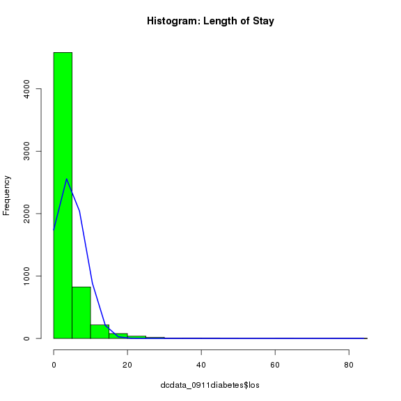
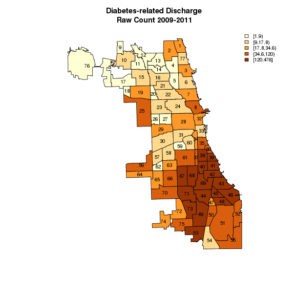

Chicago Hospital Discharge Data
========================================================

Revised data file was obtained from Dr. Peek/Nhyane on 9/30/2014. Original data format was Excel (DREQ_7906 - 093014.xlsx), size of about 20MB and burned on a DVD.
 - previously, we were given 88,756 observations (DREQ_7906_v2.xlsx), which included many obs from wrong years (i.e. not 2009-2011)
 - this time (DREQ_7906 - 093014.xlsx), HOWEVER, we were given much fewer obs, 84,846, which includes discharge year 2009-2011 ONLY!

Based on MRN (patientID?) a, patients (and thus "date of birth", "residential addresses") are repeated. However, associated ICD9 codes (icd9dx_problem_list, icd9dx_encounter) are different each time of admission. Missing values are coded as NULL.

##Problems:
- duplicates: a combination of MRN and BILL_NUM can be used as unique ID (to be more precise, we can also combine HOSP_ADMSN_TIME and HOSP_DISCH_TIME). However, there are still duplicates. By comparing duplicates, it appears they are identical and thus one (or two sometimes) of the duplicated records should be dropped (later, perhaps)
- icd9dx_problem_list (patient's current and active problem list)= codes can be repeated up to 44 times
- icd9dx_encounter (discharge diagnosis/reason of enounter, in the order of diagnosis/dx)= codes can be up to 11

### Important note to myself
Because some cell values are so long (str417 for problem_list), R cannot read this Excel file using read.xlsx(xlsx). Also, when saving in CSV or Tab-delimited, Excel replaces the long string (e.g. bill_num==813987427) to a bunch of ####################################### which is not good. To work around this problem, the best way was to:
(1) Import the Excel file to Stata (12 or higher because 11 or prior version can't handle long strings either)
    - (optional) this time, excel couldn't determine the date/time format of some columns/variables.  
    - if so, set column cell format to "time > mm/dd/yyyy time pm/am" and save the Excel data again.
    i.e.  import excel "F:\Prof_Peek\Validation\DREQ_7906 - 093014_datetimeformatted.xlsx", sheet("DREQ_7906") firstrow
(2) Then, export to a text file with "|" as a separator.. This appears to work best for me.
    i.e. export delimited using "F:\Prof_Peek\Validation\DREQ_7906_093014.txt", delimiter("|") replace

##ICD-9-CM codes:
Use Dr. Peek's selected ICD9 code for now. Selected ICD-9 codes fall in six different categories. The first category, 1, is the most important (i.e. direct diagnosis of diabetes). However, to ensure our selection, we will will select (flag) patients only if the patients has diagnostic code 1 (basically, 250.x)!

##Standardized with CHPD dataset!
On 8/7/2014, Emily and I corresponded over email and confirmed the followings:
- Age of patients are calculated based on the the date that the hospital dischare occurred.
- 2009-2011 discharge data is to be subsetted based on the "discharge" date/year! 


```r
## Original variables and example of data:
## +----------------------------------------------------------------------------------+
## 10. | mrn | bill_num | pat_en~d | birth_date | ethnic_group | RACE | |
## 1001234 | 3.319e+08 | 45678910 | 9/19/1999 | Not Hispanic or Latino |
## White |
## |---------------------------------+------------------------------------------------|
## | SEX | add_line_1 | add_li~2 | city | state | zip | | M | 123 GILLIGANS
## ISLAND ST | APT 1A | CHICAGO | IL | 66666-1234 |
## |---------------------------------------------+------------------------------------|
## | hosp_admsn_time | contact_date | hosp_disch_time | room_id | | 12jul2011
## 12:34:56 | 11jul2011 11:11:11 | 15jul2011 12:34:56 | 111 |
## |---------------------------------------------------------------------+------------|
## | depart~e | center_name | service_name | admit_c~t | ed_flag | | T1SW |
## Mitchell Hospital | ORTHOPEDICS | Confirmed | 1 |
## |-------------------------------------------------------+--------------------------|
## | ed_arrival_time | fin_cl~s | bill_num_~e | | 11jul2011 12:34:56 |
## MEDICARE | Inpat or ED |
## |----------------------------------------------------------------------------------|
## | icd9dx_encounte2 | | [415.19], [486], [564.00], [724.5], [770.16],
## [780.60], [782.3], [785.0], [787.. |
## |----------------------------------------------------------------------------------|
## | icd9dx_problem_list | | NULL |
## |----------------------------------------------------------------------------------|
## | icd9dx_encounter | | dx0:[959.9], dx3:[401.9], dx4:[492.8], dx6:[311],
## dx8:[V15.82], dx5:[724.00],.. |
## +----------------------------------------------------------------------------------+

rm(list = ls())
setwd("~/ProfPeek")
# setwd('F:\\Prof_Peek\\Validation')
source("install_load.R")
install_load("plyr", "stringr", "knitr", "Hmisc", "maptools", "RColorBrewer", 
    "classInt")
# read.xlsx doesn't work this data file, granted that some cell strings are
# way too long colindex<-1:20 rowindex<-1:88756 //this total was of previous
# data, now we have 84846 obs.  dcdata<-read.xlsx('DREQ_7906.xlsx',
# sheetIndex=1, header=T, colIndex=colindex, rowIndex=rowindex)

# also, the following canNOT handle long strings either
# connect<-odbcConnectExcel2007('DREQ_7906.xlsx')
# dcdata<-sqlFetch(connect,'DREQ_7906') odbcClose(connect)

# some apt number has #/hash symbol, so make sure to use comment.char='',
# which disable the default behavior, i.e. treating # as a comment
# character. Read: R data import/export PDF.
dcdata <- read.table("DREQ_7906_093014.txt", header = TRUE, na.strings = "NULL", 
    fill = TRUE, sep = "|", quote = "", comment.char = "", stringsAsFactors = FALSE)
# str(dcdata) head(dcdata) I don't like RACE SEX are in upper case
colnamelist <- tolower(names(dcdata))
colnames(dcdata) <- colnamelist

# check to see if the long string was imported/exported correctly..
weird <- dcdata[which(dcdata$bill_num == 813987427), ]  # long problem_list string..
weird <- dcdata[which(dcdata$mrn == 47820), ]  # address fields has #/hash symbol..

# convert date variables to time/POSIX objects
dcdata$dob <- strptime(dcdata$birth_date, "%m/%d/%Y")
# dcdata$dob<-strptime(dcdata$birth_date, '%d%b%Y') //previously - but this
# can't be right
head(dcdata[, c("dob", "birth_date")])  # see if it worked
```

```
##          dob birth_date
## 1 1927-06-25  6/25/1927
## 2 1941-07-18  7/18/1941
```

```r
dcdata$admitdate <- strptime(dcdata$hosp_admsn_time, "%d%b%Y")
dcdata$admityear <- format(dcdata$admitdate, "%Y")
dcdata$admitmonth <- format(dcdata$admitdate, "%m")
dcdata$admitday <- format(dcdata$admitdate, "%d")
dcdata$dischargedate <- strptime(dcdata$hosp_disch_time, "%d%b%Y")
dcdata$dischargeyear <- format(dcdata$dischargedate, "%Y")
dcdata$dischargemonth <- format(dcdata$dischargedate, "%m")
dcdata$dischargeday <- format(dcdata$dischargedate, "%d")
# make sure discharge date ranges are 1/1/2009-12/31/2011
summary(dcdata$dischargedate)  # check Min & Max date..
```

```
##                  Min.               1st Qu.                Median 
## "2009-01-01 00:00:00" "2009-09-18 00:00:00" "2010-06-25 00:00:00" 
##                  Mean               3rd Qu.                  Max. 
## "2010-06-26 05:40:05" "2011-03-31 00:00:00" "2011-12-30 00:00:00"
```

```r

# calculate length of stay (los) remember, our admitdate & dischargedate
# doesn't have 'time' (I didn't add when 'strptime'-ing) so los is just by
# counting days (i.e. no minding admit hour/time and discharge hour/time
# difference)
dcdata$los <- as.integer(as.numeric(difftime(dcdata$dischargedate, dcdata$admitdate, 
    units = "days")))
# check the result
head(dcdata[, c("admitdate", "dischargedate", "los")])
```

```
##    admitdate dischargedate los
## 1 2010-01-01    2010-01-10   9
## 2 2009-10-01    2009-10-10   9
```

```r
# plot hist(dcdata$los) plot(dcdata$admitdate, dcdata$los) # not much year
# difference

# calculate age at the time of discharge - this is not straight-forward!  if
# either birth_date or hosp_admsn_time are NULL/missing, age will be NULL as
# well first calculate a year difference, without minding month..  remember
# - we can do this because admitdate & dob are POSIX data type
dcdata$tmpyear <- dcdata$dischargedate$year - dcdata$dob$year
## then calculate age by considering month & date difference at the time of
## discharge (http://app.idph.state.il.us/emsrpt/hospitalization.asp) IDPH:
## The age is based upon the patient age on the date that the hospital
## discharge occurred.  age=year_difference if (discharge month is larger
## than birth mongh) or (discharge month is equal to birth month & discharge
## date is larger than or equal to birth day) else age=year_difference-1.
## remember - we can do this because dischargedate & dob are POSIX data type
dcdata$age <- ifelse(dcdata$dischargedate$mon > dcdata$dob$mon | (dcdata$dischargedate$mon == 
    dcdata$dob$mon & dcdata$dischargedate$mday >= dcdata$dob$mday), dcdata$tmpyear, 
    dcdata$tmpyear - 1)
# check the result
head(dcdata[, c("dischargedate", "birth_date", "dob", "tmpyear", "age")])
```

```
##   dischargedate birth_date        dob tmpyear age
## 1    2010-04-01  6/10/1927 1927-06-10      83  82
## 2    2009-10-10  7/10/1941 1941-07-10      68  68
```

```r
# drop the temp year variable
dropcol <- which(colnames(dcdata) == "tmpyear")  # get the column# of tmpyear..
dcdata <- dcdata[, -c(dropcol)]  # drop the specific column#..

# assign agegroup category values (1-19)
agelower <- -1
ageupper <- c(5, 10, 15, 18, 20, 25, 30, 35, 40, 45, 50, 55, 60, 65, 70, 75, 
    80, 85)
for (i in 1:18) {
    dcdata$agegpn[dcdata$age >= agelower & dcdata$age < ageupper[i]] <- i
    agelower <- ageupper[i]
}
dcdata$agegpn[dcdata$age >= 85] <- 19
which(colnames(dcdata) == "age")
```

```
## [1] 38
```

```r
head(dcdata[, 38:39])  # check data
```

```
##   age agegpn
## 1  82     18
## 2  68     15
```

```r

# sexgpn: use the common class for sex for census data: 1:ALL, 2:MALE,
# 3:FEMALE yes, these are odd categories but used for the previous, Eric's
# data
dcdata$sexgpn[dcdata$sex == "M"] <- 2
dcdata$sexgpn[dcdata$sex == "F"] <- 3
dcdata$sexgpn[dcdata$sex == "U"] <- 99
count(is.na(dcdata$sex))
```

```
##       x  freq
## 1 FALSE 84846
```

```r
count(dcdata, c("sexgpn"), )
```

```
##   sexgpn  freq
## 1      2 38478
## 2      3 46250
## 3     99   118
```

```r

# Also, I need to recode race/ethnicity categories: 3 race/ethnicity classes
# & 4 race/ethnicity classes
count(dcdata, c("ethnic_group"), )
```

```
##             ethnic_group  freq
## 1     Hispanic or Latino  4747
## 2 Not Hispanic or Latino 68953
## 3       Patient Declined    71
## 4                Unknown 11067
## 5                   <NA>     8
```

```r
count(dcdata, c("race"), )
```

```
##                                     race  freq
## 1       American Indian or Alaska Native   118
## 2                   Asian/Mideast Indian  1643
## 3                 Black/African-American 42602
## 4                     More than one Race  1104
## 5 Native Hawaiian/Other Pacific Islander   226
## 6                       Patient Declined   137
## 7                                Unknown  9270
## 8                                  White 29738
## 9                                   <NA>     8
```

```r

dcdata$racegp1 <- "Unknown"
# dcdata$racegp[(dcdata$ethnic_group=='Patient Declined' |
# dcdata$ethnic_group=='Unknown' | is.na(dcdata$ethnic_group)) |
# (dcdata$race=='Patient Decliend' | dcdata$race=='Unknown' |
# is.na(dcdata$race))]<-'Unknown'
dcdata$racegp1[dcdata$ethnic_group == "Hispanic or Latino"] <- "Hispanic"
dcdata$racegp1[dcdata$ethnic_group == "Not Hispanic or Latino" & dcdata$race == 
    "White"] <- "NH White"
dcdata$racegp1[dcdata$ethnic_group == "Not Hispanic or Latino" & (dcdata$race == 
    "American Indian or Alaska Native" | dcdata$race == "Asian/Mideast Indian" | 
    dcdata$race == "Black/African-American" | dcdata$race == "More than one Race" | 
    dcdata$race == "Native Hawaiian/Other Pacific Islander")] <- "NH Other"
count(dcdata, c("racegp1"), )  # check result
```

```
##    racegp1  freq
## 1 Hispanic  4747
## 2 NH Other 42261
## 3 NH White 25901
## 4  Unknown 11937
```

```r

# Let's create NH-Black class for another race/ethnicity group categories
dcdata$racegp2 <- "Unknown"
# dcdata$racegp[(dcdata$ethnic_group=='Patient Declined' |
# dcdata$ethnic_group=='Unknown' | is.na(dcdata$ethnic_group)) |
# (dcdata$race=='Patient Decliend' | dcdata$race=='Unknown' |
# is.na(dcdata$race))]<-'Unknown'
dcdata$racegp2[dcdata$ethnic_group == "Hispanic or Latino"] <- "Hispanic"
dcdata$racegp2[dcdata$ethnic_group == "Not Hispanic or Latino" & dcdata$race == 
    "White"] <- "NH White"
dcdata$racegp2[dcdata$ethnic_group == "Not Hispanic or Latino" & dcdata$race == 
    "Black/African-American"] <- "NH Black"
dcdata$racegp2[dcdata$ethnic_group == "Not Hispanic or Latino" & (dcdata$race == 
    "American Indian or Alaska Native" | dcdata$race == "Asian/Mideast Indian" | 
    dcdata$race == "More than one Race" | dcdata$race == "Native Hawaiian/Other Pacific Islander")] <- "NH Other"
count(dcdata, c("racegp2"), )  # check result
```

```
##    racegp2  freq
## 1 Hispanic  4747
## 2 NH Black 40261
## 3 NH Other  2000
## 4 NH White 25901
## 5  Unknown 11937
```

```r

# racegpn1: use the common class for racegroup for census data: 1:HISPANIC,
# 2:NON-HISPANIC WHITE, 3:NON-HISPANIC OTHER
dcdata$racegpn1[dcdata$racegp1 == "Hispanic"] <- 1
dcdata$racegpn1[dcdata$racegp1 == "NH White"] <- 2
dcdata$racegpn1[dcdata$racegp1 == "NH Other"] <- 3
dcdata$racegpn1[dcdata$racegp1 == "Unknown"] <- 99
count(dcdata, c("racegpn1"), )  # check result
```

```
##   racegpn1  freq
## 1        1  4747
## 2        2 25901
## 3        3 42261
## 4       99 11937
```

```r

# racegpn2: use the common class for racegroup for census data: 1:HISPANIC,
# 2:NON-HISPANIC WHITE, 3:NON-HISPANIC OTHER
dcdata$racegpn2[dcdata$racegp2 == "Hispanic"] <- 1
dcdata$racegpn2[dcdata$racegp2 == "NH White"] <- 2
dcdata$racegpn2[dcdata$racegp2 == "NH Black"] <- 3
dcdata$racegpn2[dcdata$racegp2 == "NH Other"] <- 4
dcdata$racegpn2[dcdata$racegp2 == "Unknown"] <- 99
count(dcdata, c("racegpn2"), )  # check result
```

```
##   racegpn2  freq
## 1        1  4747
## 2        2 25901
## 3        3 40261
## 4        4  2000
## 5       99 11937
```

```r

# admit date & discharge dates appear to be not just 2009-2011 although, it
# was not the case for the new data obtained in September 2014
sort <- dcdata[order(dcdata$dischargedate, na.last = FALSE), ]
tail(sort)  # what are the largest 'year' values?
```

```r
# see the distribution
table(format(dcdata$dischargedate, "%Y"))
```

```
## 
##  2009  2010  2011 
## 29234 27647 27965
```

```r
# create a flag variable, wrongyear==0 if either 2009|2010|2011, or ==1 if
# not
dcdata$wrongyear <- ifelse(format(dcdata$dischargedate, "%Y") == 2009 | format(dcdata$dischargedate, 
    "%Y") == 2010 | format(dcdata$dischargedate, "%Y") == 2011, 0, 1)
badyears <- dcdata[which(dcdata$wrongyear == 1), ]  # no more bad year obs - ZERO badyear cases.

# examine missing ICD-9 codes
sum(is.na(dcdata$icd9dx_problem_list))  #54440
```

```
## [1] 54440
```

```r
sum(is.na(dcdata$icd9dx_encounter))  #1728
```

```
## [1] 1728
```

```r
sum(is.na(dcdata$icd9dx_encounte2))  #17715
```

```
## [1] 17715
```

```r
missingEncounter <- dcdata[which(is.na(dcdata$icd9dx_encounter)), ]
sum(is.na(missingEncounter$icd9dx_problem_list))  #1168 - intersection of problem_list missings & encounter missings
```

```
## [1] 1168
```

```r
table(missingEncounter$service_name)  # see if missing has to do with Service_Name - 'TRANSPLANT ADMISSIONS', 155
```

```
## 
##                 ANESTHESIOLOGY             BURN PATIENT ADULT 
##                              2                              8 
##         BURN PATIENT PEDIATRIC                CARDIAC SURGERY 
##                             11                             20 
##                     CARDIOLOGY               GENERAL MEDICINE 
##                             98                            148 
##                GENERAL SURGERY                  GYNE ONCOLOGY 
##                             80                             15 
##                     GYNECOLOGY            HEMATOLOGY/ONCOLOGY 
##                              8                            149 
##         Hospitalist Cardiology     INFLAMMATORY BOWEL DISEASE 
##                              1                             12 
##                  LIVER SERVICE     LUNG TRANSPLANT (MEDICINE) 
##                             19                              1 
## MEDICAL INTENSIVE CARE SERVICE            MITCHELL OUTPATIENT 
##                             16                              2 
##                    NEONATOLOGY                      NEUROLOGY 
##                             41                             53 
##                   NEUROSURGERY                        NURSERY 
##                             19                             95 
##                     OBSTETRICS             OBSTETRICS FACULTY 
##                            231                              5 
##             OBSTETRICS PRIVATE                    ORTHOPEDICS 
##                             16                             19 
##                 OTOLARYNGOLOGY      PEDIATRIC CARDIAC SURGERY 
##                              8                              1 
##           PEDIATRIC CARDIOLOGY             PEDIATRIC GI/LIVER 
##                              2                             10 
##  PEDIATRIC HEMATOLOGY/ONCOLOGY       PEDIATRIC INTENSIVE CARE 
##                             34                             38 
##            PEDIATRIC NEUROLOGY         PEDIATRIC NEUROSURGERY 
##                             39                             11 
##        PEDIATRIC OPHTHALMOLOGY   PEDIATRIC ORTHOPEDIC SURGERY 
##                              1                             18 
##       PEDIATRIC OTOLARYNGOLOGY      PEDIATRIC PLASTIC SURGERY 
##                             11                              5 
##              PEDIATRIC SURGERY           PEDIATRIC TRANSPLANT 
##                             60                              1 
##              PEDIATRIC UROLOGY                PLASTIC SURGERY 
##                              7                              9 
##           PRE-HEART TRANSPLANT   Pediatric Endocrine/Diabetes 
##                              2                              1 
##              Pediatric General   Pediatric Infectious Disease 
##                            109                              1 
##           Pediatric Nephrology            Pediatric Pulmonary 
##                              1                              6 
##         Pediatric Rheumatology                      RADIOLOGY 
##                              3                              1 
##               THORACIC SURGERY          TRANSPLANT ADMISSIONS 
##                              8                            155 
##              TRANSPLANT CLINIC             TRANSPLANT SURGERY 
##                              2                             33 
##                        UROLOGY               VASCULAR SURGERY 
##                             25                             12
```

```r
# perhaps, we can use problem_list code if enounter doesn't have any code?
missingEncounter.sub <- missingEncounter[which(!is.na(missingEncounter$icd9dx_problem_list)), 
    ]  #560 obs.

save(dcdata, file = "dcdata_stage1.Rda")
```


##STAGE 2: ICD-9 selection/flagging


```r
# load('dcdata_stage1.Rda')

# sort and then add an sorted unique ID in case our merge gets lost
icd9selected <- read.table("ChicagoHospitalDischargeDataICD9codes_050214doc.txt", 
    header = TRUE, sep = "\t", na.strings = "NULL", stringsAsFactors = FALSE)
# create a new var and fill it with ICD9 found in the ICD.9 column
icd9selected$icd9 <- regmatches(icd9selected$ICD.9, regexpr("^[0-9]*[.]*[0-9]*", 
    icd9selected$ICD.9))
# icd9selected$icd9<-str_trim(icd9selected$icd9)
icd9selected$description <- sub("^[0-9]*[.]*[0-9]*[ ]", "", icd9selected$ICD.9)
# drop the temp year variable
dropcol <- which(colnames(icd9selected) == "ICD.9")  # get the column# for 'ICD.9'..
icd9selected <- icd9selected[, -c(dropcol)]  # drop the specific column#..

# make a list of diabetes' ICD9 codes
icd9selected.diabetes <- icd9selected[icd9selected$Category == 1, 2]
# make a list of diabetes-conditions' ICD9 codes - we no longer use
# 'conditions'
# icd9selected.conditions<-icd9selected[icd9selected$Category!=1,2]

# flag using 'encounters' ICD9 codes
dcdata$encountDX_diabetes <- 0
count <- 0
for (i in 1:length(icd9selected.diabetes)) {
    exp <- paste0("\\[", icd9selected.diabetes[i])
    for (j in 1:nrow(dcdata)) {
        encounters <- dcdata[j, c("icd9dx_encounter")]
        count <- ifelse(grepl(exp, encounters), 1, 0)
        dcdata[j, c("encountDX_diabetes")] <- dcdata[j, c("encountDX_diabetes")] + 
            count
    }
}
## we no longer use 'conditions' dcdata$encountDX_conditions<-0 count<-0 for
## (i in 1:length(icd9selected.conditions)){
## exp<-paste0('\\[',icd9selected.conditions[i]) for (j in 1:nrow(dcdata)){
## encounters<-dcdata[j,c('icd9dx_encounter')]
## count<-ifelse(grepl(exp,encounters),1,0)
## dcdata[j,c('encountDX_conditions')]<-dcdata[j,c('encountDX_conditions')]+count
## } }

# flag using 'problem_list' ICD9 codes
dcdata$problemDX_diabetes <- 0
count <- 0
for (i in 1:length(icd9selected.diabetes)) {
    exp <- paste0("\\[", icd9selected.diabetes[i])
    for (j in 1:nrow(dcdata)) {
        problems <- dcdata[j, c("icd9dx_problem_list")]
        count <- ifelse(grepl(exp, problems), 1, 0)
        dcdata[j, c("problemDX_diabetes")] <- dcdata[j, c("problemDX_diabetes")] + 
            count
    }
}
# # we no longer use 'conditions' dcdata$problemDX_conditions<-0 count<-0
# for (i in 1:length(icd9selected.conditions)){
# exp<-paste0('\\[',icd9selected.conditions[i]) for (j in 1:nrow(dcdata)){
# problems<-dcdata[j,c('icd9dx_problem_list')]
# count<-ifelse(grepl(exp,problems),1,0)
# dcdata[j,c('problemDX_conditions')]<-dcdata[j,c('problemDX_conditions')]+count
# } }

# # # renaming is not easy..  renamecol<-which(colnames(dcdata)=='diabetes')
# colnamelist<-colnames(dcdata) colnamelist[renamecol]<-'encountDX_diabetes'
# colnames(dcdata)<-colnamelist # repeat for another
# renamecol<-which(colnames(dcdata)=='others') colnamelist<-colnames(dcdata)
# colnamelist[renamecol]<-'encountDX_conditions'
# colnames(dcdata)<-colnamelist

# create a final flag to indicate the obs meets our criteria - using
# ENCOUNTER
dcdata$encountDX_diabetes <- ifelse(dcdata$encountDX_diabetes > 0, 1, 0)
# we no longer use 'conditions'
# dcdata$encountDX_conditions<-ifelse(dcdata$encountDX_conditions>0,1,0)
# dcdata$encountDX_flag<-ifelse(dcdata$encountDX_diabetes>0 &
# dcdata$encountDX_conditions>0,1,0)

# create a final flag to indicate the obs meets our criteria - using
# PROBLEM_LIST
dcdata$problemDX_diabetes <- ifelse(dcdata$problemDX_diabetes > 0, 1, 0)
# we no longer use 'conditions'
# dcdata$problemDX_conditions<-ifelse(dcdata$problemDX_conditions>0,1,0) #
# we no longer use 'conditions'
# dcdata$problemDX_flag<-ifelse(dcdata$problemDX_diabetes>0 &
# dcdata$problemDX_conditions>0,1,0)

# test: dcdata<-dcdata[1:5,1:45] extract dx'n' diagnosis codes
for (i in 1:11) {
    counter <- i - 1
    exp <- paste0("dx", counter)
    rexp <- paste0(exp, ":(.*?)]")
    rexp.gsub <- paste0(exp, ":\\[|]")
    for (j in 1:nrow(dcdata)) {
        match <- regmatches(dcdata[j, c("icd9dx_encounter")], gregexpr(rexp, 
            dcdata[j, c("icd9dx_encounter")]))
        match <- ifelse(match == "character(0)", NA, match)
        dcdata[j, c(exp)] <- gsub(rexp.gsub, "", match)
    }
}
save(dcdata, file = "dcdata_stage2.Rda")

# dcdataDX<-dcdata<-dcdata[,c('encountDX_diabetes','problemDX_diabetes')]
```


##STAGE 3: Geocoding and Geoprocessing (adding 2010 census tracts & community area codes)


```r
load("dcdata_stage2.Rda")

# sort and then add an sorted unique ID in case our merge gets lost
dcdata <- dcdata[order(dcdata$mrn, dcdata$bill_num, dcdata$add_line_1, dcdata$city, 
    dcdata$state, dcdata$zip), ]
dcdata$order <- seq(nrow(dcdata))
# keep only columns we need for geocoding
dcdata.geocodeready <- dcdata[, c("order", "mrn", "add_line_1", "city", "state", 
    "zip")]
# before removing duplicates, sort again with c('mrn','add_line_1', 'city',
# 'state', 'zip') just in case..
dcdata.geocodeready <- dcdata.geocodeready[order(dcdata.geocodeready$mrn, dcdata.geocodeready$add_line_1, 
    dcdata.geocodeready$city, dcdata.geocodeready$state, dcdata.geocodeready$zip), 
    ]
dcdata.geocodeready <- ddply(dcdata.geocodeready, c("mrn", "add_line_1", "city", 
    "state", "zip"), head, 1)
dcdata.geocodeready <- dcdata.geocodeready[order(dcdata.geocodeready$order), 
    ]
# spit it out for geocoding in ArcGIS Streetmap Premium
write.table(dcdata.geocodeready, file = "dcdata.geocodeready.csv", sep = ",", 
    quote = T, row.names = F)

# load('dcdata_geocoded.Rda')
# dcdata_geocoded$add_line_1<-str_trim(dcdata_geocoded$add_line_1)
# dcdata$zip5<-substr(dcdata$zip,1,5) dcdata_geo1<-merge(dcdata,
# dcdata_geocoded, by.x=c('mrn','add_line_1', 'city', 'state', 'zip5'),
# by.y=c('mrn','add_line_1', 'city', 'state', 'zip'), all.x=TRUE)
# count(is.na(dcdata_geo1$x)) # identify obs with no-geocode data i.e.
# couldn't be located!
# dcdata.geocodeready$zip5<-substr(dcdata.geocodeready$zip,1,5)
# dcdata_geo1<-merge(dcdata.geocodeready, dcdata_geocoded,
# by.x=c('mrn','add_line_1', 'city', 'state', 'zip5'),
# by.y=c('mrn','add_line_1', 'city', 'state', 'zip'), all.x=TRUE)
# count(is.na(dcdata_geo1$x)) #3599 weren't geocoded..

############# geocoding in ArcGIS using Streetmap Premium 2013 Release 13 ############
############# 3452 out of 56366 obs were still not matched move to another geocoder..

############# geocoding in Stata using ArcGIS Online geocoder API ############ addrtype
############# | Freq.  Percent Cum.  --------------+-----------------------------------
############# Locality | 42 1.22 1.22 POI | 71 2.07 3.29 PointAddress | 891 25.92 29.21
############# Postal | 1,480 43.06 72.27 StreetAddress | 614 17.86 90.14 StreetName |
############# 334 9.72 99.85 SubAdmin | 5 0.15 100.00
############# --------------+----------------------------------- Total | 3,437 100.00

# PointAddress & StreetAddress are successfully geocoded ones Locality &
# SubAdmin handled well for foreign addresses (also partially 'Postal')
# still 1947 were not geocoded - mostly Locality, Postal & StreetName I
# tried to clean some obviously bad addresses/typos but they are quite a few
# to move forward, I will use another geocoder, GoogleMap (better at
# parsing/guessing) 1818 (from Postal, StreetName & the ones I cleaned
# manually) might be geocoded using GoogleMap API

############# geocoding in Stata using GoogleMap geocoder API ############ install SSC
############# geocode3

# g_quality | Freq.  Percent Cum.
# -------------------------+----------------------------------- | 2 0.11
# 0.11 APPROXIMATE | 882 48.51 48.62 - ok, as long as has g_number &
# g_street filled GEOMETRIC_CENTER | 166 9.13 57.76 - not usable, mostly
# street name only RANGE_INTERPOLATED | 336 18.48 76.24 - good!, street
# address geocoded nicely ROOFTOP | 432 23.76 100.00 - great!, street
# address geocoded perfectly
# -------------------------+----------------------------------- Total |
# 1,818 100.00 'ROOFTOP' indicates that the returned result is a precise
# geocode for which we have location information accurate down to street
# address precision.  'RANGE_INTERPOLATED' indicates that the returned
# result reflects an approximation (usually on a road) interpolated between
# two precise points (such as intersections). Interpolated results are
# generally returned when rooftop geocodes are unavailable street address.
# 'GEOMETRIC_CENTER' indicates that the returned result is the geometric
# center of a result such as a polyline (for example, a street) or polygon
# (region).  'APPROXIMATE' indicates that the returned result is
# approximate.  921 were geocoded by GoogleMap API 897 need further
# examination

############# 2nd cleaning & geocoding in Stata using GoogleMap geocoder API
############# ############ of 897, I cleaned odd addresses, POBox, by running my
############# 'parseaddress.ado'' Then, I focused on Chicago addresses only, total 291
############# (i.e. city=='CHICAGO' | city=='Chicago' | regexm(g_addr, 'Chicago')) 385
############# addresses might be saved after cleaning - sent to GoogleMap API again
############# g_quality | Freq.  Percent Cum.
############# -------------------------+----------------------------------- | 2 0.52
############# 0.52 APPROXIMATE | 174 45.19 45.71 GEOMETRIC_CENTER | 161 41.82 87.53
############# RANGE_INTERPOLATED | 16 4.16 91.69 ROOFTOP | 32 8.31 100.00
############# -------------------------+----------------------------------- Total | 385
############# 100.00 after reviewing the result carefully, I determined that only 45
############# were properly geocoded

############# FINAL cleaning & geocoding in Stata using GoogleMap geocoder API
############# ############ after reviewing results, there were a few that could have
############# been geocoded manually expecting, cleaning and then run GoggleMap geocoder
############# API 45 more were geocoded Then again, reviewing the results, finding and
############# correcting wrongly geocoded results 55373 out of 56366 (98.2%) were
############# geocoded at the street address level 993 (1.8%) were not geocoded at the
############# street address level tab levelgeocoded, missing levelgeocoded | Freq.
############# Percent Cum.  -------------------+----------------------------------- |
############# 993 1.76 1.76 APPROXIMATE | 128 0.23 1.99 PointAddress | 891 1.58 3.57
############# RANGE_INTERPOLATED | 346 0.61 4.18 ROOFTOP | 474 0.84 5.02 StreetAddress |
############# 53,528 94.97 99.99 SubAdmin | 6 0.01 100.00
############# -------------------+----------------------------------- Total | 56,366
############# 100.00 tab geocoder, missing geocoder | Freq.  Percent Cum.
############# ------------------------+----------------------------------- | 993 1.76
############# 1.76 arcgis_online | 1,511 2.68 4.44 arcgis_streetmap2013R13 | 52,914
############# 93.88 98.32 googlemap_api | 948 1.68 100.00
############# ------------------------+----------------------------------- Total |
############# 56,366 100.0

# dcdata_geocoded<-read.table('dcdata_geocoded56366.txt', header=TRUE,
# fill=TRUE, sep='|', na.strings='.', quote='', comment.char='',
# stringsAsFactors=FALSE) str(dcdata_geocoded)
# dcdata_geocoded$add_line_1<-str_trim(dcdata_geocoded$add_line_1)
# get 2010 census tract FIPS
# # first, remove NA - can't overlay with NAs keep <-
# !is.na(dcdata_geocoded[, c(7)])
# dcdata_geocoded.keep<-dcdata_geocoded[keep,]
# dcdatapt<-SpatialPoints(dcdata_geocoded.keep[,c(7,8)]) # download census
# tract file () # tractdbf<-read.dbf('tl_2010_us_tract10.dbf')
# tracts<-readShapeSpatial('tl_2010_us_tract10.shp', ID='GEOID10')
# overlay<-overlay(tracts,dcdatapt)
# dcdata_geocoded.keep_tr10fips<-cbind(dcdata_geocoded.keep,overlay)
# dcdata_geocoded.keep_tr10fips<-dcdata_geocoded.keep_tr10fips[,c('order','GEOID10')]
# # 2010 census TIGER ZCTA5CE10 (in WGS84)
# zcta5<-readShapeSpatial('ZIP2010_ZCTA_clipped.shp', ID='ZCTA5CE10')
# overlay<-overlay(zcta5,dcdatapt)
# dcdata_geocoded.keep_zcta5<-cbind(dcdata_geocoded.keep,overlay)
# dcdata_geocoded.keep_zcta5<-dcdata_geocoded.keep_tr10fips[,c('order','ZCTA5CE10')]
# # now do it again with Community Areas
# ca<-readShapeSpatial('CommAreasNAD83.shp', ID='AREA_NUMBE')
# overlay2<-overlay(ca,dcdatapt)
# dcdata_geocoded.keep_ca<-cbind(dcdata_geocoded.keep,overlay2)
# dcdata_geocoded.keep_ca<-dcdata_geocoded.keep_ca[,c('order','AREA_NUMBE','COMMUNITY')]
# # since we removed NA..  dcdata_geocoded<-merge(dcdata_geocoded,
# dcdata_geocoded.keep_tr10fips, by.x=c('order'), by.y=c('order'),
# all.x=TRUE) dcdata_geocoded<-merge(dcdata_geocoded,
# dcdata_geocoded.keep_zcta5, by.x=c('order'), by.y=c('order'), all.x=TRUE)
# dcdata_geocoded<-merge(dcdata_geocoded, dcdata_geocoded.keep_ca,
# by.x=c('order'), by.y=c('order'), all.x=TRUE) # GEOID10, and community
# area var names are in upper case
# colnamelist<-tolower(names(dcdata_geocoded))
# colnames(dcdata_geocoded)<-colnamelist # save the final geocoded data
# save(dcdata_geocoded, file='dcdata_geocoded.Rda')

load("dcdata_stage2.Rda")
dcdata$add_line_1 <- str_trim(dcdata$add_line_1)

load("dcdata_geocoded.Rda")
dcdata_geocoded$add_line_1 <- str_trim(dcdata_geocoded$add_line_1)
dcdata$zip5 <- substr(dcdata$zip, 1, 5)
dcdata_all <- merge(dcdata, dcdata_geocoded, by.x = c("mrn", "add_line_1", "city", 
    "state", "zip5"), by.y = c("mrn", "add_line_1", "city", "state", "zip"), 
    all.x = TRUE)

# check data
sum(is.na(dcdata_all$x))  #1526 were not geocoded in the total obs, with 87229/88755 (98%) success geocoding rate
```

```
## [1] 5563
```

```r
sum(!is.na(dcdata_all$area_numbe))  #45350
```

```
## [1] 41345
```

```r
count(dcdata_all$city == "CHICAGO")  #45451
```

```
##       x  freq
## 1 FALSE 40505
## 2  TRUE 44339
## 3    NA     2
```

```r
# followings/472 obs. are double-checked - according to Chicago GIS data,
# they are not in Chicago boundary
noLongerInChicago <- dcdata_all[dcdata_all$city == "CHICAGO" & is.na(dcdata_all$area_numbe), 
    ]

# although geocoded, there is only one borderline mistake GIS/overlay made
# (not it's fault as it is data accuracy issue) I will manually change the
# cases (one address, three obs. - mom twice plus newborn baby.)

# # rename is an hasstle renamecol<-which(colnames(dcdata_all)=='RACE')
# colnamelist<-colnames(dcdata_all) colnamelist[renamecol]<-'race'
# colnames(dcdata_all)<-colnamelist

save(dcdata_all, file = "dcdata_all.Rda")
write.table(dcdata_all, file = "DREQ_7906_v2_geoprocessed.csv", sep = ",", row.names = FALSE, 
    na = "NULL")
```


##STAGE 4: Summary


```r
# rm(list=ls()) setwd('~/ProfPeek') setwd('F:\\Prof_Peek\\Validation')
# source('install_load.R') install_load('plyr','stringr','knitr','Hmisc',
# 'maptools', 'RColorBrewer','classInt') load('dcdata_all.Rda')
par(mfrow = c(1, 1))  # reset - in case, graphs are set in multi dimensions

# how many UChicago hospital patients have diabetes DX & discharge year
# 2009-2011 only i.e. who have at least one 250.x code in the encounter
# dx0-dx10
count(dcdata_all[dcdata_all$wrongyear != 1 & !is.na(dcdata_all$wrongyear) & 
    dcdata_all$encountDX_diabetes >= 1, ], c("encountDX_diabetes"), )
```

```
##   encountDX_diabetes  freq
## 1                  1 10705
```

```r

# subset 'Chicago' diabetes patients & discharge year 2009-2011 only
dcdata_0911diabetes <- dcdata_all[dcdata_all$wrongyear != 1 & !is.na(dcdata_all$wrongyear) & 
    !is.na(dcdata_all$area_numbe) & (dcdata_all$encountDX_diabetes >= 1), ]
count(dcdata_0911diabetes[dcdata_0911diabetes$encountDX_diabetes >= 1, ], c("encountDX_diabetes"), 
    )
```

```
##   encountDX_diabetes freq
## 1                  1 5771
```

```r

# by year?
count(dcdata_0911diabetes, c("dischargeyear"), )
```

```
##   dischargeyear freq
## 1          2009 1806
## 2          2010 2030
## 3          2011 1935
```

```r

# by sex
count(dcdata_0911diabetes, c("sex"), )
```

```
##   sex freq
## 1   F 3474
## 2   M 2297
```

```r

# by 3 race groups (1:Hispanic, 2:NH White, 3:NH other)
count(dcdata_0911diabetes, c("racegpn1"), )
```

```
##   racegpn1 freq
## 1        1  266
## 2        2  398
## 3        3 4728
## 4       99  379
```

```r

# by 4 race groups (1:Hispanic, 2:NH White, 3:NH Black, 4:NH other)
count(dcdata_0911diabetes, c("racegpn2"), )
```

```
##   racegpn2 freq
## 1        1  266
## 2        2  398
## 3        3 4660
## 4        4   68
## 5       99  379
```

```r

# by age
summary(dcdata_0911diabetes$age)
```

```
##    Min. 1st Qu.  Median    Mean 3rd Qu.    Max. 
##     1.0    52.0    64.0    61.3    73.0   101.0
```

```r
histg <- hist(dcdata_0911diabetes$age, col = "red", main = "Histogram: Age Distribution")
xfit <- seq(min(dcdata_0911diabetes$age), max(dcdata_0911diabetes$age), length = 25)
yfit <- dnorm(xfit, mean = mean(dcdata_0911diabetes$age), sd = sd(dcdata_0911diabetes$age))
yfit <- yfit * diff(histg$mids[1:2]) * length(dcdata_0911diabetes$age)
lines(xfit, yfit, col = "blue", lwd = 2)
```

 

```r

# by length of stay
summary(dcdata_0911diabetes$los)
```

```
##    Min. 1st Qu.  Median    Mean 3rd Qu.    Max. 
##    0.00    1.00    3.00    3.96    5.00   84.00
```

```r
histg <- hist(dcdata_0911diabetes$los, col = "green", main = "Histogram: Length of Stay")
xfit <- seq(min(dcdata_0911diabetes$los), max(dcdata_0911diabetes$los), length = 25)
yfit <- dnorm(xfit, mean = mean(dcdata_0911diabetes$los), sd = sd(dcdata_0911diabetes$los))
yfit <- yfit * diff(histg$mids[1:2]) * length(dcdata_0911diabetes$los)
lines(xfit, yfit, col = "blue", lwd = 2)
```

 

```r

# by center
count(dcdata_0911diabetes, c("center_name"), )
```

```
##                        center_name freq
## 1                           Cancer  106
## 2     Center for Advanced Medicine  120
## 3                   Comer Hospital  122
## 4                Digestive Disease    4
## 5              Medical Specialties   18
## 6                Mitchell Hospital 5193
## 7                    Neurosciences    9
## 8               Ophthalmology/Derm    2
## 9                       Pediatrics    4
## 10 University of Chicago Hospitals  173
## 11            Urology/Ent/Plastics    4
## 12               Women's Specialty   10
## 13                            <NA>    6
```

```r

# by department
count(dcdata_0911diabetes, c("department_name"), )
```

```
##        department_name freq
## 1       ADULT CATH LAB  143
## 2                 BCRC    1
## 3                 CCH5   31
## 4                 CCH6   39
## 5       CHEST ONCOLOGY    2
## 6                 CICU    6
## 7              CT DCAM    2
## 8          CT MITCHELL    3
## 9                 D2IC   11
## 10                D3IC   12
## 11                D4IC   18
## 12                D5IC   39
## 13                D6IC    8
## 14      ECHOCARDIOLOGY    2
## 15   ELECTROPHYSIOLOGY   78
## 16       ENDOCRINOLOGY    4
## 17 GAST PROCEDURE UNIT   22
## 18     GENERAL SURGERY    4
## 19            GMI DCAM    4
## 20        GMI MITCHELL    2
## 21                GPCU    2
## 22 HEMATOLOGY/ONCOLOGY   88
## 23                IMER    3
## 24         IR MITCHELL   24
## 25          IV THERAPY   18
## 26            MRI DCAM    1
## 27          NEPHROLOGY   11
## 28      NEURO ONCOLOGY    2
## 29       NEUROLOGY PDP    7
## 30    OB/GYN ANCILLARY    5
## 31     OB/GYN ONCOLOGY    5
## 32       OPHTHALMOLOGY    2
## 33      OTOLARYNGOLOGY    3
## 34  PEDIATRIC SEDATION    1
## 35  PEDS DAY TREATMENT    3
## 36                PICU   46
## 37        RHEUMATOLOGY    3
## 38                T2BR    6
## 39                T3NO   86
## 40                T3SE  259
## 41                T3SW  179
## 42                T4NE  269
## 43                T4NW  352
## 44                T4SE  335
## 45                T4SW  299
## 46                T5NE  177
## 47                T5NW  914
## 48                T5SE  723
## 49                T5SW  982
## 50                T6IC   71
## 51                T6NE  268
## 52                T6NW   23
## 53                T6SW  159
## 54 TRANSPLANT SERVICES    3
## 55             UROLOGY    1
## 56         US MITCHELL    1
## 57        VASCULAR LAB    6
## 58              X T3NA    2
## 59                <NA>    1
```

```r

# by service
count(dcdata_0911diabetes, c("service_name"), )
```

```
##                            service_name freq
## 1                     ADLT W DEVL DISAB    1
## 2                        ANESTHESIOLOGY    2
## 3                    BURN PATIENT ADULT   17
## 4                   CARDIAC CATH CLINIC    2
## 5                       CARDIAC SURGERY  123
## 6                            CARDIOLOGY 1253
## 7                      GASTROENTEROLOGY    1
## 8                      GENERAL MEDICINE 1466
## 9                       GENERAL SURGERY  340
## 10                        GYNE ONCOLOGY   55
## 11                           GYNECOLOGY   48
## 12                  HEMATOLOGY/ONCOLOGY  591
## 13               Hospitalist Cardiology   11
## 14         Hospitalist General Medicine   29
## 15 Hospitalist Interventional Radiology    1
## 16                    Hospitalist Liver    7
## 17         Hospitalist Renal Transplant    5
## 18              Hospitalist Solid Tumor    5
## 19           INFLAMMATORY BOWEL DISEASE    3
## 20                        LIVER SERVICE  118
## 21           LUNG TRANSPLANT (MEDICINE)    5
## 22       MEDICAL INTENSIVE CARE SERVICE   78
## 23                    MITCHELL EMG ROOM    1
## 24                            NEUROLOGY  371
## 25                         NEUROSURGERY   89
## 26                           OBSTETRICS  102
## 27                   OBSTETRICS FACULTY    2
## 28                   OBSTETRICS PRIVATE    6
## 29                        OPHTHALMOLOGY    4
## 30                          ORTHOPEDICS  271
## 31                       OTOLARYNGOLOGY   44
## 32                  OUTPATIENT REGISTER    1
## 33                   PEDIATRIC GI/LIVER    2
## 34        PEDIATRIC HEMATOLOGY/ONCOLOGY    6
## 35             PEDIATRIC INTENSIVE CARE   51
## 36                  PEDIATRIC NEUROLOGY    6
## 37         PEDIATRIC ORTHOPEDIC SURGERY    4
## 38                      PLASTIC SURGERY   35
## 39                 PRE-HEART TRANSPLANT   20
## 40         Pediatric Endocrine/Diabetes   38
## 41                    Pediatric General   19
## 42                 Pediatric Nephrology    1
## 43                            RADIOLOGY    4
## 44                     THORACIC SURGERY   43
## 45                   TRANSPLANT SURGERY  185
## 46                              UROLOGY  131
## 47                     VASCULAR SURGERY  174
```

```r

# by ed_flag
count(dcdata_0911diabetes, c("ed_flag"), )
```

```
##   ed_flag freq
## 1       0 2308
## 2       1 3463
```

```r

# by fin_class
count(dcdata_0911diabetes, c("fin_class"), )
```

```
##         fin_class freq
## 1      BLUE CROSS  565
## 2    CHARITY CARE   88
## 3      COMMERCIAL   16
## 4  GRANTS & FUNDS    5
## 5         HMO/POS  141
## 6        MEDICAID 1206
## 7        MEDICARE 3473
## 8  Minor Programs   25
## 9             PPO  216
## 10       SELF-PAY   36
```

```r

# by community - crude rate
count(dcdata_0911diabetes, c("community"), )
```

```
##                 community freq
## 1             ALBANY PARK    6
## 2          ARCHER HEIGHTS    9
## 3           ARMOUR SQUARE   31
## 4                 ASHBURN   64
## 5          AUBURN GRESHAM  291
## 6                  AUSTIN   41
## 7             AVALON PARK  120
## 8                AVONDALE   12
## 9          BELMONT CRAGIN   21
## 10                BEVERLY   34
## 11             BRIDGEPORT   17
## 12          BRIGHTON PARK    9
## 13               BURNSIDE   19
## 14        CALUMET HEIGHTS  123
## 15                CHATHAM  305
## 16           CHICAGO LAWN  103
## 17               CLEARING   23
## 18                DOUGLAS  108
## 19                DUNNING    7
## 20     EAST GARFIELD PARK    3
## 21              EAST SIDE   63
## 22              EDGEWATER   13
## 23            EDISON PARK    2
## 24              ENGLEWOOD  232
## 25            FOREST GLEN    8
## 26            FULLER PARK   35
## 27              GAGE PARK   32
## 28         GARFIELD RIDGE   35
## 29        GRAND BOULEVARD  246
## 30 GREATER GRAND CROSSING  355
## 31              HEGEWISCH   36
## 32                HERMOSA    3
## 33          HUMBOLDT PARK    9
## 34              HYDE PARK  323
## 35            IRVING PARK   12
## 36         JEFFERSON PARK    1
## 37                KENWOOD  271
## 38              LAKE VIEW   11
## 39           LINCOLN PARK   20
## 40         LINCOLN SQUARE    8
## 41           LOGAN SQUARE   14
## 42                   LOOP   20
## 43        LOWER WEST SIDE   11
## 44          MCKINLEY PARK    7
## 45              MONTCLARE    1
## 46            MORGAN PARK   91
## 47        MOUNT GREENWOOD   22
## 48        NEAR NORTH SIDE   52
## 49        NEAR SOUTH SIDE   17
## 50         NEAR WEST SIDE   20
## 51               NEW CITY   94
## 52           NORTH CENTER    7
## 53         NORTH LAWNDALE   21
## 54             NORTH PARK    8
## 55           NORWOOD PARK    9
## 56                OAKLAND   53
## 57                  OHARE    3
## 58           PORTAGE PARK   13
## 59                PULLMAN   55
## 60              RIVERDALE   17
## 61            ROGERS PARK   22
## 62               ROSELAND  216
## 63          SOUTH CHICAGO  242
## 64          SOUTH DEERING   79
## 65         SOUTH LAWNDALE   14
## 66            SOUTH SHORE  476
## 67                 UPTOWN   24
## 68     WASHINGTON HEIGHTS  120
## 69        WASHINGTON PARK  158
## 70            WEST ELSDON    7
## 71         WEST ENGLEWOOD  157
## 72     WEST GARFIELD PARK    1
## 73              WEST LAWN   23
## 74           WEST PULLMAN  122
## 75             WEST RIDGE   27
## 76              WEST TOWN   14
## 77               WOODLAWN  473
```

```r

stateplane <- CRS("+proj=tmerc +lat_0=36.66666666666666 +lon_0=-88.33333333333333 +k=0.999975 +x_0=300000 +y_0=0 +ellps=GRS80 +datum=NAD83 +to_meter=0.3048006096012192")
ca <- readShapeSpatial("CommAreas.shp", ID = "AREA_NUMBE", proj4string = stateplane)
dcdata_0911map <- dcdata_0911diabetes[!is.na(dcdata_0911diabetes$area_numbe), 
    c("area_numbe", "community")]
dcdata_0911map$count <- 1
dcdata_mapready <- aggregate(dcdata_0911map["count"], by = dcdata_0911map["area_numbe"], 
    FUN = sum)
ca@data <- merge(ca@data, dcdata_mapready, by.x = c("AREA_NUMBE"), by.y = c("area_numbe"), 
    all.x = TRUE)
# the ca numbers are factor - can't use for labeling as they are now
ca@data$AREA_NUM_1 <- as.numeric(levels(ca@data$AREA_NUM_1))
# sort by the ca number first
ca@data <- ca@data[order(ca@data$AREA_NUM_1), ]
caxy <- coordinates(ca)
cntdiabetes <- ca@data$count
nclr <- 5
colors <- brewer.pal(nclr, "YlOrBr")
class <- classIntervals(cntdiabetes, nclr, style = "quantile")
colorcode <- findColours(class, colors)
plot(ca, col = colorcode)
title(main = "Diabetes-related Discharge \nRaw Count 2009-2011")
text(caxy, labels = ca@data$AREA_NUM_1, cex = 0.8)
legend("topright", legend = names(attr(colorcode, "table")), fill = attr(colorcode, 
    "palette"), cex = 0.8, bty = "n")
```

 

```r

save(dcdata_0911diabetes, file = "dcdata_0911diabetes.Rda")
```


##STAGE 5: Calculate Crude & Adjusted Rate using The UChicago Hospital Data


```r
# rm(list=ls()) setwd('~/ProfPeek') setwd('F:\\Prof_Peek\\Validation')
source("install_load.R")
install_load("plyr", "stringr", "knitr", "Hmisc", "foreign", "maptools", "RColorBrewer", 
    "classInt")
# load('dcdata_0911diabetes.Rda')

# to verify the result, use 2010 'Chicago' diabetes patients only
dc10diabetes <- dcdata_all[dcdata_all$dischargeyear == 2010 & !is.na(dcdata_all$dischargeyear) & 
    !is.na(dcdata_all$area_numbe) & (dcdata_all$encountDX_diabetes >= 1), ]
dc10diabetes$count <- 1
# dc10diabetes$count[!is.na(dc10diabetes$area_numbe)]<-1
names(dc10diabetes)
```

```
##  [1] "mrn"                 "add_line_1"          "city"               
##  [4] "state"               "zip5"                "bill_num"           
##  [7] "pat_enc_csn_id"      "birth_date"          "ethnic_group"       
## [10] "race"                "sex"                 "add_line_2"         
## [13] "zip"                 "hosp_admsn_time"     "contact_date"       
## [16] "hosp_disch_time"     "room_id"             "department_name"    
## [19] "center_name"         "service_name"        "admit_conf_stat"    
## [22] "ed_flag"             "ed_arrival_time"     "fin_class"          
## [25] "bill_num_type"       "icd9dx_encounte2"    "icd9dx_problem_list"
## [28] "icd9dx_encounter"    "dob"                 "admitdate"          
## [31] "admityear"           "admitmonth"          "admitday"           
## [34] "dischargedate"       "dischargeyear"       "dischargemonth"     
## [37] "dischargeday"        "los"                 "age"                
## [40] "agegpn"              "sexgpn"              "racegp1"            
## [43] "racegp2"             "racegpn1"            "racegpn2"           
## [46] "wrongyear"           "encountDX_diabetes"  "problemDX_diabetes" 
## [49] "dx0"                 "dx1"                 "dx2"                
## [52] "dx3"                 "dx4"                 "dx5"                
## [55] "dx6"                 "dx7"                 "dx8"                
## [58] "dx9"                 "dx10"                "order"              
## [61] "x"                   "y"                   "matchzip"           
## [64] "matchstate"          "addrgeocoded"        "levelgeocoded"      
## [67] "geocoder"            "geoid10"             "area_numbe"         
## [70] "community"           "count"
```

```r
# calculate the hospitalization rate by ZIP following doesn't work but
# indexed # works.. darn it!
# dc10_racesexage_ca<-aggregate(dc10diabetes$count,
# list(area_numbe=!is.na(dc10diabetes$zip5),
# racegpn=!is.na(dc10diabetes$racegpn), sex=!is.na(dc10diabetes$sexgpn),
# agegpn=!is.na(dc10diabetes$agepgn)),sum)
dc10_racesexage_zip <- aggregate(dc10diabetes[71], dc10diabetes[c(5, 44, 41, 
    40)], sum)
census10zip_racesexage <- read.dta("census10zip_racesexage.dta", convert.factors = FALSE)
census10zip_racesexage_rate <- merge(census10zip_racesexage, dc10_racesexage_zip, 
    by.x = c("ZCTA5CE10", "racegpn", "sex", "agegpn"), by.y = c("zip5", "racegpn1", 
        "sexgpn", "agegpn"), all.x = TRUE)
census10zip_racesexage_rate$rate <- ifelse(!is.na(census10zip_racesexage_rate$count), 
    census10zip_racesexage_rate$count/census10zip_racesexage_rate$pop10, 0)
# View(census10zip_racesexage_rate[census10zip_racesexage_rate$ZCTA5CE10=='60637',])
# # qualilty check drop pop10 from census10zip_racesexage_rate
dropcol <- which(colnames(census10zip_racesexage_rate) == "pop10")  # get the column# of tmpyear..
census10zip_racesexage_ratepremerge <- census10zip_racesexage_rate[, -c(dropcol)]  # drop the specific column#..
names(census10zip_racesexage_ratepremerge)
```

```
## [1] "ZCTA5CE10" "racegpn"   "sex"       "agegpn"    "count"     "rate"
```

```r

# assign the ZIP rate to block
censusblk10_ZCTA_CA <- read.dta("censusblk10_ZCTA_CA_racesexage_pop10.dta", 
    convert.factors = FALSE)
names(censusblk10_ZCTA_CA)
```

```
## [1] "blk10fips"  "ZCTA5CE10"  "AREA_NUMBE" "community"  "racegpn"   
## [6] "sex"        "agegpn"     "pop10"
```

```r

# ensusblk10_dasymetric<-merge(censusblk10_ZCTA_CA, dc10_racesexage_zip,
# by.x=c('ZCTA5CE10','racegpn', 'sex', 'agegpn'), by.y=c('zip5','racegpn',
# 'sex', 'agegpn'), all.x=TRUE)

censusblk10_dasymetric <- merge(censusblk10_ZCTA_CA, census10zip_racesexage_ratepremerge, 
    by.x = c("ZCTA5CE10", "racegpn", "sex", "agegpn"), by.y = c("ZCTA5CE10", 
        "racegpn", "sex", "agegpn"), all.x = TRUE)
censusblk10_dasymetric$dacount <- ifelse(!is.na(censusblk10_dasymetric$rate), 
    censusblk10_dasymetric$rate * censusblk10_dasymetric$pop10, 0)
View(censusblk10_dasymetric[censusblk10_dasymetric$ZCTA5CE10 == "60637", ])
```

```
## Error: invalid device
```

```r

# aggregate the synthesized count by CA
names(censusblk10_dasymetric)
```

```
##  [1] "ZCTA5CE10"  "racegpn"    "sex"        "agegpn"     "blk10fips" 
##  [6] "AREA_NUMBE" "community"  "pop10"      "count"      "rate"      
## [11] "dacount"
```

```r
# following doesn't work but indexed # works.. darn it!
# dc10_racesexage_ca<-aggregate(dc10diabetes$count,
# list(area_numbe=!is.na(dc10diabetes$area_numbe),
# racegpn=!is.na(dc10diabetes$racegpn), sex=!is.na(dc10diabetes$sexgpn),
# agegpn=!is.na(dc10diabetes$agepgn)),sum)
dc10_racesexage_dasymetricca <- aggregate(censusblk10_dasymetric[11], censusblk10_dasymetric[c(6, 
    2, 3, 4)], sum)
# sort by the ca number first
dc10_racesexage_dasymetricca <- dc10_racesexage_dasymetricca[order(dc10_racesexage_dasymetricca$AREA_NUMBE), 
    ]
# load 2010 census pop by CA x racegpn x sex x agegpn
census10ca_racesexage <- read.dta("census10ca_racesexage.dta", convert.factors = FALSE)
dc10_census10ca_dasymetric <- merge(census10ca_racesexage, dc10_racesexage_dasymetricca, 
    by.x = c("AREA_NUMBE", "racegpn", "sex", "agegpn"), by.y = c("AREA_NUMBE", 
        "racegpn", "sex", "agegpn"), all.x = TRUE)
# prepare for another merge
dc10_census10ca_dasymetric$racesex[dc10_census10ca_dasymetric$racegpn == 1 & 
    dc10_census10ca_dasymetric$sex == 2] <- "hspmale"
dc10_census10ca_dasymetric$racesex[dc10_census10ca_dasymetric$racegpn == 1 & 
    dc10_census10ca_dasymetric$sex == 3] <- "hspfemale"
dc10_census10ca_dasymetric$racesex[dc10_census10ca_dasymetric$racegpn == 2 & 
    dc10_census10ca_dasymetric$sex == 2] <- "nhwmale"
dc10_census10ca_dasymetric$racesex[dc10_census10ca_dasymetric$racegpn == 2 & 
    dc10_census10ca_dasymetric$sex == 3] <- "nhwfemale"
dc10_census10ca_dasymetric$racesex[dc10_census10ca_dasymetric$racegpn == 3 & 
    dc10_census10ca_dasymetric$sex == 2] <- "nhomale"
dc10_census10ca_dasymetric$racesex[dc10_census10ca_dasymetric$racegpn == 3 & 
    dc10_census10ca_dasymetric$sex == 3] <- "nhofemale"
# load 2000 census pop by racegpn x sex x agegpn for the United States
# (standard population)
USstandardpop00 <- read.dta("USstandardpop00.dta", convert.factors = FALSE)
dc10_census10ca_dasymetric <- merge(dc10_census10ca_dasymetric, USstandardpop00, 
    by.x = c("racesex", "agegpn"), by.y = c("racesex", "agegp"), all.x = TRUE)
# calculate crude rate (per 1000) and then ageadjusted rate
dc10_census10ca_dasymetric$cruderate <- dc10_census10ca_dasymetric$dacount/dc10_census10ca_dasymetric$pop10 * 
    10000
# in some cases, we counted hospitalization even though the race/sex
# population doesn't exist in the CA causing 'Inf' problem - replace with 0
# for now
dc10_census10ca_dasymetric$cruderate <- ifelse(is.infinite(dc10_census10ca_dasymetric$cruderate), 
    0, dc10_census10ca_dasymetric$cruderate)
dc10_census10ca_dasymetric$expected <- dc10_census10ca_dasymetric$cruderate/10000 * 
    dc10_census10ca_dasymetric$uspop
# finally calculate age-adjusted hospitalization rate per 10,000 (total
# expected/US total population in 2000*10000)
# dc10_census10ca_dasymetric_ageadj<-aggregate(dc10_census10ca_dasymetric['expected'],
# by=dc10_census10ca_dasymetric['AREA_NUMBE'], FUN=sum, na.rm=TRUE)
dc10_census10ca_dasymetric_ageadj <- aggregate(dc10_census10ca_dasymetric[c("dacount", 
    "pop10", "expected")], by = dc10_census10ca_dasymetric[c("AREA_NUMBE", "community")], 
    FUN = sum, na.rm = TRUE)
dc10_census10ca_dasymetric_ageadj$cruderate <- dc10_census10ca_dasymetric_ageadj$dacount/dc10_census10ca_dasymetric_ageadj$pop10 * 
    10000
dc10_census10ca_dasymetric_ageadj$adjusted <- dc10_census10ca_dasymetric_ageadj$expected/281421906 * 
    10000
write.dta(dc10_census10ca_dasymetric, "dc10_census10ca_dasymetric.dta")
write.table(dc10_census10ca_dasymetric, file = "dc10_census10ca_dasymetric.csv", 
    sep = ",", quote = T, row.names = F, na = ".")

# get aggregate count by racegp (1 & 2), ageGP, sex for community areas
# dc10diabetes$count<-1
dc10diabetes$count[!is.na(dc10diabetes$area_numbe)] <- 1
# following doesn't work but indexed # works.. darn it! but why..?
# dc10_racesexage_ca<-aggregate(dc10diabetes$count,
# list(area_numbe=!is.na(dc10diabetes$area_numbe),
# racegpn=!is.na(dc10diabetes$racegpn), sex=!is.na(dc10diabetes$sexgpn),
# agegpn=!is.na(dc10diabetes$agepgn)),sum)
dc10_racesexage_ca <- aggregate(dc10diabetes[71], dc10diabetes[c(69, 44, 41, 
    40)], sum)
# sort by the ca number first
dc10_racesexage_ca <- dc10_racesexage_ca[order(dc10_racesexage_ca$area_numbe), 
    ]
# load 2010 census pop by CA x racegpn x sex x agegpn
census10ca_racesexage <- read.dta("census10ca_racesexage.dta", convert.factors = FALSE)
dc10_census10ca <- merge(census10ca_racesexage, dc10_racesexage_ca, by.x = c("AREA_NUMBE", 
    "racegpn", "sex", "agegpn"), by.y = c("area_numbe", "racegpn1", "sexgpn", 
    "agegpn"), all.x = TRUE)
# prepare for another merge
dc10_census10ca$racesex[dc10_census10ca$racegpn == 1 & dc10_census10ca$sex == 
    2] <- "hspmale"
dc10_census10ca$racesex[dc10_census10ca$racegpn == 1 & dc10_census10ca$sex == 
    3] <- "hspfemale"
dc10_census10ca$racesex[dc10_census10ca$racegpn == 2 & dc10_census10ca$sex == 
    2] <- "nhwmale"
dc10_census10ca$racesex[dc10_census10ca$racegpn == 2 & dc10_census10ca$sex == 
    3] <- "nhwfemale"
dc10_census10ca$racesex[dc10_census10ca$racegpn == 3 & dc10_census10ca$sex == 
    2] <- "nhomale"
dc10_census10ca$racesex[dc10_census10ca$racegpn == 3 & dc10_census10ca$sex == 
    3] <- "nhofemale"
# load 2000 census pop by racegpn x sex x agegpn for the United States
# (standard population)
USstandardpop00 <- read.dta("USstandardpop00.dta", convert.factors = FALSE)
dc10_census10ca <- merge(dc10_census10ca, USstandardpop00, by.x = c("racesex", 
    "agegpn"), by.y = c("racesex", "agegp"), all.x = TRUE)
# calculate crude rate (per 1000) and then ageadjusted rate
dc10_census10ca$cruderate <- dc10_census10ca$count/dc10_census10ca$pop10 * 10000
# in some cases, we counted hospitalization even though the race/sex
# population doesn't exist in the CA causing 'Inf' problem - replace with 0
# for now
dc10_census10ca$cruderate <- ifelse(is.infinite(dc10_census10ca$cruderate), 
    0, dc10_census10ca$cruderate)
dc10_census10ca$expected <- dc10_census10ca$cruderate/10000 * dc10_census10ca$uspop
# finally calculate age-adjusted hospitalization rate per 10,000 (total
# expected/US total population in 2000*10000)
# dc10_census10ca_ageadj<-aggregate(dc10_census10ca['expected'],
# by=dc10_census10ca['AREA_NUMBE'], FUN=sum, na.rm=TRUE)
dc10_census10ca_ageadj <- aggregate(dc10_census10ca[c("count", "pop10", "expected")], 
    by = dc10_census10ca[c("AREA_NUMBE", "community")], FUN = sum, na.rm = TRUE)
dc10_census10ca_ageadj$cruderate <- dc10_census10ca_ageadj$count/dc10_census10ca_ageadj$pop10 * 
    10000
dc10_census10ca_ageadj$adjusted <- dc10_census10ca_ageadj$expected/281421906 * 
    10000
write.dta(dc10_census10ca, "dc10_census10ca.dta")
write.table(dc10_census10ca, file = "dc10_census10ca.csv", sep = ",", quote = T, 
    row.names = F, na = ".")

# repeat for 4 race categories

# following doesn't work but indexed # works.. darn it! but why..?
# dc10_racesexage_ca<-aggregate(dc10diabetes$count,
# list(area_numbe=!is.na(dc10diabetes$area_numbe),
# racegpn=!is.na(dc10diabetes$racegpn), sex=!is.na(dc10diabetes$sexgpn),
# agegpn=!is.na(dc10diabetes$agepgn)),sum) names(dc10diabetes) this time,
# use racegpn2!
dc10_race4sexage_ca <- aggregate(dc10diabetes[71], dc10diabetes[c(69, 45, 41, 
    40)], sum)
# sort by the ca number first
dc10_race4sexage_ca <- dc10_race4sexage_ca[order(dc10_race4sexage_ca$area_numbe), 
    ]
# load 2010 census pop by CA x racegpn x sex x agegpn
census10ca_race4sexage <- read.dta("census10ca_race4sexage.dta", convert.factors = FALSE)

dc10_census10ca2 <- merge(census10ca_race4sexage, dc10_race4sexage_ca, by.x = c("AREA_NUMBE", 
    "racegpn", "sex", "agegpn"), by.y = c("area_numbe", "racegpn2", "sexgpn", 
    "agegpn"), all.x = TRUE)
# prepare for another merge
dc10_census10ca2$racesex[dc10_census10ca2$racegpn == 1 & dc10_census10ca2$sex == 
    2] <- "hspmale"
dc10_census10ca2$racesex[dc10_census10ca2$racegpn == 1 & dc10_census10ca2$sex == 
    3] <- "hspfemale"
dc10_census10ca2$racesex[dc10_census10ca2$racegpn == 2 & dc10_census10ca2$sex == 
    2] <- "nhwmale"
dc10_census10ca2$racesex[dc10_census10ca2$racegpn == 2 & dc10_census10ca2$sex == 
    3] <- "nhwfemale"
dc10_census10ca2$racesex[dc10_census10ca2$racegpn == 3 & dc10_census10ca2$sex == 
    2] <- "nhbmale"
dc10_census10ca2$racesex[dc10_census10ca2$racegpn == 3 & dc10_census10ca2$sex == 
    3] <- "nhbfemale"
dc10_census10ca2$racesex[dc10_census10ca2$racegpn == 4 & dc10_census10ca2$sex == 
    2] <- "nhomale"
dc10_census10ca2$racesex[dc10_census10ca2$racegpn == 4 & dc10_census10ca2$sex == 
    3] <- "nhofemale"
# load 2000 census pop by racegpn x sex x agegpn for the United States
# (standard population)
USstandardpop00_4races <- read.dta("USstandardpop00_4races.dta", convert.factors = FALSE)
dc10_census10ca2 <- merge(dc10_census10ca2, USstandardpop00_4races, by.x = c("racesex", 
    "agegpn"), by.y = c("racesex", "agegp"), all.x = TRUE)
# calculate crude rate (per 1000) and then ageadjusted rate
dc10_census10ca2$cruderate <- dc10_census10ca2$count/dc10_census10ca2$pop10 * 
    10000
# in some cases, we counted hospitalization even though the race/sex
# population doesn't exist in the CA causing 'Inf' problem - replace with 0
# for now
dc10_census10ca2$cruderate <- ifelse(is.infinite(dc10_census10ca2$cruderate), 
    0, dc10_census10ca2$cruderate)
dc10_census10ca2$expected <- dc10_census10ca2$cruderate/10000 * dc10_census10ca2$uspop
# finally calculate age-adjusted hospitalization rate per 10,000 (total
# expected/US total population in 2000*10000)
dc10_census10ca2_ageadj2 <- aggregate(dc10_census10ca2[c("count", "pop10", "expected")], 
    by = dc10_census10ca2[c("AREA_NUMBE", "community")], FUN = sum, na.rm = TRUE)
dc10_census10ca2_ageadj2$cruderate <- dc10_census10ca2_ageadj2$count/dc10_census10ca2_ageadj2$pop10 * 
    10000
dc10_census10ca2_ageadj2$adjusted <- dc10_census10ca2_ageadj2$expected/281421906 * 
    10000

write.dta(dc10_census10ca2, "dc10_census10ca2.dta")
write.table(dc10_census10ca2, file = "dc10_census10ca2.csv", sep = ",", quote = T, 
    row.names = F, na = ".")

# calculate 95% CI for the count rates skip for now

# repeat above for ZIP codes as well skip for now

# Map the adjusted rate by community
par(mfrow = c(1, 2))

# 3 race groups
stateplane <- CRS("+proj=tmerc +lat_0=36.66666666666666 +lon_0=-88.33333333333333 +k=0.999975 +x_0=300000 +y_0=0 +ellps=GRS80 +datum=NAD83 +to_meter=0.3048006096012192")
ca <- readShapeSpatial("CommAreas.shp", ID = "AREA_NUMBE", proj4string = stateplane)
ca@data <- merge(ca@data, dc10_census10ca_ageadj, by.x = c("AREA_NUMBE"), by.y = c("AREA_NUMBE"), 
    all.x = TRUE)
# the ca numbers are factor - can't use for labeling as they are now
ca@data$AREA_NUM_1 <- as.numeric(levels(ca@data$AREA_NUM_1))
# sort by the ca number first
ca@data <- ca@data[order(ca@data$AREA_NUM_1), ]
caxy <- coordinates(ca)
cntdiabetes <- ca@data$adjusted
nclr <- 5
colors <- brewer.pal(nclr, "YlOrBr")
class <- classIntervals(cntdiabetes, nclr, style = "quantile")
colorcode <- findColours(class, colors)
plot(ca, col = colorcode)
title(main = "2010 Diabetes-related Discharge \nRate Adjusted by 3-Race/Sex/Age \n(quantile)")
text(caxy, labels = ca@data$AREA_NUM_1, cex = 0.8)
legend("bottomleft", legend = names(attr(colorcode, "table")), fill = attr(colorcode, 
    "palette"), cex = 0.8, bty = "n")

# 4 race groups
ca <- readShapeSpatial("CommAreas.shp", ID = "AREA_NUMBE", proj4string = stateplane)
ca@data <- merge(ca@data, dc10_census10ca2_ageadj2, by.x = c("AREA_NUMBE"), 
    by.y = c("AREA_NUMBE"), all.x = TRUE)
# the ca numbers are factor - can't use for labeling as they are now
ca@data$AREA_NUM_1 <- as.numeric(levels(ca@data$AREA_NUM_1))
# sort by the ca number first
ca@data <- ca@data[order(ca@data$AREA_NUM_1), ]
caxy <- coordinates(ca)
cntdiabetes <- ca@data$adjusted
nclr <- 5
colors <- brewer.pal(nclr, "YlOrBr")
class <- classIntervals(cntdiabetes, nclr, style = "quantile")
colorcode <- findColours(class, colors)
plot(ca, col = colorcode)
title(main = "2010 Diabetes-related Discharge \nRate Adjusted by 4-Race/Sex/Age \n(quantile)")
text(caxy, labels = ca@data$AREA_NUM_1, cex = 0.8)
legend("bottomleft", legend = names(attr(colorcode, "table")), fill = attr(colorcode, 
    "palette"), cex = 0.8, bty = "n")
```

 

```r

save(dc10diabetes, file = "dc10diabetes.Rda")
```


