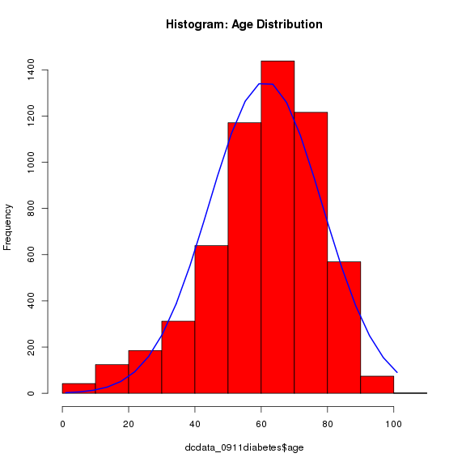

Chicago Hospital Discharge Data
========================================================

##STAGE 4: Summary


```r
setwd("~/ProfPeek")
source("install_load.R")
install_load("plyr", "stringr", "knitr", "Hmisc", "maptools", "RColorBrewer", 
    "classInt")

load("dcdata_all.Rda")

# keep admission years 2009-2011 only..
dcdata_0911 <- dcdata_all[dcdata_all$wrongyear != 1 & !is.na(dcdata_all$wrongyear), 
    ]
count(dcdata_0911, c("admityear"), )
```

```
##   admityear  freq
## 1      2009 28979
## 2      2010 28270
## 3      2011 28710
```

```r

# how many has diabetes-related DX?
count(dcdata_0911, c("encountDX_flag"), )
```

```
##   encountDX_flag  freq
## 1              0 84618
## 2              1  1341
```

```r
# dcdata_0911diabetes<-dcdata_0911[dcdata_0911$wrongyear!=1 &
# !is.na(dcdata_0911$wrongyear) & dcdata_0911$encountDX_flag==1,]
dcdata_0911diabetes <- dcdata_0911[dcdata_0911$wrongyear != 1 & !is.na(dcdata_0911$wrongyear) & 
    (dcdata_0911$encountDX_flag == 1 | dcdata_0911$problemDX_flag == 1), ]

# by year?
count(dcdata_0911diabetes, c("admityear", "encountDX_flag"), )
```

```
##   admityear encountDX_flag freq
## 1      2009              0    4
## 2      2009              1  427
## 3      2010              0    5
## 4      2010              1  435
## 5      2011              0    8
## 6      2011              1  479
```

```r

# by sex
count(dcdata_0911diabetes, c("sex"), )
```

```
##   sex freq
## 1   F  728
## 2   M  630
```

```r

# by sex & year
count(dcdata_0911diabetes, c("admityear", "sex"), )
```

```
##   admityear sex freq
## 1      2009   F  233
## 2      2009   M  198
## 3      2010   F  236
## 4      2010   M  204
## 5      2011   F  259
## 6      2011   M  228
```

```r

# by race & hispanic origin
count(dcdata_0911diabetes, c("race", "ethnic_group"), )
```

```
##                                      race           ethnic_group freq
## 1        American Indian or Alaska Native Not Hispanic or Latino    1
## 2                    Asian/Mideast Indian Not Hispanic or Latino    3
## 3                  Black/African-American     Hispanic or Latino    1
## 4                  Black/African-American Not Hispanic or Latino  972
## 5                  Black/African-American                Unknown   38
## 6                      More than one Race     Hispanic or Latino   11
## 7  Native Hawaiian/Other Pacific Islander     Hispanic or Latino    1
## 8  Native Hawaiian/Other Pacific Islander Not Hispanic or Latino    3
## 9                                 Unknown     Hispanic or Latino   20
## 10                                Unknown Not Hispanic or Latino    3
## 11                                Unknown                Unknown   61
## 12                                  White     Hispanic or Latino   27
## 13                                  White Not Hispanic or Latino  190
## 14                                  White                Unknown   27
```

```r

# by age
summary(dcdata_0911diabetes$age)
```

```
##    Min. 1st Qu.  Median    Mean 3rd Qu.    Max. 
##     0.0    31.0    53.0    48.5    66.0    95.0
```

```r
histg <- hist(dcdata_0911diabetes$age, col = "red")
xfit <- seq(min(dcdata_0911diabetes$age), max(dcdata_0911diabetes$age), length = 25)
yfit <- dnorm(xfit, mean = mean(dcdata_0911diabetes$age), sd = sd(dcdata_0911diabetes$age))
yfit <- yfit * diff(histg$mids[1:2]) * length(dcdata_0911diabetes$age)
lines(xfit, yfit, col = "blue", lwd = 2)
```

 

```r

# by race & hispanic origin
count(dcdata_0911diabetes, c("race", "ethnic_group"), )
```

```
##                                      race           ethnic_group freq
## 1        American Indian or Alaska Native Not Hispanic or Latino    1
## 2                    Asian/Mideast Indian Not Hispanic or Latino    3
## 3                  Black/African-American     Hispanic or Latino    1
## 4                  Black/African-American Not Hispanic or Latino  972
## 5                  Black/African-American                Unknown   38
## 6                      More than one Race     Hispanic or Latino   11
## 7  Native Hawaiian/Other Pacific Islander     Hispanic or Latino    1
## 8  Native Hawaiian/Other Pacific Islander Not Hispanic or Latino    3
## 9                                 Unknown     Hispanic or Latino   20
## 10                                Unknown Not Hispanic or Latino    3
## 11                                Unknown                Unknown   61
## 12                                  White     Hispanic or Latino   27
## 13                                  White Not Hispanic or Latino  190
## 14                                  White                Unknown   27
```

```r

# by center
count(dcdata_0911diabetes, c("center_name"), )
```

```
##                       center_name freq
## 1                          Cancer    4
## 2    Center for Advanced Medicine   10
## 3                  Comer Hospital  212
## 4             Medical Specialties   13
## 5               Mitchell Hospital 1095
## 6 University of Chicago Hospitals   21
## 7               Women's Specialty    1
## 8                            <NA>    2
```

```r

# by department
count(dcdata_0911diabetes, c("department_name"), )
```

```
##        department_name freq
## 1       ADULT CATH LAB   16
## 2                 CCH5   58
## 3                 CCH6   41
## 4       CHEST ONCOLOGY    1
## 5                 CICU    8
## 6                 D2IC    1
## 7                 D3IC    3
## 8                 D4IC    3
## 9                 D5IC   14
## 10                D6IC    3
## 11   ELECTROPHYSIOLOGY    4
## 12       ENDOCRINOLOGY    5
## 13 GAST PROCEDURE UNIT    1
## 14            GMI DCAM    1
## 15                GPCU    1
## 16 HEMATOLOGY/ONCOLOGY    4
## 17                IMER    1
## 18         IR MITCHELL    5
## 19          NEPHROLOGY    7
## 20     OB/GYN ONCOLOGY    1
## 21                PICU  105
## 22        RHEUMATOLOGY    1
## 23                T2BR    1
## 24                T3NO   16
## 25                T3SE   38
## 26                T3SW   18
## 27                T4NE   26
## 28                T4NW  103
## 29                T4SE   50
## 30                T4SW   58
## 31                T5NE   50
## 32                T5NW  305
## 33                T5SE  209
## 34                T5SW  108
## 35                T6IC   35
## 36                T6NE   33
## 37                T6NW    5
## 38                T6SW   15
## 39        VASCULAR LAB    3
## 40              X T3NA    1
```

```r

# by service
count(dcdata_0911diabetes, c("service_name"), )
```

```
##                            service_name freq
## 1                    BURN PATIENT ADULT    6
## 2                   CARDIAC CATH CLINIC    1
## 3                       CARDIAC SURGERY   26
## 4                            CARDIOLOGY  134
## 5                      GENERAL MEDICINE  523
## 6                       GENERAL SURGERY   14
## 7                         GYNE ONCOLOGY    4
## 8                            GYNECOLOGY    3
## 9                   HEMATOLOGY/ONCOLOGY   61
## 10               Hospitalist Cardiology    2
## 11         Hospitalist General Medicine    6
## 12 Hospitalist Interventional Radiology    1
## 13                    Hospitalist Liver    2
## 14         Hospitalist Renal Transplant    2
## 15           INFLAMMATORY BOWEL DISEASE    1
## 16                        LIVER SERVICE   15
## 17           LUNG TRANSPLANT (MEDICINE)    1
## 18       MEDICAL INTENSIVE CARE SERVICE   37
## 19                            NEUROLOGY   51
## 20                         NEUROSURGERY    9
## 21                           OBSTETRICS   21
## 22                   OBSTETRICS PRIVATE    1
## 23                          ORTHOPEDICS   57
## 24                       OTOLARYNGOLOGY    2
## 25                   PEDIATRIC GI/LIVER    4
## 26        PEDIATRIC HEMATOLOGY/ONCOLOGY    1
## 27             PEDIATRIC INTENSIVE CARE  112
## 28                  PEDIATRIC NEUROLOGY    4
## 29               PEDIATRIC NEUROSURGERY    1
## 30                    PEDIATRIC SURGERY    1
## 31                      PLASTIC SURGERY   11
## 32                 PRE-HEART TRANSPLANT    5
## 33         Pediatric Endocrine/Diabetes   69
## 34                    Pediatric General   19
## 35                  Pediatric Pulmonary    1
## 36                     THORACIC SURGERY    2
## 37                   TRANSPLANT SURGERY   65
## 38                              UROLOGY    8
## 39                     VASCULAR SURGERY   75
```

```r

# by ed_flag
count(dcdata_0911diabetes, c("ed_flag"), )
```

```
##   ed_flag freq
## 1       0  474
## 2       1  884
```

```r

# by fin_class
count(dcdata_0911diabetes, c("fin_class"), )
```

```
##         fin_class freq
## 1      BLUE CROSS  168
## 2    CHARITY CARE   32
## 3      COMMERCIAL   11
## 4  GRANTS & FUNDS    2
## 5         HMO/POS   48
## 6        MEDICAID  386
## 7        MEDICARE  614
## 8  Minor Programs   33
## 9             PPO   54
## 10       SELF-PAY   10
```

```r

# by community
count(dcdata_0911diabetes, c("community"), )
```

```
##                 community freq
## 1          ARCHER HEIGHTS    1
## 2           ARMOUR SQUARE    4
## 3                 ASHBURN   11
## 4          AUBURN GRESHAM   48
## 5                  AUSTIN    2
## 6             AVALON PARK   25
## 7                AVONDALE    1
## 8          BELMONT CRAGIN    2
## 9                 BEVERLY    3
## 10          BRIGHTON PARK    1
## 11               BURNSIDE    6
## 12        CALUMET HEIGHTS   11
## 13                CHATHAM   51
## 14           CHICAGO LAWN   23
## 15                DOUGLAS   12
## 16                DUNNING    1
## 17              EAST SIDE   12
## 18              EDGEWATER    1
## 19              ENGLEWOOD   41
## 20            FULLER PARK    3
## 21              GAGE PARK    2
## 22         GARFIELD RIDGE    3
## 23        GRAND BOULEVARD   40
## 24 GREATER GRAND CROSSING   96
## 25              HEGEWISCH    3
## 26              HYDE PARK   59
## 27                KENWOOD   44
## 28           LOGAN SQUARE    1
## 29                   LOOP    1
## 30        LOWER WEST SIDE    1
## 31            MORGAN PARK   16
## 32        MOUNT GREENWOOD    3
## 33        NEAR NORTH SIDE    4
## 34        NEAR SOUTH SIDE    1
## 35               NEW CITY   20
## 36           NORTH CENTER    1
## 37         NORTH LAWNDALE    1
## 38                OAKLAND    7
## 39                  OHARE    1
## 40                PULLMAN    5
## 41              RIVERDALE    1
## 42            ROGERS PARK    2
## 43               ROSELAND   22
## 44          SOUTH CHICAGO   50
## 45          SOUTH DEERING    8
## 46            SOUTH SHORE   71
## 47                 UPTOWN    5
## 48     WASHINGTON HEIGHTS   23
## 49        WASHINGTON PARK   34
## 50            WEST ELSDON    1
## 51         WEST ENGLEWOOD   29
## 52              WEST LAWN    1
## 53           WEST PULLMAN   16
## 54             WEST RIDGE    4
## 55              WEST TOWN    2
## 56               WOODLAWN  110
## 57                   <NA>  411
```

```r

stateplane <- CRS("+proj=tmerc +lat_0=36.66666666666666 +lon_0=-88.33333333333333 +k=0.999975 +x_0=300000 +y_0=0 +ellps=GRS80 +datum=NAD83 +to_meter=0.3048006096012192")
ca <- readShapeSpatial("CommAreas.shp", ID = "AREA_NUMBE", proj4string = stateplane)
dcdata_0911map <- dcdata_0911diabetes[!is.na(dcdata_0911diabetes$area_numbe), 
    c("area_numbe", "community")]
dcdata_0911map$count <- 1
dcdata_mapready <- aggregate(dcdata_0911map["count"], by = dcdata_0911map["area_numbe"], 
    FUN = sum)
ca@data <- merge(ca@data, dcdata_mapready, by.x = c("AREA_NUMBE"), by.y = c("area_numbe"), 
    all.x = TRUE)
# the ca numbers are factor - can't use for labeling as they are now
ca@data$AREA_NUM_1 <- as.numeric(levels(ca@data$AREA_NUM_1))
# sort by the ca number first
ca@data <- ca@data[order(ca@data$AREA_NUM_1), ]
caxy <- coordinates(ca)
cntdiabetes <- ca@data$count
nclr <- 5
colors <- brewer.pal(nclr, "YlOrBr")
class <- classIntervals(cntdiabetes, nclr, style = "quantile")
colorcode <- findColours(class, colors)
plot(ca, col = colorcode)
title(main = "Diabetes-related Discharge \nCount by Community Area")
text(caxy, labels = ca@data$AREA_NUM_1, cex = 0.6)
legend("topright", legend = names(attr(colorcode, "table")), fill = attr(colorcode, 
    "palette"), cex = 0.8, bty = "n")
```

 


