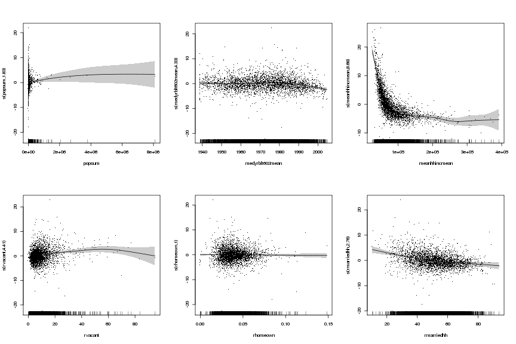
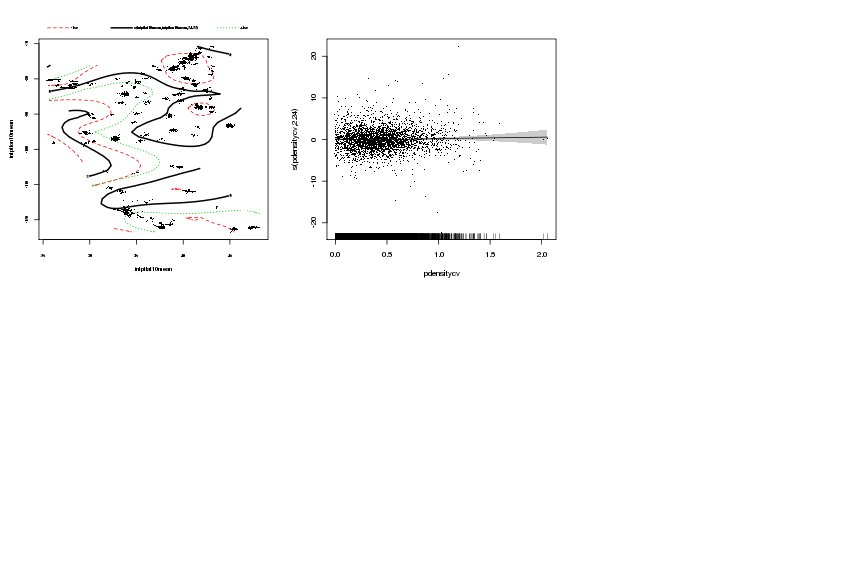
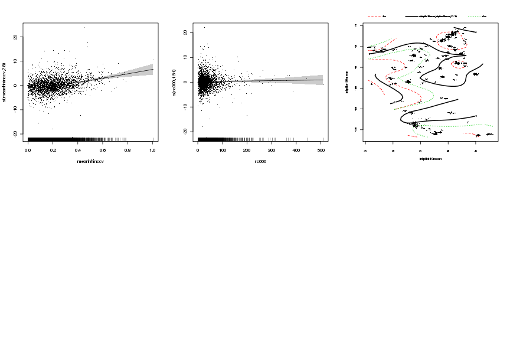
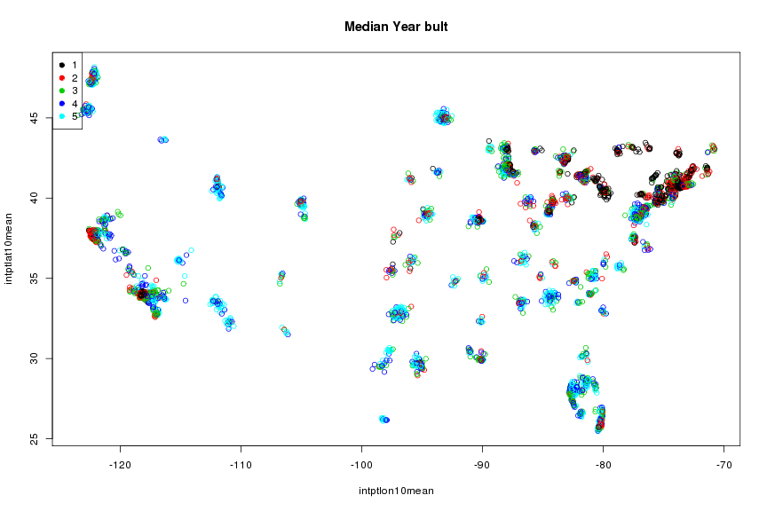
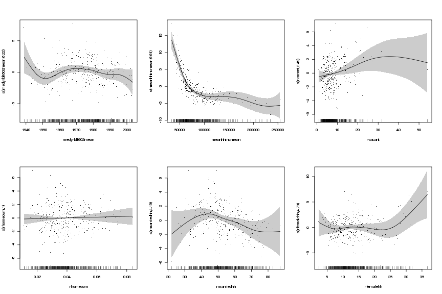
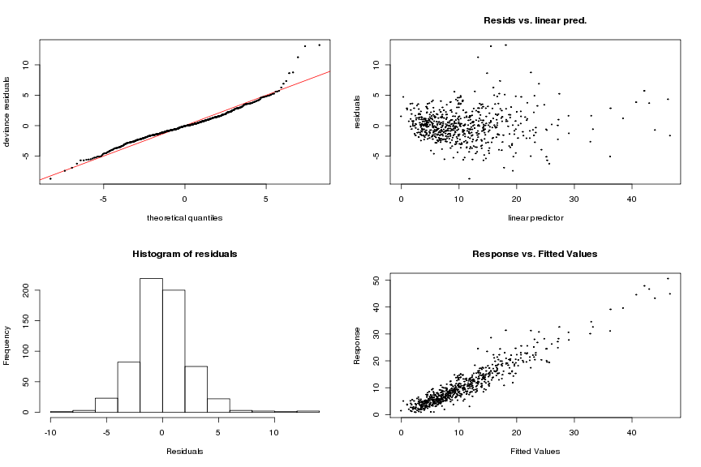

Changing Geography - model experiments
========================================================

This is the result of my experiments using the data collected for projects so far.


```r
# install.packages('knitr') install.packages('Hmisc')
# install.packages('spdep') install.packages('lme4')
# install.packages('library')
library(Hmisc)
library(knitr)
library(spdep)
library(lme4)
library(foreign)
library(plm)
```

```
## Error: there is no package called 'plm'
```

```r
library(tree)
setwd("/mnt/ide0/home/cmaene/ProfAllard/modeling")
# data0010<-read.csv('modelingready.csv',sep=',',header=T)
# data0010<-read.dta('modelingready.dta')
data0010 <- stata.get("modelingready.dta")
place10 <- stata.get("place10_pop10_allplaces.dta")
# str(data0010) head(place10)
data0010$year <- as.factor(data0010$year)
dim(data0010)
```

```
## [1] 145338     34
```

```r
table(is.na(data0010))
```

```
## 
##   FALSE    TRUE 
## 4880608   60884
```

```r
hist(log(data0010$povpop100))
```

 

```r
hist(log(data0010$povpop200))
```

 

```r
# use 'rate' instead..
# data0010$pov100rate<-data0010$povpop100/data0010$pop*100
# data0010$pov200rate<-data0010$povpop200/data0010$pop*100
# hist(log(data0010$pov100rate)) hist(log(data0010$pov200rate)) time
# series data0010ts<-ts(data0010, start=c(2000), end=c(2010),
# frequency=1/10, deltat=10) data0010ts$lagpov100rate<-lag(pov100rate,-1,
# na.pad = TRUE) plot(data0010ts[,11:12]) focus on 71 data only
keep10 <- data0010[(data0010$year == "2010"), ]
dim(keep10)
```

```
## [1] 72669    34
```

```r
# focus on tracts with place FIPS code only - need to remove plc10fips=='
# ' use regular expression
keep10grep <- grep("[0-9]", keep10$plc10fips)
keep10 <- keep10[keep10grep, ]
dim(keep10)
```

```
## [1] 46704    34
```

```r
# also remove plc10fips=='xx99999' & Hawaii (won't fit well in lat/lon
# plot)
keep10gre2 <- grep("[0-9][0-9]99999", keep10$plc10fips)
hawaiigrep <- grep("15[0-9][0-9][0-9][0-9][0-9]", keep10$plc10fips)
keep10 <- keep10[-c(keep10gre2), ]
dim(keep10)
```

```
## [1] 38644    34
```

```r
keep10 <- keep10[-c(hawaiigrep), ]
dim(keep10)
```

```
## [1] 38400    34
```

```r
# keep variable necessary for city level data
adata10 <- keep10[, -c(1:4, 7, 9, 12)]
dim(adata10)
```

```
## [1] 38400    27
```

```r
# head(adata10) aggregate 1: sums
plcsum <- aggregate(. ~ plc10fips, data = adata10, sum)
# rename vars by adding 'mean' at the end of original col.names
n <- names(plcsum)
newname <- list(dim(plcsum)[2])  #create an empty list object - using dimension/var's #
for (i in c(2:length(n))) {
    tname <- paste0(n[i], "sum")
    newname <- c(newname, tname)
}
newname[1] <- "plc10fips"
names(plcsum) <- newname
# head(plcsum)
rm(newname)

# aggregate 2: means
plcmean <- aggregate(. ~ plc10fips, data = adata10, mean)
# rename vars by adding 'mean' at the end of original col.names
n <- names(plcmean)
newname <- list(dim(plcmean)[2])  #create an empty list object - using dimension/var's #
for (i in c(2:length(n))) {
    tname <- paste0(n[i], "mean")
    newname <- c(newname, tname)
}
newname[1] <- "plc10fips"
names(plcmean) <- newname
# head(plcmean)
rm(newname)

# aggregate 3: SD
plcsd <- aggregate(. ~ plc10fips, data = adata10, sd)
# rename vars by adding 'mean' at the end of original col.names
n <- names(plcsd)
newname <- list(dim(plcsd)[2])  #create an empty list object - using dimension/var's #
for (i in c(2:length(n))) {
    tname <- paste0(n[i], "sd")
    newname <- c(newname, tname)
}
newname[1] <- "plc10fips"
names(plcsd) <- newname
# head(plcsd)
rm(newname)

# merge three aggregated data
plc10data <- merge(place10, plcsum, by = "plc10fips", all.x = TRUE)
plc10data <- merge(plc10data, plcmean, by = "plc10fips", all.x = TRUE)
plc10data <- merge(plc10data, plcsd, by = "plc10fips", all.x = TRUE)
dim(plc10data)
```

```
## [1] 29514    81
```

```r

# get ready for analyses
complete <- complete.cases(plc10data)
analysisdata <- plc10data[complete, ]
dim(analysisdata)
```

```
## [1] 3263   81
```

```r
hawaiigrep2 <- grep("15[0-9][0-9][0-9][0-9][0-9]", analysisdata$plc10fips)
# head(analysisdata[c(hawaiigrep2),])
analysisdata <- analysisdata[-c(hawaiigrep2), ]
dim(analysisdata)
```

```
## [1] 3238   81
```

```r
analysisdata$hmedyrbltcv <- analysisdata$medyrblt602sd/analysisdata$medyrblt602mean
analysisdata$pdensitycv <- analysisdata$pdensitysd/analysisdata$pdensitymean
analysisdata$rvacant <- analysisdata$vacanthusum/analysisdata$husum * 100
analysisdata$rhomeown <- analysisdata$homeownrsum/analysisdata$husum * 100
analysisdata$rmarriedhh <- analysisdata$hhfamaridsum/analysisdata$hhsum * 100
analysisdata$rfemalehh <- analysisdata$fampast13sum/analysisdata$hhsum * 100
analysisdata$rwoearnhh <- analysisdata$hhwoearnsum/analysisdata$hhsum * 100
analysisdata$rnhwhite <- analysisdata$nhwhtsum/analysisdata$popsum * 100
analysisdata$rnhblack <- analysisdata$nhblksum/analysisdata$popsum * 100
analysisdata$rnhnameri <- analysisdata$nhamisum/analysisdata$popsum * 100
analysisdata$rnhasian <- analysisdata$nhasasum/analysisdata$popsum * 100
analysisdata$rhispanic <- analysisdata$hspsum/analysisdata$popsum * 100
analysisdata$rforeign <- analysisdata$foreignsum/analysisdata$popsum * 100
analysisdata$rageund18 <- analysisdata$ageun18sum/analysisdata$popsum * 100
analysisdata$rage65ov <- analysisdata$age65ovsum/analysisdata$popsum * 100
analysisdata$meanhhinccv <- analysisdata$meanhhincsd/analysisdata$meanhhincmean
analysisdata$rc000 <- analysisdata$c000sum/analysisdata$popsum * 100
analysisdata$c000cv <- analysisdata$c000sd/analysisdata$c000mean
analysisdata$rpovpop100 <- analysisdata$povpop100sum/analysisdata$popsum * 100
# check distribution - log makes sense
hist(analysisdata$rpovpop100)
```

 

```r
hist(log(analysisdata$rpovpop100))
```

 

```r
# check distribution of covariates I am interested in
x <- c("medyrblt602mean", "hmedyrbltcv", "pdensitycv", "rvacant", "rhomeown", 
    "rmarriedhh", "rfemalehh", "rwoearnhh", "rnhwhite", "nnhblack", "rnnameri", 
    "rnhasian", "rhispanic", "rforeign", "rageund18", "rage65ov", "meanhhincmean", 
    "meanhhinccv", "rc000", "c000cv", "intptlat10mean", "intptlon10mean")
# x<-c('medyrblt602mean', 'hmedyrbltcv')
length(x)
```

```
## [1] 22
```

```r
par(mfrow = c(3, 4))
for (i in c(1:length(x))) {
    histvarlog <- names(analysisdata) %in% c(x[i])
    histvarind <- which(histvarlog)
    hist(analysisdata[, histvarind], main = x[i])
}
```

 

```r
# dev.off() # use this if start getting ploting error (Error in plot.new()
# : figure margins too large)
par(mfrow = c(1, 1))
```

 

```r
# response var should be log transformed -
analysisdata$lrpovpop100 <- log(analysisdata$rpovpop100)
# classification formula - no log transformation
treeform <- formula(rpovpop100 ~ medyrblt602mean + hmedyrbltcv + pdensitycv + 
    rvacant + rhomeown + rmarriedhh + rfemalehh + rwoearnhh + rnhwhite + rnhblack + 
    rnhnameri + rnhasian + rhispanic + +rforeign + rageund18 + rage65ov + meanhhincmean + 
    meanhhinccv + rc000 + c000cv + intptlat10mean + intptlon10mean)
tree1 <- tree(treeform, data = analysisdata, minsize = 1)
summary(tree1)
```

```
## 
## Regression tree:
## tree(formula = treeform, data = analysisdata, minsize = 1)
## Variables actually used in tree construction:
## [1] "meanhhincmean" "rageund18"     "rnhwhite"      "rmarriedhh"   
## Number of terminal nodes:  9 
## Residual mean deviance:  14.7 = 47500 / 3230 
## Distribution of residuals:
##    Min. 1st Qu.  Median    Mean 3rd Qu.    Max. 
##  -18.90   -2.26   -0.26    0.00    2.02   32.90
```

```r
tree1
```

```
## node), split, n, deviance, yval
##       * denotes terminal node
## 
##  1) root 3238 2e+05 10  
##    2) meanhhincmean < 58955 808 5e+04 20  
##      4) meanhhincmean < 44679 186 1e+04 30  
##        8) rageund18 < 34.3637 168 8e+03 30  
##         16) rnhwhite < 60.8685 102 4e+03 30 *
##         17) rnhwhite > 60.8685 66 1e+03 20 *
##        9) rageund18 > 34.3637 18 1e+03 40 *
##      5) meanhhincmean > 44679 622 2e+04 20  
##       10) rnhwhite < 61.8148 317 8e+03 20 *
##       11) rnhwhite > 61.8148 305 9e+03 20 *
##    3) meanhhincmean > 58955 2430 5e+04  8  
##      6) meanhhincmean < 78320.3 967 2e+04 10  
##       12) rnhwhite < 70.5978 501 9e+03 10 *
##       13) rnhwhite > 70.5978 466 4e+03  9 *
##      7) meanhhincmean > 78320.3 1463 1e+04  6  
##       14) rmarriedhh < 51.4059 311 4e+03  8 *
##       15) rmarriedhh > 51.4059 1152 7e+03  5 *
```

```r
plot(tree1)
text(tree1, digits = 3)
```

 

```r
# drop vars analysisdata<-analysisdata[,!names(analysisdata) %in%
# 'popclass'] tree by the size of population - 4 quantiles
analysisdata$popclass <- cut(analysisdata$popsum, breaks = quantile(analysisdata$popsum, 
    probs = 0:10/10), include.lowest = TRUE, labels = 1:10)
# head(analysisdata$popclass)
par(mfrow = c(2, 2))
x <- c(1:10)
for (i in c(1:length(x))) {
    tree2data <- analysisdata[(analysisdata$popclass == x[i]), ]
    tree2 <- tree(treeform, data = tree2data, minsize = 5)
    plot(tree2)
    text(tree2, digits = 3)
    title(main = x[i])
    print(paste0("Tree By PopClass = ", i))
    print(tree2)
    print(summary(tree2))
}
```

```
## [1] "Tree By PopClass = 1"
## node), split, n, deviance, yval
##       * denotes terminal node
## 
##  1) root 324 20000 10  
##    2) meanhhincmean < 49583.8 64  5000 20  
##      4) rageund18 < 33.6849 61  3000 20  
##        8) rfemalehh < 23.3617 47  1000 20  
##         16) rhomeown < 0.0554308 37   900 20  
##           32) meanhhincmean < 38015.3 5    20 30 *
##           33) meanhhincmean > 38015.3 32   600 20 *
##         17) rhomeown > 0.0554308 10   100 10 *
##        9) rfemalehh > 23.3617 14   600 30  
##         18) hmedyrbltcv < 0.00379264 11   400 30 *
##         19) hmedyrbltcv > 0.00379264 3    30 40 *
##      5) rageund18 > 33.6849 3   200 40 *
##    3) meanhhincmean > 49583.8 260  7000  8  
##      6) meanhhincmean < 65784.2 79  2000 10  
##       12) rhispanic < 5.95579 41   400 10 *
##       13) rhispanic > 5.95579 38   900 20 *
##      7) meanhhincmean > 65784.2 181  2000  6  
##       14) meanhhincmean < 103974 113  1000  7  
##         28) rvacant < 9.59322 77   500  6 *
##         29) rvacant > 9.59322 36   600 10  
##           58) rageund18 < 24.5465 31   300  8 *
##           59) rageund18 > 24.5465 5    40 20 *
##       15) meanhhincmean > 103974 68   300  4 *
## 
## Regression tree:
## tree(formula = treeform, data = tree2data, minsize = 5)
## Variables actually used in tree construction:
## [1] "meanhhincmean" "rageund18"     "rfemalehh"     "rhomeown"     
## [5] "hmedyrbltcv"   "rhispanic"     "rvacant"      
## Number of terminal nodes:  12 
## Residual mean deviance:  12 = 3740 / 312 
## Distribution of residuals:
##    Min. 1st Qu.  Median    Mean 3rd Qu.    Max. 
## -10.500  -2.140  -0.171   0.000   1.900  13.200
```

```
## [1] "Tree By PopClass = 2"
## node), split, n, deviance, yval
##       * denotes terminal node
## 
##  1) root 324 20000 10  
##    2) meanhhincmean < 52280.1 56  4000 20  
##      4) rfemalehh < 18.4613 35   700 20 *
##      5) rfemalehh > 18.4613 21  2000 30  
##       10) rageund18 < 33.6758 18   900 30  
##         20) intptlon10mean < -81.8617 8   100 30 *
##         21) intptlon10mean > -81.8617 10   300 20 *
##       11) rageund18 > 33.6758 3    40 50 *
##    3) meanhhincmean > 52280.1 268  6000  8  
##      6) meanhhincmean < 78336.5 119  2000 10  
##       12) meanhhincmean < 59017.9 41   800 10 *
##       13) meanhhincmean > 59017.9 78   900 10 *
##      7) meanhhincmean > 78336.5 149  1000  5  
##       14) rmarriedhh < 51.0577 31   300  7 *
##       15) rmarriedhh > 51.0577 118   600  4 *
## 
## Regression tree:
## tree(formula = treeform, data = tree2data, minsize = 5)
## Variables actually used in tree construction:
## [1] "meanhhincmean"  "rfemalehh"      "rageund18"      "intptlon10mean"
## [5] "rmarriedhh"    
## Number of terminal nodes:  8 
## Residual mean deviance:  11.6 = 3670 / 316 
## Distribution of residuals:
##    Min. 1st Qu.  Median    Mean 3rd Qu.    Max. 
## -10.200  -2.160  -0.315   0.000   1.780   9.530
```

```
## [1] "Tree By PopClass = 3"
## node), split, n, deviance, yval
##       * denotes terminal node
## 
##  1) root 324 20000 10  
##    2) meanhhincmean < 58988.9 78  4000 20  
##      4) meanhhincmean < 41828.4 11   300 30 *
##      5) meanhhincmean > 41828.4 67  2000 20  
##       10) rfemalehh < 14.1704 24   300 10  
##         20) rhispanic < 18.8886 20   100 10 *
##         21) rhispanic > 18.8886 4    40 20 *
##       11) rfemalehh > 14.1704 43   900 20 *
##    3) meanhhincmean > 58988.9 246  5000  7  
##      6) meanhhincmean < 78487.4 85  1000 10  
##       12) rhispanic < 4.47999 32   200  8 *
##       13) rhispanic > 4.47999 53   900 10  
##         26) rfemalehh < 20.5028 50   600 10 *
##         27) rfemalehh > 20.5028 3    60 20 *
##      7) meanhhincmean > 78487.4 161  1000  5  
##       14) rhispanic < 20.0333 144   700  4 *
##       15) rhispanic > 20.0333 17   300  9 *
## 
## Regression tree:
## tree(formula = treeform, data = tree2data, minsize = 5)
## Variables actually used in tree construction:
## [1] "meanhhincmean" "rfemalehh"     "rhispanic"    
## Number of terminal nodes:  9 
## Residual mean deviance:  10.2 = 3220 / 315 
## Distribution of residuals:
##    Min. 1st Qu.  Median    Mean 3rd Qu.    Max. 
##  -9.350  -1.980  -0.396   0.000   1.740  11.600
```

 

```
## [1] "Tree By PopClass = 4"
## node), split, n, deviance, yval
##       * denotes terminal node
## 
##  1) root 323 20000 10  
##    2) meanhhincmean < 59365.6 79  6000 20  
##      4) meanhhincmean < 37517.4 5    50 40 *
##      5) meanhhincmean > 37517.4 74  3000 20  
##       10) rfemalehh < 13.5592 24   500 10  
##         20) rnhwhite < 83.5268 11   200 20 *
##         21) rnhwhite > 83.5268 13    70 10 *
##       11) rfemalehh > 13.5592 50  2000 20  
##         22) meanhhincmean < 41678.6 6   200 30 *
##         23) meanhhincmean > 41678.6 44   800 20 *
##    3) meanhhincmean > 59365.6 244  5000  7  
##      6) meanhhincmean < 84594.4 122  2000 10  
##       12) rhispanic < 37.2455 99  1000  9  
##         24) rvacant < 9.38156 66   400  8 *
##         25) rvacant > 9.38156 33   600 10 *
##       13) rhispanic > 37.2455 23   500 20 *
##      7) meanhhincmean > 84594.4 122   700  4 *
## 
## Regression tree:
## tree(formula = treeform, data = tree2data, minsize = 5)
## Variables actually used in tree construction:
## [1] "meanhhincmean" "rfemalehh"     "rnhwhite"      "rhispanic"    
## [5] "rvacant"      
## Number of terminal nodes:  9 
## Residual mean deviance:  10.8 = 3400 / 314 
## Distribution of residuals:
##    Min. 1st Qu.  Median    Mean 3rd Qu.    Max. 
## -10.600  -2.000  -0.218   0.000   1.950  13.000
```

```
## [1] "Tree By PopClass = 5"
## node), split, n, deviance, yval
##       * denotes terminal node
## 
##  1) root 324 20000 10  
##    2) meanhhincmean < 55838.2 66  4000 20  
##      4) rnhwhite < 10.6342 9   400 30  
##        8) rmarriedhh < 60.0379 7   100 30 *
##        9) rmarriedhh > 60.0379 2    10 40 *
##      5) rnhwhite > 10.6342 57  2000 20  
##       10) rmarriedhh < 30.5135 7   400 30  
##         20) rage65ov < 10.4983 3    70 40 *
##         21) rage65ov > 10.4983 4    50 20 *
##       11) rmarriedhh > 30.5135 50  1000 20  
##         22) rnhwhite < 87.4626 42   900 20  
##           44) rage65ov < 9.5652 8   100 10 *
##           45) rage65ov > 9.5652 34   500 20 *
##         23) rnhwhite > 87.4626 8    70 10 *
##    3) meanhhincmean > 55838.2 258  4000  7  
##      6) meanhhincmean < 82001.5 126  2000 10  
##       12) rhispanic < 14.1628 88   800  9  
##         24) meanhhincmean < 68957.1 44   300 10 *
##         25) meanhhincmean > 68957.1 44   200  7 *
##       13) rhispanic > 14.1628 38   600 10 *
##      7) meanhhincmean > 82001.5 132   800  5  
##       14) rmarriedhh < 58.7389 52   300  6 *
##       15) rmarriedhh > 58.7389 80   300  4 *
## 
## Regression tree:
## tree(formula = treeform, data = tree2data, minsize = 5)
## Variables actually used in tree construction:
## [1] "meanhhincmean" "rnhwhite"      "rmarriedhh"    "rage65ov"     
## [5] "rhispanic"    
## Number of terminal nodes:  12 
## Residual mean deviance:  8.59 = 2680 / 312 
## Distribution of residuals:
##    Min. 1st Qu.  Median    Mean 3rd Qu.    Max. 
##  -9.980  -1.760  -0.293   0.000   1.500  11.200
```

```
## [1] "Tree By PopClass = 6"
## node), split, n, deviance, yval
##       * denotes terminal node
## 
##  1) root 324 20000 10  
##    2) meanhhincmean < 60929.4 86  7000 20  
##      4) rageund18 < 36.1633 82  3000 20  
##        8) meanhhincmean < 46664.2 20   600 20  
##         16) rageund18 < 23.4452 8    70 20 *
##         17) rageund18 > 23.4452 12   200 30 *
##        9) meanhhincmean > 46664.2 62  2000 20  
##         18) rageund18 < 20.6298 13   300 10 *
##         19) rageund18 > 20.6298 49   900 20  
##           38) rage65ov < 8.18631 8   200 20 *
##           39) rage65ov > 8.18631 41   500 20 *
##      5) rageund18 > 36.1633 4   300 50 *
##    3) meanhhincmean > 60929.4 238  3000  7  
##      6) meanhhincmean < 84359.1 115  1000  9  
##       12) rforeign < 12.1705 75   500  8 *
##       13) rforeign > 12.1705 40   400 10 *
##      7) meanhhincmean > 84359.1 123   700  5 *
## 
## Regression tree:
## tree(formula = treeform, data = tree2data, minsize = 5)
## Variables actually used in tree construction:
## [1] "meanhhincmean" "rageund18"     "rage65ov"      "rforeign"     
## Number of terminal nodes:  9 
## Residual mean deviance:  9.92 = 3130 / 315 
## Distribution of residuals:
##    Min. 1st Qu.  Median    Mean 3rd Qu.    Max. 
## -11.900  -1.720  -0.198   0.000   1.590  13.500
```

```
## [1] "Tree By PopClass = 7"
## node), split, n, deviance, yval
##       * denotes terminal node
## 
##  1) root 323 20000 10  
##    2) meanhhincmean < 58641.1 64  3000 20  
##      4) meanhhincmean < 39714.1 5   200 30 *
##      5) meanhhincmean > 39714.1 59  2000 20  
##       10) rageund18 < 30.9768 46   800 20  
##         20) rmarriedhh < 42.1764 28   300 20 *
##         21) rmarriedhh > 42.1764 18   200 10 *
##       11) rageund18 > 30.9768 13   200 20 *
##    3) meanhhincmean > 58641.1 259  5000  8  
##      6) meanhhincmean < 76434.9 105  2000 10  
##       12) meanhhinccv < 0.317103 90   900 10  
##         24) rhispanic < 21.2261 66   500 10 *
##         25) rhispanic > 21.2261 24   200 10 *
##       13) meanhhinccv > 0.317103 15   300 20  
##         26) c000cv < 1.50589 12    60 10 *
##         27) c000cv > 1.50589 3    20 20 *
##      7) meanhhincmean > 76434.9 154  1000  6  
##       14) rmarriedhh < 52.7679 38   300  8 *
##       15) rmarriedhh > 52.7679 116   600  5 *
## 
## Regression tree:
## tree(formula = treeform, data = tree2data, minsize = 5)
## Variables actually used in tree construction:
## [1] "meanhhincmean" "rageund18"     "rmarriedhh"    "meanhhinccv"  
## [5] "rhispanic"     "c000cv"       
## Number of terminal nodes:  10 
## Residual mean deviance:  7.91 = 2480 / 313 
## Distribution of residuals:
##    Min. 1st Qu.  Median    Mean 3rd Qu.    Max. 
##  -6.200  -1.880  -0.311   0.000   1.470  10.500
```

 

```
## [1] "Tree By PopClass = 8"
## node), split, n, deviance, yval
##       * denotes terminal node
## 
##  1) root 324 10000 10  
##    2) meanhhincmean < 61988.1 80  3000 20  
##      4) meanhhincmean < 48830.8 24   800 30  
##        8) meanhhincmean < 40433 5    60 30 *
##        9) meanhhincmean > 40433 19   400 20  
##         18) rageund18 < 23.738 9   100 20 *
##         19) rageund18 > 23.738 10   100 30 *
##      5) meanhhincmean > 48830.8 56   900 20  
##       10) rfemalehh < 22.2251 46   600 20  
##         20) rforeign < 7.5672 18   200 10 *
##         21) rforeign > 7.5672 28   300 20 *
##       11) rfemalehh > 22.2251 10    70 20 *
##    3) meanhhincmean > 61988.1 244  3000  7  
##      6) meanhhincmean < 79503.3 83   700 10  
##       12) rforeign < 21.0613 57   300  9 *
##       13) rforeign > 21.0613 26   200 10 *
##      7) meanhhincmean > 79503.3 161  1000  6  
##       14) rhispanic < 25.9496 136   600  5  
##         28) rmarriedhh < 49.3926 18    70  8 *
##         29) rmarriedhh > 49.3926 118   300  5 *
##       15) rhispanic > 25.9496 25   200  9 *
## 
## Regression tree:
## tree(formula = treeform, data = tree2data, minsize = 5)
## Variables actually used in tree construction:
## [1] "meanhhincmean" "rageund18"     "rfemalehh"     "rforeign"     
## [5] "rhispanic"     "rmarriedhh"   
## Number of terminal nodes:  11 
## Residual mean deviance:  5.9 = 1850 / 313 
## Distribution of residuals:
##    Min. 1st Qu.  Median    Mean 3rd Qu.    Max. 
##  -7.200  -1.600  -0.227   0.000   1.590   8.020
```

```
## [1] "Tree By PopClass = 9"
## node), split, n, deviance, yval
##       * denotes terminal node
## 
##  1) root 324 20000 10  
##    2) meanhhincmean < 71984 139  5000 20  
##      4) meanhhincmean < 57631.2 72  2000 20  
##        8) meanhhincmean < 44743.8 9   100 30 *
##        9) meanhhincmean > 44743.8 63  1000 20  
##         18) rage65ov < 13.4213 43   600 20  
##           36) rageund18 < 31.9845 35   300 20 *
##           37) rageund18 > 31.9845 8    70 30 *
##         19) rage65ov > 13.4213 20   200 10 *
##      5) meanhhincmean > 57631.2 67   800 10  
##       10) rnhwhite < 67.0252 46   400 10 *
##       11) rnhwhite > 67.0252 21    90 10 *
##    3) meanhhincmean > 71984 185  2000  7  
##      6) meanhhincmean < 96165.3 90   900  8  
##       12) rforeign < 15.5956 52   200  7 *
##       13) rforeign > 15.5956 38   500 10 *
##      7) meanhhincmean > 96165.3 95   400  6 *
## 
## Regression tree:
## tree(formula = treeform, data = tree2data, minsize = 5)
## Variables actually used in tree construction:
## [1] "meanhhincmean" "rage65ov"      "rageund18"     "rnhwhite"     
## [5] "rforeign"     
## Number of terminal nodes:  9 
## Residual mean deviance:  7.38 = 2320 / 315 
## Distribution of residuals:
##    Min. 1st Qu.  Median    Mean 3rd Qu.    Max. 
##  -9.200  -1.570  -0.205   0.000   1.540  14.100
```

```
## [1] "Tree By PopClass = 10"
## node), split, n, deviance, yval
##       * denotes terminal node
## 
##  1) root 324 20000 10  
##    2) meanhhincmean < 72564.6 185  6000 20  
##      4) meanhhincmean < 52704 44   800 30  
##        8) meanhhincmean < 40622.1 6    50 30 *
##        9) meanhhincmean > 40622.1 38   300 20 *
##      5) meanhhincmean > 52704 141  2000 20  
##       10) meanhhinccv < 0.347975 61   800 10  
##         20) rfemalehh < 13.5017 19   100 10 *
##         21) rfemalehh > 13.5017 42   400 20 *
##       11) meanhhinccv > 0.347975 80  1000 20  
##         22) rfemalehh < 17.4932 67   600 20 *
##         23) rfemalehh > 17.4932 13   100 20 *
##    3) meanhhincmean > 72564.6 139  2000  9  
##      6) rmarriedhh < 43.5903 21   300 10 *
##      7) rmarriedhh > 43.5903 118   800  8  
##       14) rfemalehh < 11.2109 61   200  7 *
##       15) rfemalehh > 11.2109 57   300 10 *
## 
## Regression tree:
## tree(formula = treeform, data = tree2data, minsize = 5)
## Variables actually used in tree construction:
## [1] "meanhhincmean" "meanhhinccv"   "rfemalehh"     "rmarriedhh"   
## Number of terminal nodes:  9 
## Residual mean deviance:  7.6 = 2390 / 315 
## Distribution of residuals:
##    Min. 1st Qu.  Median    Mean 3rd Qu.    Max. 
##  -7.420  -1.980  -0.031   0.000   1.640  10.900
```

```r

# View(analysisdata[analysisdata$popclass==9,])
par(mfrow = c(1, 1))
```

 

```r
boxplot(rpovpop100 ~ factor(popclass), data = analysisdata)
```

 

```r

analysisdata$povclass <- cut(analysisdata$rpovpop100, breaks = quantile(analysisdata$rpovpop100, 
    probs = 0:5/5), include.lowest = TRUE, labels = 1:5)
# colors <- c('white','grey70','grey90','grey50','black')
plot(analysisdata[analysisdata$popclass == 10, c("intptlon10mean", "intptlat10mean")], 
    col = grey(1:5/5)[analysisdata$povclass], pch = 1)
```

 

```r
# legend('topleft', legend=levels(analysisdata$povclass),
# col=1+9*analysisdata$povclass, pch=19)
# View(analysisdata[analysisdata$popclass==10,c(1:3,7,8,100,102,103)]) The
# following is just to check - focusing on Illinois to see if color
# appears correctly
# exp<-grep('17[0-9][0-9][0-9][0-9][0-9]',analysisdata$plc10fips)
# subs<-analysisdata[c(exp),]
# plot(subs[subs$popclass==6,c('intptlon10mean','intptlat10mean')],
# col=grey(1:5/5)[subs$povclass],pch=20)
# View(subs[subs$popclass==6,c(1:3,7,8,100,103)])

plot(analysisdata[analysisdata$popclass == 10, c("intptlon10mean", "intptlat10mean")], 
    col = analysisdata$povclass, main = "Cities with the largest poplation")
legend("topleft", legend = levels(analysisdata$povclass), col = 1:length(analysisdata$povclass), 
    pch = 19)
```

 

```r
# ptree<-tree(lrpovpop100 ~ meanhhincmean + rmarriedhh)
# partition.tree(ptree) cplot(ptree) regression formula
# logform<-formula(lrpovpop100 ~ medyrblt602mean + hmedyrbltcv +
# pdensitycv + log(rvacant) + rhomeown + rmarriedhh + #rfemalehh +
# rwoearnhh + log(rnhwhite) + log(rnhblack) + log(rnhnameri) +
# log(rnhasian) + log(rhispanic) + log(rforeign) + rageund18 + rage65ov +
# meanhhincmean + meanhhinccv + log(rc000) + c000cv + intptlat10mean +
# intptlon10mean) ols<-lm(logform, data=analysisdata) summary(ols)
# fit<-step(ols)
```


GAM:


```r
library(mgcv)
# more
par(mfrow = c(2, 3))
popcls <- analysisdata[, c(8, 32, 49, 82:100, 30, 31)]
fit <- gam(rpovpop100 ~ s(popsum) + s(medyrblt602mean) + s(meanhhincmean) + 
    s(rvacant) + s(rhomeown) + s(rmarriedhh) + s(rfemalehh) + s(rwoearnhh) + 
    s(rnhwhite) + s(rnhblack) + s(rnhasian) + s(rhispanic) + s(rforeign) + s(rageund18) + 
    s(rage65ov) + s(meanhhinccv) + s(rc000) + s(c000cv) + s(intptlat10mean, 
    intptlon10mean) + s(pdensitycv), data = popcls)
summary(fit)
```

```
## 
## Family: gaussian 
## Link function: identity 
## 
## Formula:
## rpovpop100 ~ s(popsum) + s(medyrblt602mean) + s(meanhhincmean) + 
##     s(rvacant) + s(rhomeown) + s(rmarriedhh) + s(rfemalehh) + 
##     s(rwoearnhh) + s(rnhwhite) + s(rnhblack) + s(rnhasian) + 
##     s(rhispanic) + s(rforeign) + s(rageund18) + s(rage65ov) + 
##     s(meanhhinccv) + s(rc000) + s(c000cv) + s(intptlat10mean, 
##     intptlon10mean) + s(pdensitycv)
## 
## Parametric coefficients:
##             Estimate Std. Error t value Pr(>|t|)    
## (Intercept)  10.8770     0.0485     224   <2e-16 ***
## ---
## Signif. codes:  0 '***' 0.001 '**' 0.01 '*' 0.05 '.' 0.1 ' ' 1 
## 
## Approximate significance of smooth terms:
##                                    edf Ref.df      F p-value    
## s(popsum)                         1.83   2.22   2.93  0.0480 *  
## s(medyrblt602mean)                4.33   5.38  10.37 2.8e-10 ***
## s(meanhhincmean)                  8.68   8.97 136.28 < 2e-16 ***
## s(rvacant)                        4.41   5.51  10.26 2.5e-10 ***
## s(rhomeown)                       1.00   1.00   0.30  0.5832    
## s(rmarriedhh)                     2.76   3.60  15.92 1.9e-11 ***
## s(rfemalehh)                      5.27   6.48  10.54 3.8e-12 ***
## s(rwoearnhh)                      6.03   7.34  21.25 < 2e-16 ***
## s(rnhwhite)                       1.64   2.06   0.82  0.4428    
## s(rnhblack)                       2.65   3.34   7.10 5.6e-05 ***
## s(rnhasian)                       2.22   2.81   1.33  0.2596    
## s(rhispanic)                      3.98   4.94   3.40  0.0048 ** 
## s(rforeign)                       2.81   3.61   7.61 1.4e-05 ***
## s(rageund18)                      8.79   8.98  64.98 < 2e-16 ***
## s(rage65ov)                       8.63   8.94  17.24 < 2e-16 ***
## s(meanhhinccv)                    2.62   3.34  52.12 < 2e-16 ***
## s(rc000)                          1.59   1.98   2.31  0.1002    
## s(c000cv)                         1.61   2.04   0.59  0.5584    
## s(intptlat10mean,intptlon10mean) 24.22  27.54   5.16 < 2e-16 ***
## s(pdensitycv)                     2.24   2.88   1.29  0.2725    
## ---
## Signif. codes:  0 '***' 0.001 '**' 0.01 '*' 0.05 '.' 0.1 ' ' 1 
## 
## R-sq.(adj) =  0.868   Deviance explained = 87.2%
## GCV score =  7.866  Scale est. = 7.6272    n = 3238
```

```r
plot(fit, scale = 0, se = 2, shade = TRUE, resid = TRUE)
```

   

```r
par(mfrow = c(1, 1))
```

 

```r
# removed insignificant covariates..
par(mfrow = c(2, 3))
fitrev <- gam(rpovpop100 ~ s(popsum) + s(medyrblt602mean) + s(meanhhincmean) + 
    s(rvacant) + s(rmarriedhh) + s(rfemalehh) + s(rwoearnhh) + s(rnhblack) + 
    s(rhispanic) + s(rforeign) + s(rageund18) + s(rage65ov) + s(meanhhinccv) + 
    s(rc000) + s(intptlat10mean, intptlon10mean), data = popcls)
summary(fitrev)
```

```
## 
## Family: gaussian 
## Link function: identity 
## 
## Formula:
## rpovpop100 ~ s(popsum) + s(medyrblt602mean) + s(meanhhincmean) + 
##     s(rvacant) + s(rmarriedhh) + s(rfemalehh) + s(rwoearnhh) + 
##     s(rnhblack) + s(rhispanic) + s(rforeign) + s(rageund18) + 
##     s(rage65ov) + s(meanhhinccv) + s(rc000) + s(intptlat10mean, 
##     intptlon10mean)
## 
## Parametric coefficients:
##             Estimate Std. Error t value Pr(>|t|)    
## (Intercept)  10.8770     0.0486     224   <2e-16 ***
## ---
## Signif. codes:  0 '***' 0.001 '**' 0.01 '*' 0.05 '.' 0.1 ' ' 1 
## 
## Approximate significance of smooth terms:
##                                    edf Ref.df      F p-value    
## s(popsum)                         1.72   2.09   4.08   0.016 *  
## s(medyrblt602mean)                4.50   5.57  10.38 1.5e-10 ***
## s(meanhhincmean)                  8.67   8.97 139.05 < 2e-16 ***
## s(rvacant)                        4.44   5.53  12.04 2.7e-12 ***
## s(rmarriedhh)                     2.80   3.64  19.26 5.5e-14 ***
## s(rfemalehh)                      5.31   6.51   9.97 1.8e-11 ***
## s(rwoearnhh)                      5.69   7.02  22.30 < 2e-16 ***
## s(rnhblack)                       2.77   3.48  11.13 7.6e-08 ***
## s(rhispanic)                      4.15   5.15  13.01 9.6e-13 ***
## s(rforeign)                       2.17   2.81  12.08 2.7e-07 ***
## s(rageund18)                      8.78   8.98  66.07 < 2e-16 ***
## s(rage65ov)                       8.56   8.93  17.12 < 2e-16 ***
## s(meanhhinccv)                    2.80   3.56  52.78 < 2e-16 ***
## s(rc000)                          1.51   1.87   2.16   0.118    
## s(intptlat10mean,intptlon10mean) 23.76  27.27   5.70 < 2e-16 ***
## ---
## Signif. codes:  0 '***' 0.001 '**' 0.01 '*' 0.05 '.' 0.1 ' ' 1 
## 
## R-sq.(adj) =  0.867   Deviance explained = 87.1%
## GCV score = 7.8638  Scale est. = 7.6486    n = 3238
```

```r
plot(fitrev, scale = 0, se = 2, shade = TRUE, resid = TRUE)
```

  

```r
resi <- resid(fitrev)
pred <- fitted(fitrev)
# plot(x=pred, y=resi, xlab='Fitted', ylab='Residuals', main='Residuals
# vs. Fitted')
gam.check(fitrev, pch = 19, cex = 0.3)
```

  

```
## 
## Method: GCV   Optimizer: magic
## Smoothing parameter selection converged after 20 iterations.
## The RMS GCV score gradiant at convergence was 5.01e-07 .
## The Hessian was positive definite.
## The estimated model rank was 156 (maximum possible: 156)
## 
## Basis dimension (k) checking results. Low p-value (k-index<1) may
## indicate that k is too low, especially if edf is close to k'.
## 
##                                      k'    edf k-index p-value
## s(popsum)                         9.000  1.721   1.016    0.85
## s(medyrblt602mean)                9.000  4.497   0.998    0.48
## s(meanhhincmean)                  9.000  8.666   0.990    0.24
## s(rvacant)                        9.000  4.436   1.004    0.61
## s(rmarriedhh)                     9.000  2.796   0.977    0.11
## s(rfemalehh)                      9.000  5.305   0.981    0.12
## s(rwoearnhh)                      9.000  5.694   1.000    0.50
## s(rnhblack)                       9.000  2.767   1.002    0.54
## s(rhispanic)                      9.000  4.155   1.033    0.96
## s(rforeign)                       9.000  2.173   0.993    0.39
## s(rageund18)                      9.000  8.777   0.983    0.18
## s(rage65ov)                       9.000  8.558   0.997    0.42
## s(meanhhinccv)                    9.000  2.799   1.025    0.90
## s(rc000)                          9.000  1.511   1.001    0.52
## s(intptlat10mean,intptlon10mean) 29.000 23.756   0.861    0.00
```

```r
fitrev.pred <- predict(fitrev, se.fit = TRUE)

gam1 <- sapply(1:10, function(x) {
    popcls <- analysisdata[analysisdata$popclass == x, c(32, 49, 82:100, 30, 
        31)]
    # print(dim(popcls)) print(head(popcls))
    fit <- gam(rpovpop100 ~ s(medyrblt602mean) + s(meanhhincmean) + s(rvacant) + 
        s(rhomeown) + s(rmarriedhh) + s(rfemalehh) + s(rwoearnhh) + s(rnhwhite) + 
        s(rnhblack) + s(rnhasian) + s(rhispanic) + s(rforeign) + s(rageund18) + 
        s(rage65ov) + s(meanhhinccv) + s(rc000) + s(c000cv) + s(intptlat10mean, 
        intptlon10mean) + s(pdensitycv), data = popcls)
    print(summary(fit))
    print(plot(fit, scale = 0, se = 2, shade = TRUE, resid = TRUE))
    print(gam.check(fit, pch = 19, cex = 0.3))
})
```

```
## 
## Family: gaussian 
## Link function: identity 
## 
## Formula:
## rpovpop100 ~ s(medyrblt602mean) + s(meanhhincmean) + s(rvacant) + 
##     s(rhomeown) + s(rmarriedhh) + s(rfemalehh) + s(rwoearnhh) + 
##     s(rnhwhite) + s(rnhblack) + s(rnhasian) + s(rhispanic) + 
##     s(rforeign) + s(rageund18) + s(rage65ov) + s(meanhhinccv) + 
##     s(rc000) + s(c000cv) + s(intptlat10mean, intptlon10mean) + 
##     s(pdensitycv)
## <environment: 0x24f0c4b0>
## 
## Parametric coefficients:
##             Estimate Std. Error t value Pr(>|t|)    
## (Intercept)   11.080      0.186    59.5   <2e-16 ***
## ---
## Signif. codes:  0 '***' 0.001 '**' 0.01 '*' 0.05 '.' 0.1 ' ' 1 
## 
## Approximate significance of smooth terms:
##                                   edf Ref.df     F p-value    
## s(medyrblt602mean)               2.14   2.68  1.22  0.2953    
## s(meanhhincmean)                 8.15   8.79 16.52 < 2e-16 ***
## s(rvacant)                       1.00   1.00  0.92  0.3388    
## s(rhomeown)                      1.58   1.97  1.94  0.1462    
## s(rmarriedhh)                    1.00   1.00  0.31  0.5777    
## s(rfemalehh)                     5.28   6.40  5.15 3.5e-05 ***
## s(rwoearnhh)                     1.84   2.33  6.17  0.0016 ** 
## s(rnhwhite)                      1.00   1.00  2.17  0.1422    
## s(rnhblack)                      1.00   1.00  2.58  0.1097    
## s(rnhasian)                      1.00   1.00  3.01  0.0838 .  
## s(rhispanic)                     1.00   1.00  0.79  0.3753    
## s(rforeign)                      3.04   3.80  0.75  0.5552    
## s(rageund18)                     7.15   8.12 13.31 < 2e-16 ***
## s(rage65ov)                      3.92   4.92  3.44  0.0053 ** 
## s(meanhhinccv)                   1.81   2.28  1.31  0.2682    
## s(rc000)                         3.52   4.35  3.26  0.0105 *  
## s(c000cv)                        1.00   1.00  0.99  0.3210    
## s(intptlat10mean,intptlon10mean) 5.72   7.76  2.40  0.0176 *  
## s(pdensitycv)                    5.54   6.65  1.32  0.2416    
## ---
## Signif. codes:  0 '***' 0.001 '**' 0.01 '*' 0.05 '.' 0.1 ' ' 1 
## 
## R-sq.(adj) =  0.845   Deviance explained = 87.2%
## GCV score = 13.663  Scale est. = 11.23     n = 324
```

    

```
## NULL
```

```
## 
## Method: GCV   Optimizer: magic
## Smoothing parameter selection converged after 22 iterations.
## The RMS GCV score gradiant at convergence was 1.242e-07 .
## The Hessian was positive definite.
## The estimated model rank was 192 (maximum possible: 192)
## 
## Basis dimension (k) checking results. Low p-value (k-index<1) may
## indicate that k is too low, especially if edf is close to k'.
## 
##                                      k'    edf k-index p-value
## s(medyrblt602mean)                9.000  2.144   0.957    0.24
## s(meanhhincmean)                  9.000  8.155   0.929    0.06
## s(rvacant)                        9.000  1.000   1.045    0.74
## s(rhomeown)                       9.000  1.576   1.097    0.96
## s(rmarriedhh)                     9.000  1.000   1.020    0.58
## s(rfemalehh)                      9.000  5.282   1.136    1.00
## s(rwoearnhh)                      9.000  1.836   0.918    0.08
## s(rnhwhite)                       9.000  1.000   0.936    0.10
## s(rnhblack)                       9.000  1.000   1.010    0.52
## s(rnhasian)                       9.000  1.000   1.036    0.73
## s(rhispanic)                      9.000  1.000   0.982    0.36
## s(rforeign)                       9.000  3.043   1.027    0.68
## s(rageund18)                      9.000  7.151   1.024    0.70
## s(rage65ov)                       9.000  3.920   0.976    0.26
## s(meanhhinccv)                    9.000  1.806   0.950    0.14
## s(rc000)                          9.000  3.519   0.990    0.42
## s(c000cv)                         9.000  1.000   1.001    0.50
## s(intptlat10mean,intptlon10mean) 29.000  5.719   0.980    0.32
## s(pdensitycv)                     9.000  5.535   0.949    0.16
## $mfrow
## [1] 2 2
```

 

```
## 
## Family: gaussian 
## Link function: identity 
## 
## Formula:
## rpovpop100 ~ s(medyrblt602mean) + s(meanhhincmean) + s(rvacant) + 
##     s(rhomeown) + s(rmarriedhh) + s(rfemalehh) + s(rwoearnhh) + 
##     s(rnhwhite) + s(rnhblack) + s(rnhasian) + s(rhispanic) + 
##     s(rforeign) + s(rageund18) + s(rage65ov) + s(meanhhinccv) + 
##     s(rc000) + s(c000cv) + s(intptlat10mean, intptlon10mean) + 
##     s(pdensitycv)
## <environment: 0x286780c8>
## 
## Parametric coefficients:
##             Estimate Std. Error t value Pr(>|t|)    
## (Intercept)   10.097      0.167    60.5   <2e-16 ***
## ---
## Signif. codes:  0 '***' 0.001 '**' 0.01 '*' 0.05 '.' 0.1 ' ' 1 
## 
## Approximate significance of smooth terms:
##                                    edf Ref.df     F p-value    
## s(medyrblt602mean)                3.74   4.63  2.94 0.01624 *  
## s(meanhhincmean)                  6.78   7.83 13.01 5.4e-16 ***
## s(rvacant)                        1.22   1.40  9.29 0.00102 ** 
## s(rhomeown)                       1.00   1.00  1.71 0.19204    
## s(rmarriedhh)                     1.00   1.00  8.56 0.00373 ** 
## s(rfemalehh)                      1.95   2.49  3.54 0.02239 *  
## s(rwoearnhh)                      1.47   1.78 13.90 8.5e-06 ***
## s(rnhwhite)                       1.95   2.47  0.69 0.53064    
## s(rnhblack)                       3.92   4.80  3.41 0.00617 ** 
## s(rnhasian)                       4.15   5.11  1.64 0.14803    
## s(rhispanic)                      4.88   5.90  2.29 0.03709 *  
## s(rforeign)                       1.18   1.33  0.66 0.44174    
## s(rageund18)                      4.84   5.92  1.64 0.13724    
## s(rage65ov)                       1.00   1.00 11.58 0.00077 ***
## s(meanhhinccv)                    1.16   1.29  0.03 0.91564    
## s(rc000)                          1.00   1.00  1.45 0.22915    
## s(c000cv)                         1.00   1.00  0.00 0.96646    
## s(intptlat10mean,intptlon10mean) 16.80  21.22  1.67 0.03465 *  
## s(pdensitycv)                     1.00   1.00  1.53 0.21723    
## ---
## Signif. codes:  0 '***' 0.001 '**' 0.01 '*' 0.05 '.' 0.1 ' ' 1 
## 
## R-sq.(adj) =  0.856   Deviance explained = 88.2%
## GCV score =  11.12  Scale est. = 9.0251    n = 324
```

    

```
## NULL
```

```
## 
## Method: GCV   Optimizer: magic
## Smoothing parameter selection converged after 26 iterations.
## The RMS GCV score gradiant at convergence was 1.736e-07 .
## The Hessian was positive definite.
## The estimated model rank was 192 (maximum possible: 192)
## 
## Basis dimension (k) checking results. Low p-value (k-index<1) may
## indicate that k is too low, especially if edf is close to k'.
## 
##                                      k'    edf k-index p-value
## s(medyrblt602mean)                9.000  3.737   0.994    0.42
## s(meanhhincmean)                  9.000  6.775   0.944    0.12
## s(rvacant)                        9.000  1.220   1.038    0.70
## s(rhomeown)                       9.000  1.000   1.131    0.98
## s(rmarriedhh)                     9.000  1.000   0.870    0.02
## s(rfemalehh)                      9.000  1.954   1.064    0.84
## s(rwoearnhh)                      9.000  1.473   0.980    0.29
## s(rnhwhite)                       9.000  1.952   1.098    0.96
## s(rnhblack)                       9.000  3.917   1.100    0.96
## s(rnhasian)                       9.000  4.149   1.041    0.76
## s(rhispanic)                      9.000  4.882   0.981    0.33
## s(rforeign)                       9.000  1.184   0.968    0.26
## s(rageund18)                      9.000  4.842   1.013    0.60
## s(rage65ov)                       9.000  1.000   1.011    0.48
## s(meanhhinccv)                    9.000  1.158   1.064    0.88
## s(rc000)                          9.000  1.000   1.016    0.63
## s(c000cv)                         9.000  1.000   1.061    0.81
## s(intptlat10mean,intptlon10mean) 29.000 16.795   1.039    0.74
## s(pdensitycv)                     9.000  1.000   1.048    0.74
## $mfrow
## [1] 2 2
```

 

```
## 
## Family: gaussian 
## Link function: identity 
## 
## Formula:
## rpovpop100 ~ s(medyrblt602mean) + s(meanhhincmean) + s(rvacant) + 
##     s(rhomeown) + s(rmarriedhh) + s(rfemalehh) + s(rwoearnhh) + 
##     s(rnhwhite) + s(rnhblack) + s(rnhasian) + s(rhispanic) + 
##     s(rforeign) + s(rageund18) + s(rage65ov) + s(meanhhinccv) + 
##     s(rc000) + s(c000cv) + s(intptlat10mean, intptlon10mean) + 
##     s(pdensitycv)
## <environment: 0x24ee1ca8>
## 
## Parametric coefficients:
##             Estimate Std. Error t value Pr(>|t|)    
## (Intercept)    9.767      0.135    72.2   <2e-16 ***
## ---
## Signif. codes:  0 '***' 0.001 '**' 0.01 '*' 0.05 '.' 0.1 ' ' 1 
## 
## Approximate significance of smooth terms:
##                                   edf Ref.df     F p-value    
## s(medyrblt602mean)               3.32   4.13  1.83  0.1212    
## s(meanhhincmean)                 7.24   8.20 18.54 < 2e-16 ***
## s(rvacant)                       3.67   4.50  1.13  0.3425    
## s(rhomeown)                      1.00   1.00  0.02  0.8922    
## s(rmarriedhh)                    4.60   5.65  1.97  0.0741 .  
## s(rfemalehh)                     2.74   3.48  5.12  0.0012 ** 
## s(rwoearnhh)                     1.00   1.00 31.15 5.9e-08 ***
## s(rnhwhite)                      1.00   1.00  0.79  0.3741    
## s(rnhblack)                      4.73   5.74  7.39 5.0e-07 ***
## s(rnhasian)                      2.45   3.06  3.33  0.0197 *  
## s(rhispanic)                     8.05   8.73  2.68  0.0060 ** 
## s(rforeign)                      6.94   7.98  2.41  0.0161 *  
## s(rageund18)                     1.00   1.00  5.00  0.0262 *  
## s(rage65ov)                      5.58   6.70  4.79 6.4e-05 ***
## s(meanhhinccv)                   5.29   6.36  2.46  0.0226 *  
## s(rc000)                         1.30   1.53  0.07  0.8824    
## s(c000cv)                        2.56   3.19  1.65  0.1736    
## s(intptlat10mean,intptlon10mean) 2.00   2.00 13.39 2.9e-06 ***
## s(pdensitycv)                    6.41   7.52  1.45  0.1810    
## ---
## Signif. codes:  0 '***' 0.001 '**' 0.01 '*' 0.05 '.' 0.1 ' ' 1 
## 
## R-sq.(adj) =  0.894   Deviance explained = 91.7%
## GCV score =  7.612  Scale est. = 5.9235    n = 324
```

    

```
## NULL
```

```
## 
## Method: GCV   Optimizer: magic
## Smoothing parameter selection converged after 43 iterations.
## The RMS GCV score gradiant at convergence was 5.927e-08 .
## The Hessian was positive definite.
## The estimated model rank was 192 (maximum possible: 192)
## 
## Basis dimension (k) checking results. Low p-value (k-index<1) may
## indicate that k is too low, especially if edf is close to k'.
## 
##                                      k'    edf k-index p-value
## s(medyrblt602mean)                9.000  3.318   1.023    0.66
## s(meanhhincmean)                  9.000  7.241   1.094    0.92
## s(rvacant)                        9.000  3.671   0.954    0.24
## s(rhomeown)                       9.000  1.000   1.014    0.58
## s(rmarriedhh)                     9.000  4.599   1.113    0.98
## s(rfemalehh)                      9.000  2.742   1.115    1.00
## s(rwoearnhh)                      9.000  1.000   1.023    0.67
## s(rnhwhite)                       9.000  1.000   1.023    0.59
## s(rnhblack)                       9.000  4.734   1.048    0.80
## s(rnhasian)                       9.000  2.451   0.994    0.42
## s(rhispanic)                      9.000  8.047   1.009    0.52
## s(rforeign)                       9.000  6.942   1.032    0.64
## s(rageund18)                      9.000  1.000   1.049    0.78
## s(rage65ov)                       9.000  5.576   1.035    0.70
## s(meanhhinccv)                    9.000  5.285   1.005    0.48
## s(rc000)                          9.000  1.302   0.969    0.27
## s(c000cv)                         9.000  2.555   1.054    0.83
## s(intptlat10mean,intptlon10mean) 29.000  2.000   1.006    0.57
## s(pdensitycv)                     9.000  6.407   1.070    0.86
## $mfrow
## [1] 2 2
```

 

```
## 
## Family: gaussian 
## Link function: identity 
## 
## Formula:
## rpovpop100 ~ s(medyrblt602mean) + s(meanhhincmean) + s(rvacant) + 
##     s(rhomeown) + s(rmarriedhh) + s(rfemalehh) + s(rwoearnhh) + 
##     s(rnhwhite) + s(rnhblack) + s(rnhasian) + s(rhispanic) + 
##     s(rforeign) + s(rageund18) + s(rage65ov) + s(meanhhinccv) + 
##     s(rc000) + s(c000cv) + s(intptlat10mean, intptlon10mean) + 
##     s(pdensitycv)
## <environment: 0x2b028388>
## 
## Parametric coefficients:
##             Estimate Std. Error t value Pr(>|t|)    
## (Intercept)   10.614      0.138      77   <2e-16 ***
## ---
## Signif. codes:  0 '***' 0.001 '**' 0.01 '*' 0.05 '.' 0.1 ' ' 1 
## 
## Approximate significance of smooth terms:
##                                    edf Ref.df     F p-value    
## s(medyrblt602mean)                3.07   3.84  1.17 0.32251    
## s(meanhhincmean)                  8.36   8.83 17.59 < 2e-16 ***
## s(rvacant)                        8.74   8.97  3.39 0.00062 ***
## s(rhomeown)                       1.00   1.00  1.56 0.21353    
## s(rmarriedhh)                     5.72   6.90  4.42 0.00013 ***
## s(rfemalehh)                      5.82   6.94  2.77 0.00891 ** 
## s(rwoearnhh)                      2.72   3.52  3.32 0.01566 *  
## s(rnhwhite)                       1.00   1.00  3.05 0.08178 .  
## s(rnhblack)                       3.77   4.63  1.89 0.10156    
## s(rnhasian)                       1.00   1.00  1.57 0.21124    
## s(rhispanic)                      1.28   1.49  5.84 0.00845 ** 
## s(rforeign)                       1.00   1.00  0.38 0.53671    
## s(rageund18)                      1.00   1.00  0.65 0.41935    
## s(rage65ov)                       2.85   3.50  2.10 0.09045 .  
## s(meanhhinccv)                    1.00   1.00 14.25 0.00020 ***
## s(rc000)                          3.45   4.24  1.00 0.40741    
## s(c000cv)                         1.00   1.00  1.25 0.26467    
## s(intptlat10mean,intptlon10mean) 21.70  25.45  2.09 0.00218 ** 
## s(pdensitycv)                     2.39   2.99  1.69 0.16967    
## ---
## Signif. codes:  0 '***' 0.001 '**' 0.01 '*' 0.05 '.' 0.1 ' ' 1 
## 
## R-sq.(adj) =  0.909   Deviance explained = 93.1%
## GCV score = 8.0799  Scale est. = 6.1321    n = 323
```

    

```
## NULL
```

```
## 
## Method: GCV   Optimizer: magic
## Smoothing parameter selection converged after 32 iterations.
## The RMS GCV score gradiant at convergence was 1.272e-07 .
## The Hessian was positive definite.
## The estimated model rank was 191 (maximum possible: 192)
## 
## Basis dimension (k) checking results. Low p-value (k-index<1) may
## indicate that k is too low, especially if edf is close to k'.
## 
##                                      k'    edf k-index p-value
## s(medyrblt602mean)                9.000  3.066   0.989    0.44
## s(meanhhincmean)                  9.000  8.357   0.975    0.28
## s(rvacant)                        9.000  8.739   1.053    0.85
## s(rhomeown)                       9.000  1.000   0.991    0.39
## s(rmarriedhh)                     9.000  5.719   1.019    0.61
## s(rfemalehh)                      9.000  5.818   1.128    0.98
## s(rwoearnhh)                      9.000  2.721   0.911    0.08
## s(rnhwhite)                       9.000  1.000   0.891    0.00
## s(rnhblack)                       9.000  3.771   1.084    0.92
## s(rnhasian)                       9.000  1.000   0.963    0.24
## s(rhispanic)                      9.000  1.282   1.191    1.00
## s(rforeign)                       9.000  1.000   1.119    0.98
## s(rageund18)                      9.000  1.000   0.940    0.11
## s(rage65ov)                       9.000  2.846   1.089    0.94
## s(meanhhinccv)                    9.000  1.000   1.009    0.50
## s(rc000)                          9.000  3.451   1.031    0.64
## s(c000cv)                         9.000  1.000   0.999    0.54
## s(intptlat10mean,intptlon10mean) 29.000 21.704   1.052    0.84
## s(pdensitycv)                     9.000  2.391   1.058    0.80
## $mfrow
## [1] 2 2
```

 

```
## 
## Family: gaussian 
## Link function: identity 
## 
## Formula:
## rpovpop100 ~ s(medyrblt602mean) + s(meanhhincmean) + s(rvacant) + 
##     s(rhomeown) + s(rmarriedhh) + s(rfemalehh) + s(rwoearnhh) + 
##     s(rnhwhite) + s(rnhblack) + s(rnhasian) + s(rhispanic) + 
##     s(rforeign) + s(rageund18) + s(rage65ov) + s(meanhhinccv) + 
##     s(rc000) + s(c000cv) + s(intptlat10mean, intptlon10mean) + 
##     s(pdensitycv)
## <environment: 0x208b37b0>
## 
## Parametric coefficients:
##             Estimate Std. Error t value Pr(>|t|)    
## (Intercept)   10.183      0.141    72.4   <2e-16 ***
## ---
## Signif. codes:  0 '***' 0.001 '**' 0.01 '*' 0.05 '.' 0.1 ' ' 1 
## 
## Approximate significance of smooth terms:
##                                   edf Ref.df     F p-value    
## s(medyrblt602mean)               1.00   1.00  0.28 0.59684    
## s(meanhhincmean)                 7.39   8.34 16.66 < 2e-16 ***
## s(rvacant)                       8.49   8.90  6.71 1.4e-08 ***
## s(rhomeown)                      1.72   2.18  0.57 0.58216    
## s(rmarriedhh)                    1.00   1.00  3.54 0.06120 .  
## s(rfemalehh)                     2.43   3.12  3.40 0.01739 *  
## s(rwoearnhh)                     6.91   8.05  1.95 0.05254 .  
## s(rnhwhite)                      1.69   2.13  0.70 0.50484    
## s(rnhblack)                      1.00   1.00  0.00 0.99477    
## s(rnhasian)                      1.00   1.00  0.00 0.96698    
## s(rhispanic)                     7.64   8.50  3.76 0.00027 ***
## s(rforeign)                      8.88   8.99  5.25 1.4e-06 ***
## s(rageund18)                     8.92   9.00 10.21 8.7e-14 ***
## s(rage65ov)                      8.77   8.97  5.92 1.6e-07 ***
## s(meanhhinccv)                   1.00   1.00  3.22 0.07408 .  
## s(rc000)                         1.00   1.00  0.01 0.93392    
## s(c000cv)                        1.74   2.18  0.71 0.49803    
## s(intptlat10mean,intptlon10mean) 3.00   3.76  1.58 0.18082    
## s(pdensitycv)                    1.00   1.00  0.00 0.94962    
## ---
## Signif. codes:  0 '***' 0.001 '**' 0.01 '*' 0.05 '.' 0.1 ' ' 1 
## 
## R-sq.(adj) =  0.888   Deviance explained = 91.4%
## GCV score = 8.3608  Scale est. = 6.4105    n = 324
```

    

```
## NULL
```

```
## 
## Method: GCV   Optimizer: magic
## Smoothing parameter selection converged after 30 iterations.
## The RMS GCV score gradiant at convergence was 6.608e-07 .
## The Hessian was positive definite.
## The estimated model rank was 192 (maximum possible: 192)
## 
## Basis dimension (k) checking results. Low p-value (k-index<1) may
## indicate that k is too low, especially if edf is close to k'.
## 
##                                      k'    edf k-index p-value
## s(medyrblt602mean)                9.000  1.000   1.082    0.94
## s(meanhhincmean)                  9.000  7.390   1.117    0.98
## s(rvacant)                        9.000  8.490   1.129    0.98
## s(rhomeown)                       9.000  1.724   1.107    0.96
## s(rmarriedhh)                     9.000  1.000   1.007    0.46
## s(rfemalehh)                      9.000  2.426   0.972    0.30
## s(rwoearnhh)                      9.000  6.906   0.926    0.08
## s(rnhwhite)                       9.000  1.690   0.941    0.14
## s(rnhblack)                       9.000  1.000   0.992    0.44
## s(rnhasian)                       9.000  1.000   1.052    0.83
## s(rhispanic)                      9.000  7.639   0.947    0.20
## s(rforeign)                       9.000  8.883   0.992    0.42
## s(rageund18)                      9.000  8.923   1.149    0.99
## s(rage65ov)                       9.000  8.766   0.974    0.30
## s(meanhhinccv)                    9.000  1.000   0.945    0.16
## s(rc000)                          9.000  1.000   1.016    0.56
## s(c000cv)                         9.000  1.739   1.055    0.79
## s(intptlat10mean,intptlon10mean) 29.000  3.000   0.989    0.44
## s(pdensitycv)                     9.000  1.000   1.040    0.78
## $mfrow
## [1] 2 2
```

 

```
## 
## Family: gaussian 
## Link function: identity 
## 
## Formula:
## rpovpop100 ~ s(medyrblt602mean) + s(meanhhincmean) + s(rvacant) + 
##     s(rhomeown) + s(rmarriedhh) + s(rfemalehh) + s(rwoearnhh) + 
##     s(rnhwhite) + s(rnhblack) + s(rnhasian) + s(rhispanic) + 
##     s(rforeign) + s(rageund18) + s(rage65ov) + s(meanhhinccv) + 
##     s(rc000) + s(c000cv) + s(intptlat10mean, intptlon10mean) + 
##     s(pdensitycv)
## <environment: 0x210c1bc8>
## 
## Parametric coefficients:
##             Estimate Std. Error t value Pr(>|t|)    
## (Intercept)   10.391      0.133    78.4   <2e-16 ***
## ---
## Signif. codes:  0 '***' 0.001 '**' 0.01 '*' 0.05 '.' 0.1 ' ' 1 
## 
## Approximate significance of smooth terms:
##                                    edf Ref.df     F p-value    
## s(medyrblt602mean)                3.13   3.92  5.28 0.00049 ***
## s(meanhhincmean)                  7.60   8.46 14.78 < 2e-16 ***
## s(rvacant)                        4.88   5.91  2.22 0.04310 *  
## s(rhomeown)                       1.56   1.92  2.94 0.05668 .  
## s(rmarriedhh)                     1.28   1.50  2.13 0.12820    
## s(rfemalehh)                      1.00   1.00  0.79 0.37483    
## s(rwoearnhh)                      3.94   4.85  5.35 0.00014 ***
## s(rnhwhite)                       1.00   1.00  0.59 0.44474    
## s(rnhblack)                       2.20   2.73  1.80 0.15009    
## s(rnhasian)                       1.86   2.34  0.37 0.72420    
## s(rhispanic)                      2.33   2.91  1.81 0.14595    
## s(rforeign)                       3.43   4.23  2.38 0.04921 *  
## s(rageund18)                      7.24   8.08 32.67 < 2e-16 ***
## s(rage65ov)                       4.25   5.21  3.71 0.00260 ** 
## s(meanhhinccv)                    1.00   1.00 10.35 0.00146 ** 
## s(rc000)                          2.69   3.29  3.38 0.01609 *  
## s(c000cv)                         1.00   1.00  4.61 0.03265 *  
## s(intptlat10mean,intptlon10mean) 12.08  15.85  1.65 0.05670 .  
## s(pdensitycv)                     4.59   5.62  1.85 0.09407 .  
## ---
## Signif. codes:  0 '***' 0.001 '**' 0.01 '*' 0.05 '.' 0.1 ' ' 1 
## 
## R-sq.(adj) =  0.901   Deviance explained = 92.2%
## GCV score = 7.2031  Scale est. = 5.6896    n = 324
```

    

```
## NULL
```

```
## 
## Method: GCV   Optimizer: magic
## Smoothing parameter selection converged after 21 iterations.
## The RMS GCV score gradiant at convergence was 1.862e-07 .
## The Hessian was positive definite.
## The estimated model rank was 191 (maximum possible: 192)
## 
## Basis dimension (k) checking results. Low p-value (k-index<1) may
## indicate that k is too low, especially if edf is close to k'.
## 
##                                      k'    edf k-index p-value
## s(medyrblt602mean)                9.000  3.133   0.979    0.28
## s(meanhhincmean)                  9.000  7.596   0.969    0.28
## s(rvacant)                        9.000  4.885   1.053    0.84
## s(rhomeown)                       9.000  1.559   1.015    0.64
## s(rmarriedhh)                     9.000  1.280   1.133    0.98
## s(rfemalehh)                      9.000  1.000   0.892    0.04
## s(rwoearnhh)                      9.000  3.941   0.971    0.28
## s(rnhwhite)                       9.000  1.000   1.047    0.76
## s(rnhblack)                       9.000  2.201   0.878    0.01
## s(rnhasian)                       9.000  1.865   1.047    0.79
## s(rhispanic)                      9.000  2.332   1.101    0.98
## s(rforeign)                       9.000  3.428   1.095    0.94
## s(rageund18)                      9.000  7.242   1.060    0.83
## s(rage65ov)                       9.000  4.252   1.002    0.46
## s(meanhhinccv)                    9.000  1.000   0.969    0.32
## s(rc000)                          9.000  2.694   0.952    0.20
## s(c000cv)                         9.000  1.000   1.046    0.80
## s(intptlat10mean,intptlon10mean) 29.000 12.081   1.085    0.96
## s(pdensitycv)                     9.000  4.591   0.984    0.38
## $mfrow
## [1] 2 2
```

 

```
## 
## Family: gaussian 
## Link function: identity 
## 
## Formula:
## rpovpop100 ~ s(medyrblt602mean) + s(meanhhincmean) + s(rvacant) + 
##     s(rhomeown) + s(rmarriedhh) + s(rfemalehh) + s(rwoearnhh) + 
##     s(rnhwhite) + s(rnhblack) + s(rnhasian) + s(rhispanic) + 
##     s(rforeign) + s(rageund18) + s(rage65ov) + s(meanhhinccv) + 
##     s(rc000) + s(c000cv) + s(intptlat10mean, intptlon10mean) + 
##     s(pdensitycv)
## <environment: 0x1fdfe1b0>
## 
## Parametric coefficients:
##             Estimate Std. Error t value Pr(>|t|)    
## (Intercept)   10.395      0.117    88.8   <2e-16 ***
## ---
## Signif. codes:  0 '***' 0.001 '**' 0.01 '*' 0.05 '.' 0.1 ' ' 1 
## 
## Approximate significance of smooth terms:
##                                   edf Ref.df     F p-value    
## s(medyrblt602mean)               6.22   7.33  2.27  0.0270 *  
## s(meanhhincmean)                 6.61   7.72 19.30 < 2e-16 ***
## s(rvacant)                       2.49   3.08  1.83  0.1410    
## s(rhomeown)                      1.00   1.00  0.15  0.6945    
## s(rmarriedhh)                    4.15   5.20  2.47  0.0314 *  
## s(rfemalehh)                     4.79   5.90  2.19  0.0458 *  
## s(rwoearnhh)                     3.87   4.76 14.28 7.3e-12 ***
## s(rnhwhite)                      1.72   2.15  1.04  0.3562    
## s(rnhblack)                      3.46   4.28  0.91  0.4593    
## s(rnhasian)                      1.00   1.00  0.15  0.7018    
## s(rhispanic)                     3.76   4.62  1.60  0.1648    
## s(rforeign)                      1.00   1.00 19.80 1.3e-05 ***
## s(rageund18)                     3.20   4.03  4.33  0.0020 ** 
## s(rage65ov)                      1.00   1.00 60.66 1.1e-13 ***
## s(meanhhinccv)                   1.00   1.00 30.25 8.8e-08 ***
## s(rc000)                         1.00   1.00  0.15  0.6946    
## s(c000cv)                        1.00   1.00  0.32  0.5697    
## s(intptlat10mean,intptlon10mean) 9.53  12.68  1.36  0.1817    
## s(pdensitycv)                    8.15   8.77  2.79  0.0042 ** 
## ---
## Signif. codes:  0 '***' 0.001 '**' 0.01 '*' 0.05 '.' 0.1 ' ' 1 
## 
## R-sq.(adj) =  0.908   Deviance explained = 92.6%
## GCV score = 5.5556  Scale est. = 4.4212    n = 323
```

    

```
## NULL
```

```
## 
## Method: GCV   Optimizer: magic
## Smoothing parameter selection converged after 21 iterations.
## The RMS GCV score gradiant at convergence was 9.801e-08 .
## The Hessian was positive definite.
## The estimated model rank was 192 (maximum possible: 192)
## 
## Basis dimension (k) checking results. Low p-value (k-index<1) may
## indicate that k is too low, especially if edf is close to k'.
## 
##                                      k'    edf k-index p-value
## s(medyrblt602mean)                9.000  6.216   1.086    0.92
## s(meanhhincmean)                  9.000  6.614   0.915    0.06
## s(rvacant)                        9.000  2.493   0.997    0.41
## s(rhomeown)                       9.000  1.000   0.931    0.08
## s(rmarriedhh)                     9.000  4.150   1.030    0.70
## s(rfemalehh)                      9.000  4.793   1.071    0.90
## s(rwoearnhh)                      9.000  3.871   1.072    0.90
## s(rnhwhite)                       9.000  1.722   0.976    0.32
## s(rnhblack)                       9.000  3.455   1.042    0.76
## s(rnhasian)                       9.000  1.000   1.056    0.86
## s(rhispanic)                      9.000  3.762   1.002    0.44
## s(rforeign)                       9.000  1.000   0.962    0.24
## s(rageund18)                      9.000  3.196   0.978    0.25
## s(rage65ov)                       9.000  1.000   0.934    0.10
## s(meanhhinccv)                    9.000  1.000   1.066    0.91
## s(rc000)                          9.000  1.000   1.065    0.84
## s(c000cv)                         9.000  1.000   0.954    0.20
## s(intptlat10mean,intptlon10mean) 29.000  9.531   0.997    0.41
## s(pdensitycv)                     9.000  8.150   1.039    0.75
## $mfrow
## [1] 2 2
```

 

```
## 
## Family: gaussian 
## Link function: identity 
## 
## Formula:
## rpovpop100 ~ s(medyrblt602mean) + s(meanhhincmean) + s(rvacant) + 
##     s(rhomeown) + s(rmarriedhh) + s(rfemalehh) + s(rwoearnhh) + 
##     s(rnhwhite) + s(rnhblack) + s(rnhasian) + s(rhispanic) + 
##     s(rforeign) + s(rageund18) + s(rage65ov) + s(meanhhinccv) + 
##     s(rc000) + s(c000cv) + s(intptlat10mean, intptlon10mean) + 
##     s(pdensitycv)
## <environment: 0x21728840>
## 
## Parametric coefficients:
##             Estimate Std. Error t value Pr(>|t|)    
## (Intercept)   10.292      0.101     102   <2e-16 ***
## ---
## Signif. codes:  0 '***' 0.001 '**' 0.01 '*' 0.05 '.' 0.1 ' ' 1 
## 
## Approximate significance of smooth terms:
##                                    edf Ref.df     F p-value    
## s(medyrblt602mean)                3.38   4.23  3.96 0.00331 ** 
## s(meanhhincmean)                  6.86   7.95 13.74 < 2e-16 ***
## s(rvacant)                        2.26   2.83  2.61 0.05527 .  
## s(rhomeown)                       1.00   1.00  0.66 0.41595    
## s(rmarriedhh)                     2.60   3.34  8.08 2.0e-05 ***
## s(rfemalehh)                      1.00   1.00  4.37 0.03757 *  
## s(rwoearnhh)                      1.00   1.00 19.67 1.3e-05 ***
## s(rnhwhite)                       1.71   2.15  0.66 0.53061    
## s(rnhblack)                       2.54   3.17  4.24 0.00530 ** 
## s(rnhasian)                       3.34   4.12  4.72 0.00096 ***
## s(rhispanic)                      8.06   8.72  2.45 0.01184 *  
## s(rforeign)                       3.01   3.82  5.75 0.00027 ***
## s(rageund18)                      2.35   3.05  4.04 0.00755 ** 
## s(rage65ov)                       1.00   1.00 10.73 0.00119 ** 
## s(meanhhinccv)                    1.00   1.00 38.02 2.4e-09 ***
## s(rc000)                          1.35   1.62  0.15 0.81214    
## s(c000cv)                         1.00   1.00  1.55 0.21371    
## s(intptlat10mean,intptlon10mean) 11.72  15.43  1.07 0.38727    
## s(pdensitycv)                     1.00   1.00  0.02 0.89972    
## ---
## Signif. codes:  0 '***' 0.001 '**' 0.01 '*' 0.05 '.' 0.1 ' ' 1 
## 
## R-sq.(adj) =  0.928   Deviance explained = 94.1%
## GCV score = 4.0181  Scale est. = 3.3089    n = 324
```

    

```
## NULL
```

```
## 
## Method: GCV   Optimizer: magic
## Smoothing parameter selection converged after 25 iterations.
## The RMS GCV score gradiant at convergence was 7.508e-08 .
## The Hessian was positive definite.
## The estimated model rank was 192 (maximum possible: 192)
## 
## Basis dimension (k) checking results. Low p-value (k-index<1) may
## indicate that k is too low, especially if edf is close to k'.
## 
##                                      k'    edf k-index p-value
## s(medyrblt602mean)                9.000  3.384   1.077    0.90
## s(meanhhincmean)                  9.000  6.860   0.953    0.15
## s(rvacant)                        9.000  2.263   1.004    0.56
## s(rhomeown)                       9.000  1.000   0.862    0.01
## s(rmarriedhh)                     9.000  2.597   1.089    0.93
## s(rfemalehh)                      9.000  1.000   1.057    0.83
## s(rwoearnhh)                      9.000  1.000   0.959    0.25
## s(rnhwhite)                       9.000  1.707   1.054    0.82
## s(rnhblack)                       9.000  2.542   1.099    0.96
## s(rnhasian)                       9.000  3.338   1.058    0.88
## s(rhispanic)                      9.000  8.063   1.039    0.70
## s(rforeign)                       9.000  3.009   1.097    0.95
## s(rageund18)                      9.000  2.350   1.029    0.64
## s(rage65ov)                       9.000  1.000   0.996    0.48
## s(meanhhinccv)                    9.000  1.000   1.045    0.81
## s(rc000)                          9.000  1.355   0.989    0.42
## s(c000cv)                         9.000  1.000   1.025    0.65
## s(intptlat10mean,intptlon10mean) 29.000 11.717   1.118    1.00
## s(pdensitycv)                     9.000  1.000   0.967    0.22
## $mfrow
## [1] 2 2
```

 

```
## 
## Family: gaussian 
## Link function: identity 
## 
## Formula:
## rpovpop100 ~ s(medyrblt602mean) + s(meanhhincmean) + s(rvacant) + 
##     s(rhomeown) + s(rmarriedhh) + s(rfemalehh) + s(rwoearnhh) + 
##     s(rnhwhite) + s(rnhblack) + s(rnhasian) + s(rhispanic) + 
##     s(rforeign) + s(rageund18) + s(rage65ov) + s(meanhhinccv) + 
##     s(rc000) + s(c000cv) + s(intptlat10mean, intptlon10mean) + 
##     s(pdensitycv)
## <environment: 0x216d86e0>
## 
## Parametric coefficients:
##             Estimate Std. Error t value Pr(>|t|)    
## (Intercept)   11.350      0.101     113   <2e-16 ***
## ---
## Signif. codes:  0 '***' 0.001 '**' 0.01 '*' 0.05 '.' 0.1 ' ' 1 
## 
## Approximate significance of smooth terms:
##                                     edf Ref.df     F p-value    
## s(medyrblt602mean)                3.544  4.414  4.44 0.00127 ** 
## s(meanhhincmean)                  6.344  7.464 11.53 1.8e-13 ***
## s(rvacant)                        1.000  1.000 12.10 0.00059 ***
## s(rhomeown)                       1.000  1.000  8.98 0.00298 ** 
## s(rmarriedhh)                     1.000  1.000 10.23 0.00155 ** 
## s(rfemalehh)                      2.654  3.378  5.04 0.00145 ** 
## s(rwoearnhh)                      1.000  1.000 44.10 1.6e-10 ***
## s(rnhwhite)                       0.998  0.998  0.00 0.94875    
## s(rnhblack)                       2.531  3.176  1.30 0.27361    
## s(rnhasian)                       1.000  1.000  0.24 0.62735    
## s(rhispanic)                      0.999  0.999  0.10 0.75624    
## s(rforeign)                       1.000  1.000  0.79 0.37425    
## s(rageund18)                      3.723  4.723 13.68 2.7e-11 ***
## s(rage65ov)                       1.000  1.000 47.66 3.3e-11 ***
## s(meanhhinccv)                    1.000  1.000 33.23 2.2e-08 ***
## s(rc000)                          3.564  4.453  1.47 0.20322    
## s(c000cv)                         4.937  6.027  0.89 0.50399    
## s(intptlat10mean,intptlon10mean) 22.164 25.737  1.85 0.00923 ** 
## s(pdensitycv)                     6.955  7.965  2.62 0.00918 ** 
## ---
## Signif. codes:  0 '***' 0.001 '**' 0.01 '*' 0.05 '.' 0.1 ' ' 1 
## 
## R-sq.(adj) =   0.93   Deviance explained = 94.4%
## GCV score = 4.1344  Scale est. = 3.2742    n = 324
```

    

```
## NULL
```

```
## 
## Method: GCV   Optimizer: magic
## Smoothing parameter selection converged after 22 iterations.
## The RMS GCV score gradiant at convergence was 2.577e-08 .
## The Hessian was positive definite.
## The estimated model rank was 191 (maximum possible: 192)
## 
## Basis dimension (k) checking results. Low p-value (k-index<1) may
## indicate that k is too low, especially if edf is close to k'.
## 
##                                      k'    edf k-index p-value
## s(medyrblt602mean)                9.000  3.544   1.070    0.89
## s(meanhhincmean)                  9.000  6.344   1.005    0.47
## s(rvacant)                        9.000  1.000   0.961    0.16
## s(rhomeown)                       9.000  1.000   1.001    0.45
## s(rmarriedhh)                     9.000  1.000   0.928    0.12
## s(rfemalehh)                      9.000  2.654   1.002    0.53
## s(rwoearnhh)                      9.000  1.000   1.003    0.45
## s(rnhwhite)                       9.000  0.998   1.045    0.78
## s(rnhblack)                       9.000  2.531   1.014    0.58
## s(rnhasian)                       9.000  1.000   0.927    0.07
## s(rhispanic)                      9.000  0.999   0.957    0.18
## s(rforeign)                       9.000  1.000   1.002    0.55
## s(rageund18)                      9.000  3.723   1.041    0.76
## s(rage65ov)                       9.000  1.000   0.925    0.07
## s(meanhhinccv)                    9.000  1.000   0.971    0.24
## s(rc000)                          9.000  3.564   1.068    0.87
## s(c000cv)                         9.000  4.937   1.036    0.75
## s(intptlat10mean,intptlon10mean) 29.000 22.164   0.993    0.47
## s(pdensitycv)                     9.000  6.955   1.045    0.84
## $mfrow
## [1] 2 2
```

 

```
## 
## Family: gaussian 
## Link function: identity 
## 
## Formula:
## rpovpop100 ~ s(medyrblt602mean) + s(meanhhincmean) + s(rvacant) + 
##     s(rhomeown) + s(rmarriedhh) + s(rfemalehh) + s(rwoearnhh) + 
##     s(rnhwhite) + s(rnhblack) + s(rnhasian) + s(rhispanic) + 
##     s(rforeign) + s(rageund18) + s(rage65ov) + s(meanhhinccv) + 
##     s(rc000) + s(c000cv) + s(intptlat10mean, intptlon10mean) + 
##     s(pdensitycv)
## <environment: 0x214ce108>
## 
## Parametric coefficients:
##             Estimate Std. Error t value Pr(>|t|)    
## (Intercept)  14.5985     0.0868     168   <2e-16 ***
## ---
## Signif. codes:  0 '***' 0.001 '**' 0.01 '*' 0.05 '.' 0.1 ' ' 1 
## 
## Approximate significance of smooth terms:
##                                     edf Ref.df     F p-value    
## s(medyrblt602mean)                2.795  3.550  1.68 0.16058    
## s(meanhhincmean)                  4.109  5.117 28.50 < 2e-16 ***
## s(rvacant)                        2.064  2.633  1.68 0.17500    
## s(rhomeown)                       1.000  1.000  0.93 0.33572    
## s(rmarriedhh)                     1.000  1.000  5.97 0.01516 *  
## s(rfemalehh)                      1.000  1.000  5.45 0.02027 *  
## s(rwoearnhh)                      1.000  1.000 79.58 < 2e-16 ***
## s(rnhwhite)                       6.413  7.294  2.13 0.03884 *  
## s(rnhblack)                       1.223  1.405  0.97 0.33628    
## s(rnhasian)                       0.999  0.999  2.27 0.13340    
## s(rhispanic)                      2.535  3.236  2.94 0.03052 *  
## s(rforeign)                       5.778  6.757  3.82 0.00069 ***
## s(rageund18)                      3.043  3.845  2.53 0.04322 *  
## s(rage65ov)                       1.756  2.209 33.84 1.1e-14 ***
## s(meanhhinccv)                    2.690  3.380 22.46 5.2e-14 ***
## s(rc000)                          2.997  3.787  3.05 0.01990 *  
## s(c000cv)                         1.000  1.000  1.23 0.26821    
## s(intptlat10mean,intptlon10mean) 14.058 18.269  3.17 2.0e-05 ***
## s(pdensitycv)                     2.228  2.839  7.37 0.00015 ***
## ---
## Signif. codes:  0 '***' 0.001 '**' 0.01 '*' 0.05 '.' 0.1 ' ' 1 
## 
## R-sq.(adj) =  0.948   Deviance explained = 95.7%
## GCV score = 2.9809  Scale est. = 2.441     n = 324
```

    

```
## NULL
```

 

```
## 
## Method: GCV   Optimizer: magic
## Smoothing parameter selection converged after 29 iterations.
## The RMS GCV score gradiant at convergence was 3.17e-08 .
## The Hessian was positive definite.
## The estimated model rank was 189 (maximum possible: 192)
## 
## Basis dimension (k) checking results. Low p-value (k-index<1) may
## indicate that k is too low, especially if edf is close to k'.
## 
##                                      k'    edf k-index p-value
## s(medyrblt602mean)                9.000  2.795   1.034    0.66
## s(meanhhincmean)                  9.000  4.109   0.997    0.41
## s(rvacant)                        9.000  2.064   0.974    0.34
## s(rhomeown)                       9.000  1.000   1.051    0.79
## s(rmarriedhh)                     9.000  1.000   0.994    0.46
## s(rfemalehh)                      9.000  1.000   0.920    0.05
## s(rwoearnhh)                      9.000  1.000   0.983    0.36
## s(rnhwhite)                       9.000  6.413   1.058    0.80
## s(rnhblack)                       9.000  1.223   1.039    0.76
## s(rnhasian)                       9.000  0.999   1.114    0.98
## s(rhispanic)                      9.000  2.535   1.008    0.48
## s(rforeign)                       9.000  5.778   0.967    0.28
## s(rageund18)                      9.000  3.043   1.062    0.85
## s(rage65ov)                       9.000  1.756   0.986    0.43
## s(meanhhinccv)                    9.000  2.690   0.976    0.34
## s(rc000)                          9.000  2.997   1.051    0.82
## s(c000cv)                         9.000  1.000   1.036    0.74
## s(intptlat10mean,intptlon10mean) 29.000 14.058   0.881    0.02
## s(pdensitycv)                     9.000  2.228   1.105    0.98
## $mfrow
## [1] 2 2
```


Same GAM by Median House Built:


```r
library(mgcv)
#
par(mfrow = c(1, 1))
analysisdata$yrbltclass <- cut(analysisdata$medyrblt602mean, breaks = quantile(analysisdata$medyrblt602mean, 
    probs = 0:5/5), include.lowest = TRUE, labels = 1:5)
# colors <- c('white','grey70','grey90','grey50','black')
plot(analysisdata[, c("intptlon10mean", "intptlat10mean")], col = analysisdata$yrbltclass, 
    main = "Median Year bult")
legend("topleft", legend = levels(analysisdata$yrbltclass), col = 1:length(analysisdata$yrbltclass), 
    pch = 19)
```

 

```r
# repeat GAM for 5 different year bult classes
yrbltcls <- analysisdata[, c(8, 32, 49, 82:100, 30, 31)]
par(mfrow = c(2, 3))
gam2 <- sapply(1:5, function(x) {
    yrbltcls <- analysisdata[analysisdata$yrbltclass == x, c(32, 49, 82:100, 
        30, 31)]
    # print(dim(popcls)) print(head(popcls))
    fit <- gam(rpovpop100 ~ s(medyrblt602mean) + s(meanhhincmean) + s(rvacant) + 
        s(rhomeown) + s(rmarriedhh) + s(rfemalehh) + s(rwoearnhh) + s(rnhwhite) + 
        s(rnhblack) + s(rnhasian) + s(rhispanic) + s(rforeign) + s(rageund18) + 
        s(rage65ov) + s(meanhhinccv) + s(rc000) + s(c000cv) + s(intptlat10mean, 
        intptlon10mean) + s(pdensitycv), data = yrbltcls)
    print(summary(fit))
    print(plot(fit, scale = 0, se = 2, shade = TRUE, resid = TRUE))
    print(gam.check(fit, pch = 19, cex = 0.3))
})
```

```
## 
## Family: gaussian 
## Link function: identity 
## 
## Formula:
## rpovpop100 ~ s(medyrblt602mean) + s(meanhhincmean) + s(rvacant) + 
##     s(rhomeown) + s(rmarriedhh) + s(rfemalehh) + s(rwoearnhh) + 
##     s(rnhwhite) + s(rnhblack) + s(rnhasian) + s(rhispanic) + 
##     s(rforeign) + s(rageund18) + s(rage65ov) + s(meanhhinccv) + 
##     s(rc000) + s(c000cv) + s(intptlat10mean, intptlon10mean) + 
##     s(pdensitycv)
## <environment: 0x216a9d28>
## 
## Parametric coefficients:
##             Estimate Std. Error t value Pr(>|t|)    
## (Intercept)  12.6527     0.0996     127   <2e-16 ***
## ---
## Signif. codes:  0 '***' 0.001 '**' 0.01 '*' 0.05 '.' 0.1 ' ' 1 
## 
## Approximate significance of smooth terms:
##                                    edf Ref.df     F p-value    
## s(medyrblt602mean)                1.00   1.00  2.97 0.08558 .  
## s(meanhhincmean)                  7.72   8.56 25.34 < 2e-16 ***
## s(rvacant)                        1.73   2.18  7.48 0.00046 ***
## s(rhomeown)                       2.52   3.23  2.42 0.06081 .  
## s(rmarriedhh)                     2.15   2.79  1.75 0.15812    
## s(rfemalehh)                      5.34   6.54  2.87 0.00753 ** 
## s(rwoearnhh)                      1.60   2.00 32.18 4.8e-14 ***
## s(rnhwhite)                       1.00   1.00  0.70 0.40210    
## s(rnhblack)                       5.17   6.27  1.72 0.11054    
## s(rnhasian)                       2.90   3.60  1.02 0.38834    
## s(rhispanic)                      1.00   1.00  0.59 0.44400    
## s(rforeign)                       2.75   3.49  4.75 0.00177 ** 
## s(rageund18)                      2.71   3.48  3.86 0.00682 ** 
## s(rage65ov)                       2.70   3.45 17.90 5.1e-12 ***
## s(meanhhinccv)                    1.48   1.82 18.69 9.6e-08 ***
## s(rc000)                          2.94   3.65  2.43 0.05250 .  
## s(c000cv)                         1.00   1.00  4.94 0.02662 *  
## s(intptlat10mean,intptlon10mean) 24.73  27.71  2.42 7.9e-05 ***
## s(pdensitycv)                     1.60   2.00  0.72 0.48687    
## ---
## Signif. codes:  0 '***' 0.001 '**' 0.01 '*' 0.05 '.' 0.1 ' ' 1 
## 
## R-sq.(adj) =  0.911   Deviance explained = 92.1%
## GCV score = 7.2984  Scale est. = 6.4833    n = 654
```

    

```
## NULL
```

```
## 
## Method: GCV   Optimizer: magic
## Smoothing parameter selection converged after 29 iterations.
## The RMS GCV score gradiant at convergence was 1.456e-07 .
## The Hessian was positive definite.
## The estimated model rank was 192 (maximum possible: 192)
## 
## Basis dimension (k) checking results. Low p-value (k-index<1) may
## indicate that k is too low, especially if edf is close to k'.
## 
##                                      k'    edf k-index p-value
## s(medyrblt602mean)                9.000  1.000   1.025    0.73
## s(meanhhincmean)                  9.000  7.722   1.003    0.54
## s(rvacant)                        9.000  1.731   0.882    0.00
## s(rhomeown)                       9.000  2.519   0.978    0.26
## s(rmarriedhh)                     9.000  2.149   1.025    0.71
## s(rfemalehh)                      9.000  5.338   1.019    0.66
## s(rwoearnhh)                      9.000  1.597   1.026    0.69
## s(rnhwhite)                       9.000  1.000   1.036    0.82
## s(rnhblack)                       9.000  5.173   1.004    0.54
## s(rnhasian)                       9.000  2.896   1.025    0.72
## s(rhispanic)                      9.000  1.000   1.011    0.59
## s(rforeign)                       9.000  2.749   0.989    0.36
## s(rageund18)                      9.000  2.714   0.957    0.12
## s(rage65ov)                       9.000  2.696   0.979    0.30
## s(meanhhinccv)                    9.000  1.484   1.061    0.94
## s(rc000)                          9.000  2.944   1.034    0.80
## s(c000cv)                         9.000  1.000   1.060    0.92
## s(intptlat10mean,intptlon10mean) 29.000 24.735   0.989    0.35
## s(pdensitycv)                     9.000  1.598   1.057    0.95
## $mfrow
## [1] 2 2
```

 

```
## 
## Family: gaussian 
## Link function: identity 
## 
## Formula:
## rpovpop100 ~ s(medyrblt602mean) + s(meanhhincmean) + s(rvacant) + 
##     s(rhomeown) + s(rmarriedhh) + s(rfemalehh) + s(rwoearnhh) + 
##     s(rnhwhite) + s(rnhblack) + s(rnhasian) + s(rhispanic) + 
##     s(rforeign) + s(rageund18) + s(rage65ov) + s(meanhhinccv) + 
##     s(rc000) + s(c000cv) + s(intptlat10mean, intptlon10mean) + 
##     s(pdensitycv)
## <environment: 0x2058a788>
## 
## Parametric coefficients:
##             Estimate Std. Error t value Pr(>|t|)    
## (Intercept)   11.303      0.099     114   <2e-16 ***
## ---
## Signif. codes:  0 '***' 0.001 '**' 0.01 '*' 0.05 '.' 0.1 ' ' 1 
## 
## Approximate significance of smooth terms:
##                                    edf Ref.df     F p-value    
## s(medyrblt602mean)                1.00   1.00  0.01 0.92871    
## s(meanhhincmean)                  8.43   8.90 34.93 < 2e-16 ***
## s(rvacant)                        4.92   6.00  2.15 0.04674 *  
## s(rhomeown)                       1.00   1.00  1.03 0.30956    
## s(rmarriedhh)                     6.21   7.38  5.07 9.6e-06 ***
## s(rfemalehh)                      2.44   3.14  4.00 0.00704 ** 
## s(rwoearnhh)                      2.98   3.80  7.42 1.5e-05 ***
## s(rnhwhite)                       1.00   1.00  0.14 0.71302    
## s(rnhblack)                       1.80   2.25  1.24 0.28596    
## s(rnhasian)                       1.00   1.00  0.99 0.32110    
## s(rhispanic)                      1.00   1.00  0.16 0.68693    
## s(rforeign)                       3.13   3.95  9.07 5.2e-07 ***
## s(rageund18)                      3.02   3.87  6.82 3.3e-05 ***
## s(rage65ov)                       5.55   6.67  4.94 3.2e-05 ***
## s(meanhhinccv)                    1.00   1.00 28.72 1.2e-07 ***
## s(rc000)                          1.00   1.00  3.27 0.07114 .  
## s(c000cv)                         7.39   8.34  2.28 0.01925 *  
## s(intptlat10mean,intptlon10mean) 11.86  15.56  2.64 0.00058 ***
## s(pdensitycv)                     6.05   7.17  1.59 0.13290    
## ---
## Signif. codes:  0 '***' 0.001 '**' 0.01 '*' 0.05 '.' 0.1 ' ' 1 
## 
## R-sq.(adj) =  0.886   Deviance explained = 89.9%
## GCV score = 7.0792  Scale est. = 6.2877    n = 642
```

    

```
## NULL
```

```
## 
## Method: GCV   Optimizer: magic
## Smoothing parameter selection converged after 38 iterations.
## The RMS GCV score gradiant at convergence was 7.35e-08 .
## The Hessian was positive definite.
## The estimated model rank was 192 (maximum possible: 192)
## 
## Basis dimension (k) checking results. Low p-value (k-index<1) may
## indicate that k is too low, especially if edf is close to k'.
## 
##                                      k'    edf k-index p-value
## s(medyrblt602mean)                9.000  1.000   1.013    0.60
## s(meanhhincmean)                  9.000  8.425   1.003    0.57
## s(rvacant)                        9.000  4.922   1.048    0.89
## s(rhomeown)                       9.000  1.000   0.959    0.06
## s(rmarriedhh)                     9.000  6.208   1.021    0.68
## s(rfemalehh)                      9.000  2.439   1.014    0.62
## s(rwoearnhh)                      9.000  2.982   1.031    0.77
## s(rnhwhite)                       9.000  1.000   0.980    0.34
## s(rnhblack)                       9.000  1.799   1.042    0.88
## s(rnhasian)                       9.000  1.000   0.973    0.21
## s(rhispanic)                      9.000  1.000   1.036    0.82
## s(rforeign)                       9.000  3.127   1.084    0.98
## s(rageund18)                      9.000  3.024   1.030    0.79
## s(rage65ov)                       9.000  5.547   1.010    0.57
## s(meanhhinccv)                    9.000  1.000   1.027    0.71
## s(rc000)                          9.000  1.000   0.972    0.20
## s(c000cv)                         9.000  7.395   0.963    0.16
## s(intptlat10mean,intptlon10mean) 29.000 11.855   0.983    0.28
## s(pdensitycv)                     9.000  6.054   0.972    0.21
## $mfrow
## [1] 2 2
```

 

```
## 
## Family: gaussian 
## Link function: identity 
## 
## Formula:
## rpovpop100 ~ s(medyrblt602mean) + s(meanhhincmean) + s(rvacant) + 
##     s(rhomeown) + s(rmarriedhh) + s(rfemalehh) + s(rwoearnhh) + 
##     s(rnhwhite) + s(rnhblack) + s(rnhasian) + s(rhispanic) + 
##     s(rforeign) + s(rageund18) + s(rage65ov) + s(meanhhinccv) + 
##     s(rc000) + s(c000cv) + s(intptlat10mean, intptlon10mean) + 
##     s(pdensitycv)
## <environment: 0x1e840570>
## 
## Parametric coefficients:
##             Estimate Std. Error t value Pr(>|t|)    
## (Intercept)    11.66       0.11     106   <2e-16 ***
## ---
## Signif. codes:  0 '***' 0.001 '**' 0.01 '*' 0.05 '.' 0.1 ' ' 1 
## 
## Approximate significance of smooth terms:
##                                   edf Ref.df     F p-value    
## s(medyrblt602mean)               1.00   1.00  0.00   0.997    
## s(meanhhincmean)                 6.58   7.71 22.68 < 2e-16 ***
## s(rvacant)                       6.61   7.75  1.55   0.139    
## s(rhomeown)                      1.08   1.15  1.65   0.194    
## s(rmarriedhh)                    7.91   8.68  4.01 7.5e-05 ***
## s(rfemalehh)                     2.75   3.59  2.88   0.027 *  
## s(rwoearnhh)                     6.83   7.94  8.10 2.3e-10 ***
## s(rnhwhite)                      1.00   1.00  0.35   0.556    
## s(rnhblack)                      2.14   2.71  1.75   0.159    
## s(rnhasian)                      1.00   1.00  0.71   0.401    
## s(rhispanic)                     5.52   6.66  2.47   0.019 *  
## s(rforeign)                      1.47   1.80  0.40   0.648    
## s(rageund18)                     3.11   4.01  6.30 5.6e-05 ***
## s(rage65ov)                      1.00   1.00 16.33 6.0e-05 ***
## s(meanhhinccv)                   2.58   3.29 19.99 5.5e-13 ***
## s(rc000)                         1.00   1.00  0.01   0.909    
## s(c000cv)                        1.68   2.11  0.84   0.433    
## s(intptlat10mean,intptlon10mean) 8.10  10.94  1.15   0.318    
## s(pdensitycv)                    2.13   2.69  2.95   0.038 *  
## ---
## Signif. codes:  0 '***' 0.001 '**' 0.01 '*' 0.05 '.' 0.1 ' ' 1 
## 
## R-sq.(adj) =  0.827   Deviance explained = 84.4%
## GCV score = 8.9577  Scale est. = 8.0876    n = 664
```

    

```
## NULL
```

```
## 
## Method: GCV   Optimizer: magic
## Smoothing parameter selection converged after 22 iterations.
## The RMS GCV score gradiant at convergence was 2.117e-07 .
## The Hessian was positive definite.
## The estimated model rank was 192 (maximum possible: 192)
## 
## Basis dimension (k) checking results. Low p-value (k-index<1) may
## indicate that k is too low, especially if edf is close to k'.
## 
##                                      k'    edf k-index p-value
## s(medyrblt602mean)                9.000  1.000   0.985    0.32
## s(meanhhincmean)                  9.000  6.582   1.117    1.00
## s(rvacant)                        9.000  6.607   1.029    0.78
## s(rhomeown)                       9.000  1.080   1.029    0.83
## s(rmarriedhh)                     9.000  7.915   0.953    0.08
## s(rfemalehh)                      9.000  2.752   1.052    0.92
## s(rwoearnhh)                      9.000  6.831   0.981    0.28
## s(rnhwhite)                       9.000  1.000   1.073    0.94
## s(rnhblack)                       9.000  2.143   0.920    0.02
## s(rnhasian)                       9.000  1.000   0.996    0.45
## s(rhispanic)                      9.000  5.522   0.910    0.00
## s(rforeign)                       9.000  1.466   0.999    0.42
## s(rageund18)                      9.000  3.115   0.990    0.38
## s(rage65ov)                       9.000  1.000   1.031    0.79
## s(meanhhinccv)                    9.000  2.582   1.018    0.68
## s(rc000)                          9.000  1.000   0.973    0.17
## s(c000cv)                         9.000  1.679   0.989    0.34
## s(intptlat10mean,intptlon10mean) 29.000  8.096   0.927    0.05
## s(pdensitycv)                     9.000  2.132   1.008    0.52
## $mfrow
## [1] 2 2
```

 

```
## 
## Family: gaussian 
## Link function: identity 
## 
## Formula:
## rpovpop100 ~ s(medyrblt602mean) + s(meanhhincmean) + s(rvacant) + 
##     s(rhomeown) + s(rmarriedhh) + s(rfemalehh) + s(rwoearnhh) + 
##     s(rnhwhite) + s(rnhblack) + s(rnhasian) + s(rhispanic) + 
##     s(rforeign) + s(rageund18) + s(rage65ov) + s(meanhhinccv) + 
##     s(rc000) + s(c000cv) + s(intptlat10mean, intptlon10mean) + 
##     s(pdensitycv)
## <environment: 0x2461bec8>
## 
## Parametric coefficients:
##             Estimate Std. Error t value Pr(>|t|)    
## (Intercept)   10.661      0.104     102   <2e-16 ***
## ---
## Signif. codes:  0 '***' 0.001 '**' 0.01 '*' 0.05 '.' 0.1 ' ' 1 
## 
## Approximate significance of smooth terms:
##                                    edf Ref.df     F p-value    
## s(medyrblt602mean)                1.00   1.00  6.82 0.00925 ** 
## s(meanhhincmean)                  6.74   7.83 34.26 < 2e-16 ***
## s(rvacant)                        1.00   1.00 18.47 2.0e-05 ***
## s(rhomeown)                       1.00   1.00  0.14 0.70928    
## s(rmarriedhh)                     5.98   7.16  3.99 0.00026 ***
## s(rfemalehh)                      2.78   3.60  3.68 0.00809 ** 
## s(rwoearnhh)                      6.32   7.47  5.07 8.7e-06 ***
## s(rnhwhite)                       3.83   4.81  1.16 0.32523    
## s(rnhblack)                       1.07   1.12  0.15 0.73032    
## s(rnhasian)                       1.00   1.00  0.00 0.98944    
## s(rhispanic)                      5.35   6.46  5.95 2.8e-06 ***
## s(rforeign)                       4.95   6.06  4.10 0.00046 ***
## s(rageund18)                      8.13   8.77 16.48 < 2e-16 ***
## s(rage65ov)                       7.07   8.10  3.90 0.00016 ***
## s(meanhhinccv)                    2.48   3.16 12.69 3.0e-08 ***
## s(rc000)                          1.00   1.00  0.06 0.81152    
## s(c000cv)                         1.00   1.00  0.24 0.62651    
## s(intptlat10mean,intptlon10mean) 11.08  14.77  2.57 0.00109 ** 
## s(pdensitycv)                     1.00   1.00  1.03 0.31078    
## ---
## Signif. codes:  0 '***' 0.001 '**' 0.01 '*' 0.05 '.' 0.1 ' ' 1 
## 
## R-sq.(adj) =  0.877   Deviance explained = 89.1%
## GCV score = 7.7622  Scale est. = 6.8578    n = 633
```

    

```
## NULL
```

```
## 
## Method: GCV   Optimizer: magic
## Smoothing parameter selection converged after 30 iterations.
## The RMS GCV score gradiant at convergence was 0.0005676 .
## The Hessian was not positive definite.
## The estimated model rank was 192 (maximum possible: 192)
## 
## Basis dimension (k) checking results. Low p-value (k-index<1) may
## indicate that k is too low, especially if edf is close to k'.
## 
##                                      k'    edf k-index p-value
## s(medyrblt602mean)                9.000  1.000   1.004    0.46
## s(meanhhincmean)                  9.000  6.743   0.974    0.25
## s(rvacant)                        9.000  1.000   1.048    0.86
## s(rhomeown)                       9.000  1.000   0.997    0.44
## s(rmarriedhh)                     9.000  5.976   0.989    0.34
## s(rfemalehh)                      9.000  2.778   0.961    0.09
## s(rwoearnhh)                      9.000  6.316   1.012    0.55
## s(rnhwhite)                       9.000  3.830   0.965    0.22
## s(rnhblack)                       9.000  1.065   0.953    0.10
## s(rnhasian)                       9.000  1.000   1.035    0.78
## s(rhispanic)                      9.000  5.349   0.971    0.20
## s(rforeign)                       9.000  4.949   0.975    0.26
## s(rageund18)                      9.000  8.126   0.969    0.22
## s(rage65ov)                       9.000  7.067   0.993    0.41
## s(meanhhinccv)                    9.000  2.482   0.956    0.12
## s(rc000)                          9.000  1.000   0.962    0.16
## s(c000cv)                         9.000  1.000   0.980    0.28
## s(intptlat10mean,intptlon10mean) 29.000 11.078   0.933    0.04
## s(pdensitycv)                     9.000  1.000   1.007    0.57
## $mfrow
## [1] 2 2
```

 

```
## 
## Family: gaussian 
## Link function: identity 
## 
## Formula:
## rpovpop100 ~ s(medyrblt602mean) + s(meanhhincmean) + s(rvacant) + 
##     s(rhomeown) + s(rmarriedhh) + s(rfemalehh) + s(rwoearnhh) + 
##     s(rnhwhite) + s(rnhblack) + s(rnhasian) + s(rhispanic) + 
##     s(rforeign) + s(rageund18) + s(rage65ov) + s(meanhhinccv) + 
##     s(rc000) + s(c000cv) + s(intptlat10mean, intptlon10mean) + 
##     s(pdensitycv)
## <environment: 0x24681d88>
## 
## Parametric coefficients:
##             Estimate Std. Error t value Pr(>|t|)    
## (Intercept)   8.0616     0.0916      88   <2e-16 ***
## ---
## Signif. codes:  0 '***' 0.001 '**' 0.01 '*' 0.05 '.' 0.1 ' ' 1 
## 
## Approximate significance of smooth terms:
##                                   edf Ref.df     F p-value    
## s(medyrblt602mean)               2.96   3.68  4.18  0.0035 ** 
## s(meanhhincmean)                 5.88   7.07 18.47 < 2e-16 ***
## s(rvacant)                       1.00   1.00  7.71  0.0057 ** 
## s(rhomeown)                      1.00   1.00  0.15  0.6978    
## s(rmarriedhh)                    7.07   8.14  3.27  0.0011 ** 
## s(rfemalehh)                     2.84   3.64  6.91 4.9e-05 ***
## s(rwoearnhh)                     2.65   3.49 17.59 6.4e-12 ***
## s(rnhwhite)                      2.95   3.76  1.93  0.1082    
## s(rnhblack)                      2.64   3.29  2.07  0.0967 .  
## s(rnhasian)                      2.92   3.67  6.79 5.7e-05 ***
## s(rhispanic)                     2.86   3.59 10.05 4.1e-07 ***
## s(rforeign)                      6.67   7.76  7.35 4.6e-09 ***
## s(rageund18)                     8.22   8.82 43.15 < 2e-16 ***
## s(rage65ov)                      1.00   1.00 41.89 2.0e-10 ***
## s(meanhhinccv)                   2.01   2.55  4.11  0.0108 *  
## s(rc000)                         1.58   1.94  2.00  0.1365    
## s(c000cv)                        1.29   1.52  0.28  0.6922    
## s(intptlat10mean,intptlon10mean) 2.00   2.00  4.75  0.0090 ** 
## s(pdensitycv)                    1.00   1.00  4.45  0.0352 *  
## ---
## Signif. codes:  0 '***' 0.001 '**' 0.01 '*' 0.05 '.' 0.1 ' ' 1 
## 
## R-sq.(adj) =  0.882   Deviance explained = 89.3%
## GCV score = 5.9681  Scale est. = 5.4172    n = 645
```

    

```
## NULL
```

 

```
## 
## Method: GCV   Optimizer: magic
## Smoothing parameter selection converged after 29 iterations.
## The RMS GCV score gradiant at convergence was 6.36e-08 .
## The Hessian was positive definite.
## The estimated model rank was 192 (maximum possible: 192)
## 
## Basis dimension (k) checking results. Low p-value (k-index<1) may
## indicate that k is too low, especially if edf is close to k'.
## 
##                                      k'    edf k-index p-value
## s(medyrblt602mean)                9.000  2.964   0.985    0.34
## s(meanhhincmean)                  9.000  5.876   1.038    0.80
## s(rvacant)                        9.000  1.000   0.996    0.40
## s(rhomeown)                       9.000  1.000   1.057    0.91
## s(rmarriedhh)                     9.000  7.069   0.992    0.44
## s(rfemalehh)                      9.000  2.840   1.004    0.52
## s(rwoearnhh)                      9.000  2.651   0.975    0.21
## s(rnhwhite)                       9.000  2.949   1.001    0.50
## s(rnhblack)                       9.000  2.636   0.988    0.36
## s(rnhasian)                       9.000  2.919   1.008    0.61
## s(rhispanic)                      9.000  2.865   1.020    0.70
## s(rforeign)                       9.000  6.667   1.074    0.98
## s(rageund18)                      9.000  8.219   1.045    0.86
## s(rage65ov)                       9.000  1.000   0.951    0.15
## s(meanhhinccv)                    9.000  2.014   0.990    0.40
## s(rc000)                          9.000  1.577   1.019    0.67
## s(c000cv)                         9.000  1.290   1.042    0.83
## s(intptlat10mean,intptlon10mean) 29.000  2.000   0.958    0.13
## s(pdensitycv)                     9.000  1.000   1.048    0.91
## $mfrow
## [1] 2 2
```

```r
save(analysisdata, file = "analysisdata.rda")
```


Abstraction - using Cluster Analysis & PCA : see if patterns exists:


```r
# Cluster analysis better to exclude land/water & x/y interation 100
# caused warnings 'did not converge in 10 iterations' - increase iteration
# is adviced https://stat.ethz.ch/pipermail/r-help/2006-March/102752.html
# which(names(analysisdata)=='intptlat10mean') # use this to find the
# index/col#
kClust <- kmeans(analysisdata[, c(32, 49, 82:100, 30, 31)], centers = 5, nstart = 100, 
    iter.max = 50)
# export the result
kClustSave <- cbind(analysisdata[, c(1, 2)], kClust$cluster)
# write.table(kClust10Save, file='kClustSave.csv',sep=',',row.names=FALSE)
# see cosma, lec11? p7 first subsetting - to exclude extreme value
# data00pca<-data00[!(data00$tr10fips %in% c('17031839100')),]
par(mfrow = c(5, 2))
analysisdatapca <- analysisdata
pca1 <- sapply(1:10, function(x) {
    pca1 = prcomp(scale(analysisdatapca[analysisdatapca$popclass == x, c(32, 
        49, 82:100, 30, 31)]))
    round(pca1$rotation[, 1:4], 4)
    biplot(pca1, cex = 0.4, main = x[i])
})
```

 

```r
# pca1=prcomp(scale(analysisdatapca[,c(32,49,82:100,30,31)]))
# round(pca1$rotation[,1:4],4) biplot(pca1,cex=0.4)
par(mfrow = c(1, 1))
```


More Abstraction - using Singular Value Decomposition


```r
# the cluster is more obvious if we don't scale data
which(names(analysisdata) == "intptlat10mean")  # use this to find the index/col#
```

```
## [1] 30
```

```r
svddata <- analysisdata[, c(32, 49, 82:100, 30, 31)]
# head(svddata)
svd1 <- svd(scale(svddata))
# plot the results
par(mfrow = c(1, 3))
plot(svd1$d^2/sum(svd1$d^2), pch = 19, xlab = "singular vector/column", ylab = "variance explained", 
    main = "5 clusters (kmeans)")
plot(svd1$u[, 1], col = kClust$cluster, pch = 19, xlab = "column", ylab = "1st left singular vector", 
    main = "5 clusters (kmeans)")
legend("bottomright", legend = unique(kClust$cluster), col = unique(kClust$cluster), 
    pch = 19)
plot(svd1$u[, 2], col = kClust$cluster, pch = 19, xlab = "column", ylab = "2nd left singular vector", 
    main = "5 clusters (kmeans)")
legend("bottomright", legend = unique(kClust$cluster), col = unique(kClust$cluster), 
    pch = 19, cex = 0.8)
```

 

```r
maxContrib1v <- which.max(svd1$v[, 1])
names(svddata)[maxContrib1v]
```

```
## [1] "rnhwhite"
```

```r
maxContrib2v <- which.max(svd1$v[, 2])
names(svddata)[maxContrib2v]
```

```
## [1] "rageund18"
```

Save data:


```r
# more
write.table(analysisdata, file = "analysisdata.csv", sep = ",", row.names = F)
```

