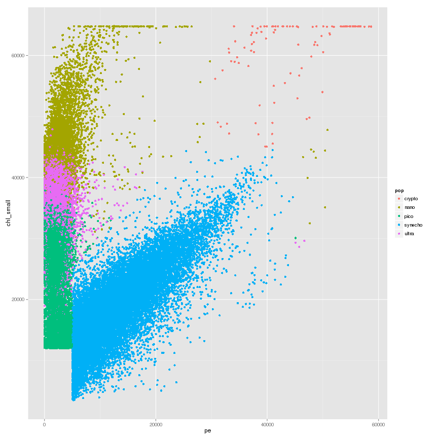

DataScience: Classification of Ocean Microbes
========================================================
A flow cytometer delivers a flow of particles through capilliary. By shining lasers of different wavelengths and measuring the absorption and refraction patterns, you can determine how large the particle is and some information about its color and other properties, allowing you to detect it.

The technology was developed for medical applciations, where the particles were potential pathogens in, say, serum, and the goal was to give a diagnosis. But the technology was adapted for use in environmental science to understand microbial population profiles.

The SeaFlow instrument, developed by the Armbrust Lab at the University of Washington, is unique in that it is deployed on research vessels and takes continuous measurements of population profiles in the open ocean.

The scale of the data can be quite large, and is expected to grow significantly: A two-week cruise from one vessel can generate hundreds of gigabytes per day, and the vision is to deploy one of these instruments on not only research vessels but the commercial shipping fleet as well.

While there are a number of challenging analytics tasks associated with this data, a central task is classification of particles. Based on the optical measurements of the particle, it can be identified as one of several populations.


```r
rm(list = ls())
setwd("~/uwhpsc/quiz2")

# cp datasci_course_materials/assignment5/setup.r setup.r source('setup.r')
source("install_load.R")
install_load("plyr", "knitr", "Hmisc", "caret", "rpart", "tree", "randomForest", 
    "e1071", "ggplot2")

# cp datasci_course_materials/assignment5/seaflow_21min.csv
# seaflow_21min.csv
dataframe <- read.csv("seaflow_21min.csv", sep = ",", header = T)
```


Analysis steps:


```r
# q1: How many particles labeled 'synecho' are in the file provided?
names(dataframe)
```

```
##  [1] "file_id"   "time"      "cell_id"   "d1"        "d2"       
##  [6] "fsc_small" "fsc_perp"  "fsc_big"   "pe"        "chl_small"
## [11] "chl_big"   "pop"
```

```r
head(dataframe)
```

```
##   file_id time cell_id    d1    d2 fsc_small fsc_perp fsc_big    pe
## 1     203   12       1 25344 27968     34677    14944   32400  2216
## 2     203   12       4 12960 22144     37275    20440   32400  1795
## 3     203   12       6 21424 23008     31725    11253   32384  1901
## 4     203   12       9  7712 14528     28744    10219   32416  1248
## 5     203   12      11 30368 21440     28861     6101   32400 12989
## 6     203   12      15 30032 22704     31221    13488   32400  1883
##   chl_small chl_big     pop
## 1     28237    5072    pico
## 2     36755   14224   ultra
## 3     26640       0    pico
## 4     35392   10704   ultra
## 5     23421    5920 synecho
## 6     27323    6560    pico
```

```r
library("plyr")
count(dataframe, c("pop"), )  # 18146
```

```
##       pop  freq
## 1  crypto   102
## 2    nano 12698
## 3    pico 20860
## 4 synecho 18146
## 5   ultra 20537
```

```r

# q2: What is the 3rd Quantile of the field fsc_small? (the summary function
# computes this on your behalf)
summary(dataframe)  # 39184
```

```
##     file_id         time        cell_id            d1       
##  Min.   :203   Min.   : 12   Min.   :    0   Min.   : 1328  
##  1st Qu.:204   1st Qu.:174   1st Qu.: 7486   1st Qu.: 7296  
##  Median :206   Median :362   Median :14995   Median :17728  
##  Mean   :206   Mean   :342   Mean   :15008   Mean   :17039  
##  3rd Qu.:208   3rd Qu.:503   3rd Qu.:22401   3rd Qu.:24512  
##  Max.   :209   Max.   :643   Max.   :32081   Max.   :54048  
##        d2          fsc_small        fsc_perp        fsc_big     
##  Min.   :   32   Min.   :10005   Min.   :    0   Min.   :32384  
##  1st Qu.: 9584   1st Qu.:31341   1st Qu.:13496   1st Qu.:32400  
##  Median :18512   Median :35483   Median :18069   Median :32400  
##  Mean   :17437   Mean   :34919   Mean   :17646   Mean   :32405  
##  3rd Qu.:24656   3rd Qu.:39184   3rd Qu.:22243   3rd Qu.:32416  
##  Max.   :54688   Max.   :65424   Max.   :63456   Max.   :32464  
##        pe          chl_small        chl_big           pop       
##  Min.   :    0   Min.   : 3485   Min.   :    0   crypto :  102  
##  1st Qu.: 1635   1st Qu.:22525   1st Qu.: 2800   nano   :12698  
##  Median : 2421   Median :30512   Median : 7744   pico   :20860  
##  Mean   : 5325   Mean   :30164   Mean   : 8328   synecho:18146  
##  3rd Qu.: 5854   3rd Qu.:38299   3rd Qu.:12880   ultra  :20537  
##  Max.   :58675   Max.   :64832   Max.   :57184
```

```r

# Split the data into test and training sets

library("caret")  #didn't use: trainIndex <- createDataPartition(dataframe, p=.5, times = 1)
set.seed(3456)
index <- 1:nrow(dataframe)
trainindex <- sample(index, trunc(length(index)/2))
head(trainindex)
```

```
## [1] 56325 55115 62598 26427 36691 57728
```

```r
training <- dataframe[trainindex, ]
testing <- dataframe[-trainindex, ]

# q3: What is the mean of the variable 'time' for your training set?
summary(training)
```

```
##     file_id         time        cell_id            d1       
##  Min.   :203   Min.   : 12   Min.   :    0   Min.   : 1488  
##  1st Qu.:204   1st Qu.:176   1st Qu.: 7500   1st Qu.: 7280  
##  Median :206   Median :364   Median :14948   Median :17616  
##  Mean   :206   Mean   :342   Mean   :14981   Mean   :17001  
##  3rd Qu.:208   3rd Qu.:504   3rd Qu.:22346   3rd Qu.:24464  
##  Max.   :209   Max.   :643   Max.   :32057   Max.   :53040  
##        d2          fsc_small        fsc_perp        fsc_big     
##  Min.   :   32   Min.   :10005   Min.   :    0   Min.   :32384  
##  1st Qu.: 9568   1st Qu.:31300   1st Qu.:13445   1st Qu.:32400  
##  Median :18400   Median :35504   Median :18075   Median :32400  
##  Mean   :17390   Mean   :34906   Mean   :17636   Mean   :32405  
##  3rd Qu.:24608   3rd Qu.:39200   3rd Qu.:22269   3rd Qu.:32416  
##  Max.   :54688   Max.   :65424   Max.   :63456   Max.   :32464  
##        pe          chl_small        chl_big           pop       
##  Min.   :    0   Min.   : 3675   Min.   :    0   crypto :   52  
##  1st Qu.: 1635   1st Qu.:22477   1st Qu.: 2816   nano   : 6467  
##  Median : 2419   Median :30573   Median : 7760   pico   :10373  
##  Mean   : 5311   Mean   :30187   Mean   : 8342   synecho: 9092  
##  3rd Qu.: 5880   3rd Qu.:38349   3rd Qu.:12912   ultra  :10187  
##  Max.   :58675   Max.   :64832   Max.   :57184
```

```r
# 342.4

# q4: In the plot of pe vs. chl_small, the particles labeled ultra should
# appear to be somewhat 'mixed' with two other populations of particles.
# Which two populations?
library("ggplot2")
qplot(pe, chl_small, data = dataframe, color = pop)  #pico, nano
```

 

```r

library("rpart")
library("tree")
fol <- formula(pop ~ fsc_small + fsc_perp + fsc_big + pe + chl_big + chl_small)
model <- rpart(fol, method = "class", data = training)
plot(model)
text(model)
```

 

```r
print(model)
```

```
## n= 36171 
## 
## node), split, n, loss, yval, (yprob)
##       * denotes terminal node
## 
##  1) root 36171 25800 pico (0.0014 0.18 0.29 0.25 0.28)  
##    2) pe< 5002 26318 15990 pico (0 0.23 0.39 0 0.38)  
##      4) chl_small< 3.217e+04 11278  1903 pico (0 8.9e-05 0.83 0 0.17) *
##      5) chl_small>=3.217e+04 15040  6897 ultra (0 0.39 0.064 0 0.54)  
##       10) chl_small>=4.105e+04 5512   789 nano (0 0.86 0.00018 0 0.14) *
##       11) chl_small< 4.105e+04 9528  2173 ultra (0 0.13 0.1 0 0.77) *
##    3) pe>=5002 9853   761 synecho (0.0053 0.053 0.0042 0.92 0.014)  
##      6) chl_small>=3.811e+04 643   130 nano (0.081 0.8 0 0.058 0.064) *
##      7) chl_small< 3.811e+04 9210   155 synecho (0 0.0014 0.0045 0.98 0.011) *
```

```r

# q5: Use print(model) to inspect your tree. Which populations, if any, is
# your tree incapable of recognizing?  crypto

# q6: What is the value of the threshold on the pe field learned in your
# model?  5004

# q7: based on your decision tree, which variables appear to be most
# important in predicting the class population?  pe, chl_small

# fol <- formula(pop~fsc_small + fsc_perp + fsc_big + pe + chl_big +
# chl_small)
modeltest <- rpart(fol, method = "class", data = testing)
plot(modeltest)
text(modeltest)
```

 

```r
print(modeltest)
```

```
## n= 36172 
## 
## node), split, n, loss, yval, (yprob)
##       * denotes terminal node
## 
##  1) root 36172 25680 pico (0.0014 0.17 0.29 0.25 0.29)  
##    2) pe< 5004 26349 15910 pico (0 0.22 0.4 0 0.39)  
##      4) chl_small< 3.259e+04 11970  2276 pico (0 0.00025 0.81 0 0.19) *
##      5) chl_small>=3.259e+04 14379  6449 ultra (0 0.4 0.052 0 0.55)  
##       10) chl_small>=4.13e+04 5117   652 nano (0 0.87 0 0 0.13) *
##       11) chl_small< 4.13e+04 9262  1984 ultra (0 0.13 0.08 0 0.79) *
##    3) pe>=5004 9823   769 synecho (0.0051 0.053 0.0052 0.92 0.015)  
##      6) chl_small>=3.828e+04 645   135 nano (0.078 0.79 0 0.064 0.068) *
##      7) chl_small< 3.828e+04 9178   165 synecho (0 0.0012 0.0056 0.98 0.011) *
```

```r
sum(predict(modeltest, testing, type = "class") == testing$pop) * 100/nrow(testing)
```

```
## [1] 85.59
```

```r
pred1 <- predict(modeltest, testing, type = "class")
# sum(predict(pruneTree, treedata, type = 'class') == treedata$activity) *
# 100/nrow(treedata)

# q8: How accurate was your decision tree on the test data? Enter a number
# between 0 and 1 0.86

##### DON'T RUN RANDOMFOREST - TAKES FOREVER (OR, REDUCE INPUT OBS# FIRST) #####

# library('randomForest') ranfol <- formula(as.factor(pop)~fsc_small +
# fsc_perp + fsc_big + pe + chl_big + chl_small) foresttest <-
# randomForest(ranfol, data=testing, importance=T, prox=T) plot(foresttest)
# text(foresttest) print(foresttest) importance(foresttest)
# sum(predict(foresttest, testing) == testing$pop) * 100/nrow(testing)
# pred2<-predict(foresttest, testing)

# q9: What was the accuracy of your random forest model on the test data?
# Enter a number between 0 and 1.  appeared to be 0.92

# q10: importance pe, chl_small

library("e1071")
modelvm <- svm(fol, data = testing)
sum(predict(modelvm, testing) == testing$pop) * 100/nrow(testing)
```

```
## [1] 92.19
```

```r
pred3 <- predict(modelvm, testing)

# q11: What was the accuracy of your support vector machine model on the
# test data? Enter a number between 0 and 1. 0.92

table(pred = pred1, tru = testing$pop)
```

```
##          tru
## pred      crypto nano pico synecho ultra
##   crypto       0    0    0       0     0
##   nano        50 4975    0      41   696
##   pico         0    3 9694       0  2273
##   synecho      0   11   51    9013   103
##   ultra        0 1242  742       0  7278
```

```r

# table(pred=pred2, tru = testing$pop) - random forest takes a long time..

table(pred = pred3, tru = testing$pop)
```

```
##          tru
## pred      crypto  nano  pico synecho ultra
##   crypto      47     0     0       0     0
##   nano         1  5549     0       0   370
##   pico         0     0 10108      18  1368
##   synecho      2     2    64    9036     4
##   ultra        0   680   315       0  8608
```

```r

# q12: Construct a confusion matrix for each of the three methods using the
# table function. What appears to be the most common error the models make?
# ultra is mistaken for pico

# q13: The measurements in this dataset are all supposed to be continuous
# (fsc_small, fsc_perp, fsc_big, pe, chl_small, chl_big), but one is not.
# Using plots or R code, figure out which field is corrupted.

x <- c("file_id", "time", "cell_id", "d1", "d2", "fsc_small", "fsc_perp", "fsc_big", 
    "pe", "chl_small", "chl_big")
par(mfrow = c(3, 4))
for (i in c(1:length(x))) {
    histvarlog <- names(dataframe) %in% c(x[i])
    histvarind <- which(histvarlog)
    hist(dataframe[, histvarind], main = x[i])
}
# histgrame/distribution of fsc_big values seem to be wrong

# q14: Plot time vs. chl_big, and you will notice a band of the data looks
# out of place.  Remove this data from the dataset by filtering out all data
# associated with file_id 208.  what was the effect on the accuracy of your
# svm model? Enter a positive or negative number representing the net change
# in accuracy

newtraining <- training[training$file_id != 208, ]
modelvm2 <- svm(fol, data = newtraining)
sum(predict(modelvm2, newtraining) == newtraining$pop) * 100/nrow(newtraining)
```

```
## [1] 97.28
```

```r
# 0.97
```

 


